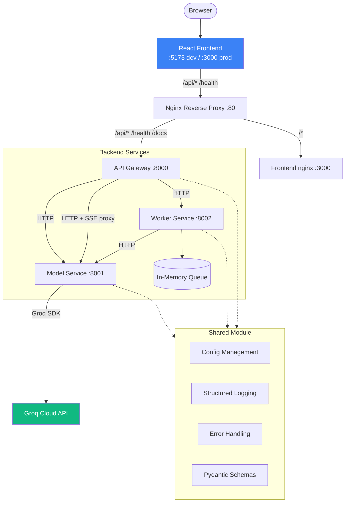

# Prodigon - Learn Production AI System Design

A multi-service AI assistant platform built for teaching production system design patterns, scalability, and security. Includes a polished React frontend with streaming chat, a system dashboard, and batch job management.

## Architecture



> **Dev mode:** Vite on `:5173` proxies `/api/*` and `/health` directly to the API Gateway on `:8000` — no Nginx needed.
>
> **Docker mode:** Nginx on `:80` routes `/api/*` to the Gateway and `/*` to the Frontend container.

## Request Flow

**Streaming chat (primary flow):**
1. Browser sends `POST /api/v1/generate/stream` through the Vite proxy (dev) or Nginx (prod)
2. **API Gateway** proxies the request as an SSE stream to **Model Service**
3. **Model Service** calls **Groq API** with `stream=True`, yields tokens as `data: token\n\n` events
4. Tokens flow back through the Gateway to the browser in real-time
5. Frontend parses SSE events and appends each token to the chat message

**Synchronous generation:**
1. Browser sends `POST /api/v1/generate` to the **API Gateway**
2. Gateway adds request ID, logs the request, and proxies to **Model Service**
3. Model Service calls **Groq API** for inference and returns the full response
4. Gateway returns the JSON result to the browser

**Batch jobs (async):**
1. Browser sends `POST /api/v1/jobs` to the **API Gateway**
2. Gateway forwards to **Worker Service**, which enqueues the job and returns `202 Accepted`
3. Background worker picks up the job, calls **Model Service** for each prompt, updates progress
4. Browser polls `GET /api/v1/jobs/{id}` every 2 seconds for status and results

## Quick Start

**Prerequisites:** Python 3.11+, Node.js 20+, Git

### 1. Setup backend

```bash
# 1. Clone and setup
bash scripts/setup.sh

# 2. Activate virtual environment (venv is already created in setup.sh run)
source venv/Scripts/activate    # Windows Git Bash
# source venv/bin/activate      # macOS / Linux

# 3. Configure environment (optional if done already)
cp .env.example .env
# Edit .env: set GROQ_API_KEY=your-key  (or USE_MOCK=true for offline mode)
```

### 2. Start backend services

```bash
# 1. Run all services
make run

# 2. Verify
curl http://localhost:8000/health
# optional test
curl -X POST http://localhost:8000/api/v1/generate \
  -H "Content-Type: application/json" \
  -d '{"prompt": "Explain microservices in one sentence"}'
```

> **Important:** Always activate the virtual env (`source venv/Scripts/activate`) before running `make run`. The system Python does not have uvicorn installed.

### 3. Start frontend (separate terminal)

```bash
cd frontend
npm install
npm run dev
```

### 4. Open the app

Navigate to **http://localhost:5173** — you should see the Prodigon chat interface with streaming, dashboard, and batch jobs.

### With Docker (alternative)

```bash
make run-docker    # Starts all services + frontend + nginx on :80
```

## Project Structure

```
prod-ai-system-design/
├── architecture/               # Architecture documentation (v0)
├── baseline/                   # Backend services
│   ├── api_gateway/            # Public API entry point (:8000)
│   ├── model_service/          # LLM inference via Groq (:8001)
│   ├── worker_service/         # Async job processing (:8002)
│   ├── shared/                 # Config, logging, schemas, errors, HTTP client
│   ├── infra/                  # Nginx reverse proxy config
│   ├── protos/                 # gRPC definitions (Task 1)
│   ├── tests/                  # Integration tests
│   └── docker-compose.yml
├── frontend/                   # React + Vite SPA
│   ├── src/                    # Components, stores, hooks, API client
│   ├── Dockerfile              # Multi-stage build (Node → Nginx)
│   └── nginx.conf              # SPA routing config
├── scripts/                    # setup.sh, run_all.sh, check_health.sh
├── .env.example
├── Makefile
└── pyproject.toml
```

## Workshop Topics (Pending)

| Part | Task | Topic |
|------|------|-------|
| I | 1 | REST APIs vs gRPC |
| I | 2 | Microservices vs Monolith |
| I | 3 | Batch vs Real-time vs Streaming |
| I | 4 | FastAPI Dependency Injection |
| II | 5 | Code Profiling & Optimization |
| II | 6 | Concurrency & Parallelism |
| II | 7 | Memory Management |
| II | 8 | Load Balancing & Caching |
| III | 9 | Authentication vs Authorization |
| III | 10 | Securing API Endpoints |
| III | 11 | Secrets Management |

## Commands

```bash
# Backend
make run             # Start all backend services
make run-docker      # Run everything with Docker Compose
make test            # Run pytest
make health          # Check service health
make lint            # Run ruff linter

# Frontend
make install-frontend  # npm install
make run-frontend      # Start Vite dev server (:5173)
make build-frontend    # Production build

# General
make setup           # Install Python dependencies
make clean           # Remove caches and build artifacts
make help            # Show all commands
```

## Tech Stack

**Backend:**
- **Python 3.11+** with **FastAPI**
- **Groq API** (llama-3.3-70b-versatile) for LLM inference
- **structlog** for structured JSON logging
- **Pydantic v2** for config and validation
- **httpx** for async HTTP and SSE proxy streaming

**Frontend:**
- **React 18** + **TypeScript** with **Vite**
- **Zustand** for state management (chat sessions, settings, health, jobs)
- **Tailwind CSS** for styling with dark mode support
- **react-markdown** + **react-syntax-highlighter** for AI response rendering

**Infrastructure:**
- **Docker** + **docker-compose** for containerization
- **Nginx** as reverse proxy (API routing + SSE support)
- **Redis** (stubbed for Workshop Task 8)

## Documentation

For detailed architecture documentation, see [`architecture/README.md`](architecture/README.md):
- [System Overview](architecture/system-overview.md) — high-level architecture and tech stack
- [Getting Started](architecture/getting-started.md) — detailed setup guide with troubleshooting
- [API Reference](architecture/api-reference.md) — complete endpoint documentation
- [Data Flow](architecture/data-flow.md) — request lifecycle diagrams
- [Design Decisions](architecture/design-decisions.md) — why things are built this way


