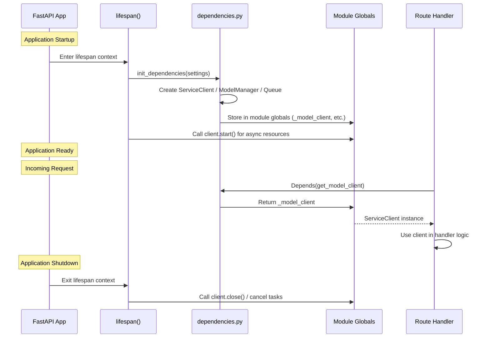
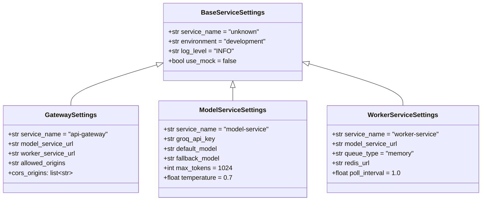
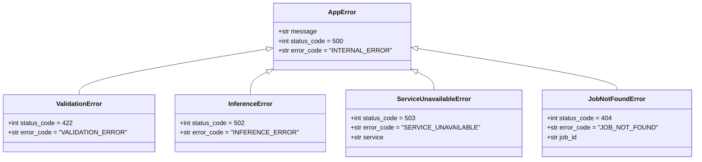

<!-- Version: v0 | Last updated: 2026-04-16 | Status: current -->

# Backend Architecture Deep Dive

This document provides a comprehensive reference for the Prodigon AI platform backend. It covers the three services (API Gateway, Model Service, Worker Service), the shared module, and the patterns that tie them together.

---

## Table of Contents

1. [Service Template Pattern](#1-service-template-pattern)
2. [API Gateway (Port 8000)](#2-api-gateway-port-8000)
3. [Model Service (Port 8001)](#3-model-service-port-8001)
4. [Worker Service (Port 8002)](#4-worker-service-port-8002)
5. [Shared Module](#5-shared-module)
6. [Dependency Injection Pattern](#6-dependency-injection-pattern)
7. [Configuration Flow](#7-configuration-flow)
8. [Error Hierarchy](#8-error-hierarchy)
9. [Cross-References](#9-cross-references)

---

## 1. Service Template Pattern

Every backend service follows the same directory layout. This consistency means that once you understand one service, you can navigate all of them.

```
service_name/
├── __init__.py
├── Dockerfile
├── requirements.txt
└── app/
    ├── __init__.py
    ├── main.py          # FastAPI app + lifespan
    ├── config.py         # Pydantic Settings subclass
    ├── dependencies.py   # DI container (module globals + getters)
    ├── routes/           # APIRouter modules
    ├── services/         # Business logic classes
    └── middleware/        # Request/response processing (gateway only)
```

### Why this layout

| Concern | File | Rationale |
|---|---|---|
| App bootstrap | `main.py` | Single place for lifespan, middleware registration, and router inclusion. |
| Configuration | `config.py` | Pydantic Settings subclass per service. All config is env-driven and validated at startup. |
| Dependency wiring | `dependencies.py` | Module-level globals initialized during lifespan, exposed via getter functions for `Depends()`. |
| HTTP surface | `routes/` | Each file is an `APIRouter`. Keeps endpoint definitions small and focused. |
| Domain logic | `services/` | Pure business logic. No FastAPI imports, no HTTP concerns. Testable in isolation. |
| Cross-cutting | `middleware/` | Gateway-only. Timing, logging, and CORS applied as Starlette middleware. |

### Lifespan contract

Every service implements the same lifespan pattern:

```python
@asynccontextmanager
async def lifespan(app: FastAPI):
    # 1. Load settings
    # 2. Call init_dependencies(settings) to create clients/managers
    # 3. Start async resources (HTTP clients, background tasks)
    logger.info("service_ready")
    yield
    # 4. Cancel background tasks
    # 5. Close HTTP clients
    logger.info("service_stopped")
```

---

## 2. API Gateway (Port 8000)

**Entry point:** `baseline/api_gateway/app/main.py`

The gateway is the only service exposed to external clients. It performs no business logic of its own -- it validates, decorates, and proxies requests to backend services.

### Configuration

`GatewaySettings` extends `BaseServiceSettings` with:

| Field | Type | Default | Description |
|---|---|---|---|
| `service_name` | `str` | `"api-gateway"` | Service identity for logging |
| `model_service_url` | `str` | `"http://localhost:8001"` | Model Service base URL |
| `worker_service_url` | `str` | `"http://localhost:8002"` | Worker Service base URL |
| `allowed_origins` | `str` | `"http://localhost:3000,http://localhost:5173,http://localhost:8000"` | Comma-separated CORS origins |

The `cors_origins` property splits `allowed_origins` into a `list[str]` for the CORS middleware.

### Middleware Stack

Middleware is applied in `main.py` in this order. Starlette processes middleware outermost-first, so `TimingMiddleware` wraps the entire request lifecycle:

| Order | Middleware | Responsibility |
|---|---|---|
| 1 (outermost) | `TimingMiddleware` | Measures request duration via `time.perf_counter()`. Adds `X-Process-Time` header to every response. Logs a warning for any request exceeding 2000 ms. |
| 2 | `RequestLoggingMiddleware` | Generates a UUID `X-Request-ID` if the client did not send one, or propagates the client-provided value. Logs `request_started` (with method, path, client IP) and `request_completed` (with status code) events. Attaches the request ID to the response headers. |
| 3 (innermost) | `CORSMiddleware` | Reads origins from `settings.cors_origins`. Allows all methods (`["*"]`) and all headers (`["*"]`). Credentials enabled. |

### Routes

| Method | Path | Handler | Behavior |
|---|---|---|---|
| `GET` | `/health` | `health.router` | Returns `HealthResponse` with service name and environment. |
| `POST` | `/api/v1/generate` | `generate.generate_text` | Proxies `GenerateRequest` to Model Service via `ServiceClient.post("/inference")`. Returns `GenerateResponse`. |
| `POST` | `/api/v1/generate/stream` | `generate.generate_text_stream` | SSE proxy. Opens a raw `httpx.AsyncClient.stream("POST", ...)` to Model Service `/inference/stream`. Yields bytes directly to the client. Does **not** use `ServiceClient` because the client expects JSON responses, not byte streams. |
| `POST` | `/api/v1/jobs` | `jobs.submit_job` | Proxies `JobSubmission` to Worker Service via `ServiceClient.post("/jobs")`. Returns 202 with `JobResponse`. |
| `GET` | `/api/v1/jobs/{job_id}` | `jobs.get_job_status` | Proxies to Worker Service via `ServiceClient.get("/jobs/{job_id}")`. Returns `JobResponse` or 404. |

### Dependencies

| Getter | Returns | Initialized by |
|---|---|---|
| `get_settings()` | `GatewaySettings` | `@lru_cache` -- loaded once on first call |
| `get_model_client()` | `ServiceClient` | `init_dependencies(settings)` during lifespan |
| `get_worker_client()` | `ServiceClient` | `init_dependencies(settings)` during lifespan |

Both `ServiceClient` instances have their `start()` called during lifespan startup and `close()` called during shutdown.

---

## 3. Model Service (Port 8001)

**Entry point:** `baseline/model_service/app/main.py`

The Model Service owns all LLM inference. It wraps the Groq API behind a clean interface and provides model selection, fallback logic, and structured logging.

### Configuration

`ModelServiceSettings` extends `BaseServiceSettings` with:

| Field | Type | Default | Description |
|---|---|---|---|
| `service_name` | `str` | `"model-service"` | Service identity |
| `groq_api_key` | `str` | `""` | Groq API key (required for production; ignored when `use_mock=True`) |
| `default_model` | `str` | `"llama-3.3-70b-versatile"` | Primary model for inference |
| `fallback_model` | `str` | `"llama-3.1-8b-instant"` | Fallback model when primary fails |
| `max_tokens` | `int` | `1024` | Default max tokens for generation |
| `temperature` | `float` | `0.7` | Default sampling temperature |

### Key Classes

#### `GroqInferenceClient`

**File:** `baseline/model_service/app/services/groq_client.py`

Wraps the `AsyncGroq` SDK. Provides two methods:

- **`generate(prompt, model, max_tokens, temperature, system_prompt)`** -- Builds a messages list (optional system message + user message), calls `chat.completions.create()`, measures latency via `time.perf_counter()`, and returns a dict with keys: `text`, `model`, `usage` (prompt_tokens, completion_tokens, total_tokens), `latency_ms`.
- **`generate_stream(prompt, model, max_tokens, temperature, system_prompt)`** -- Same message construction, but calls the SDK with `stream=True` and yields `chunk.choices[0].delta.content` for each non-empty chunk.

#### `MockGroqClient`

**File:** `baseline/model_service/app/services/groq_client.py`

Activated when `USE_MOCK=true` in the environment. Returns canned responses without making API calls.

- **`generate()`** returns a deterministic dict with `"[Mock response for model=...] ..."` text, a `{model}-mock` model name, synthetic usage stats, and a fixed 5.0 ms latency.
- **`generate_stream()`** splits a mock sentence into words and yields each word followed by a space, simulating token-by-token delivery.

#### `ModelManager`

**File:** `baseline/model_service/app/services/model_manager.py`

Implements the **fallback pattern**. Sits between route handlers and the Groq client.

- **`resolve_model(requested_model)`** -- Returns the client-requested model if provided, otherwise `self.default_model`.
- **`generate()`** -- Tries the resolved model. On failure: if the resolved model is already the fallback, raises `InferenceError`. Otherwise logs a warning and retries with `self.fallback_model`. If the fallback also fails, raises `InferenceError` naming both models.
- **`generate_stream()`** -- Same fallback logic for streaming. If the primary model fails before or during token delivery, falls back to the secondary model. Both paths raise `InferenceError` on complete failure.

### Routes

| Method | Path | Handler | Behavior |
|---|---|---|---|
| `GET` | `/health` | `health.router` | Returns `HealthResponse`. |
| `POST` | `/inference` | `inference.run_inference` | Calls `ModelManager.generate()`, returns `GenerateResponse` with text, model, usage, and latency. |
| `POST` | `/inference/stream` | `inference.run_inference_stream` | Calls `ModelManager.generate_stream()`, returns `StreamingResponse` with `media_type="text/event-stream"`. Format: `data: {token}\n\n` per token, `data: [DONE]\n\n` on completion, `data: [ERROR] {message}\n\n` on failure. |

### Dependencies

| Getter | Returns | Initialized by |
|---|---|---|
| `get_settings()` | `ModelServiceSettings` | `@lru_cache` |
| `get_model_manager()` | `ModelManager` | `init_dependencies(settings)` during lifespan |

The `init_dependencies` function checks `settings.use_mock`: if true, creates a `MockGroqClient`; otherwise creates a `GroqInferenceClient` with the API key. The client is injected into a new `ModelManager` instance.

---

## 4. Worker Service (Port 8002)

**Entry point:** `baseline/worker_service/app/main.py`

The Worker Service manages background/batch inference jobs. It exposes a REST API for submitting and tracking jobs, and runs a background worker loop that processes queued jobs by calling the Model Service over HTTP.

### Configuration

`WorkerServiceSettings` extends `BaseServiceSettings` with:

| Field | Type | Default | Description |
|---|---|---|---|
| `service_name` | `str` | `"worker-service"` | Service identity |
| `model_service_url` | `str` | `"http://localhost:8001"` | Model Service base URL (for job processing) |
| `queue_type` | `str` | `"memory"` | Queue backend: `"memory"` or `"redis"` |
| `redis_url` | `str` | `"redis://localhost:6379/0"` | Redis connection string (used when `queue_type="redis"`) |
| `poll_interval` | `float` | `1.0` | Seconds between queue polls when idle |

### Key Classes

#### `BaseQueue` (ABC)

**File:** `baseline/worker_service/app/services/queue.py`

Abstract interface defining the queue contract. This is the **Strategy pattern** -- the queue backend can be swapped without changing any business logic.

| Method | Signature | Description |
|---|---|---|
| `enqueue` | `(submission: JobSubmission) -> JobResponse` | Add a job to the queue. Returns the initial job response with status `PENDING`. |
| `dequeue` | `() -> tuple[str, JobSubmission] \| None` | Get the next pending job as `(job_id, submission)`, or `None` if empty. |
| `get_job` | `(job_id: str) -> JobResponse \| None` | Look up job status and results by ID. |
| `update_job` | `(job_id: str, **kwargs) -> None` | Patch job fields (status, results, error, progress). |

#### `InMemoryQueue`

**File:** `baseline/worker_service/app/services/queue.py`

Dict-based implementation for local development. Not suitable for production (single-process, no persistence).

Internal data structures:

| Attribute | Type | Purpose |
|---|---|---|
| `_jobs` | `dict[str, JobResponse]` | Stores job status and results, keyed by `job_id` |
| `_submissions` | `dict[str, JobSubmission]` | Stores the original submission data |
| `_pending` | `list[str]` | FIFO list of job IDs waiting to be processed |

`enqueue()` generates a UUID, creates a `JobResponse` with `PENDING` status, stores it, and appends the ID to `_pending`. `dequeue()` pops from the front of `_pending` and marks the job as `RUNNING`.

#### `create_queue(queue_type)` Factory

Returns an `InMemoryQueue` for `queue_type="memory"`. Raises `NotImplementedError` for `"redis"` (placeholder for Task 8 -- Load Balancing and Caching). Raises `ValueError` for unknown types.

#### `JobProcessor`

**File:** `baseline/worker_service/app/services/processor.py`

Executes batch inference jobs. For each prompt in a `JobSubmission`:

1. Calls `ServiceClient.post("/inference", json={...})` to the Model Service.
2. Appends the response text to the results list.
3. Calls `queue.update_job()` to update `completed_prompts` and `results` (progress tracking).

After all prompts succeed, marks the job as `COMPLETED` with a `completed_at` timestamp. If any prompt fails, marks the job as `FAILED` with the error message.

Communication is over HTTP, not direct import -- this enforces service boundaries and allows independent scaling and deployment.

#### `worker_loop`

**File:** `baseline/worker_service/app/worker.py`

An async function launched via `asyncio.create_task()` during lifespan startup. Runs an infinite loop:

1. Call `queue.dequeue()`.
2. If `None`, sleep for `poll_interval` seconds and try again.
3. If a job is returned, call `processor.process(job_id, submission)`.
4. On `asyncio.CancelledError`, break out of the loop (graceful shutdown).
5. On any other exception, log the error and continue (the worker loop must not crash).

### Routes

| Method | Path | Handler | Behavior |
|---|---|---|---|
| `GET` | `/health` | `health.router` | Returns `HealthResponse`. |
| `POST` | `/jobs` | `jobs.submit_job` | Calls `queue.enqueue(submission)`. Returns 202 with `JobResponse`. |
| `GET` | `/jobs/{job_id}` | `jobs.get_job_status` | Calls `queue.get_job(job_id)`. Returns `JobResponse` or raises HTTP 404. |

### Dependencies

| Getter | Returns | Initialized by |
|---|---|---|
| `get_settings()` | `WorkerServiceSettings` | `@lru_cache` |
| `get_queue()` | `BaseQueue` (concretely `InMemoryQueue`) | `init_dependencies(settings)` |
| `get_processor()` | `JobProcessor` | `init_dependencies(settings)` |
| `get_model_client()` | `ServiceClient` | `init_dependencies(settings)` |

The `ServiceClient` is created with `base_url=settings.model_service_url`, started during lifespan, and closed during shutdown.

---

## 5. Shared Module

**Location:** `baseline/shared/`

The shared module contains code imported by all three services. It defines the contracts (schemas, errors), the communication primitives (HTTP client), and the operational foundations (config, logging, constants).

### `config.py` -- Base Configuration

```python
class BaseServiceSettings(BaseSettings):
    service_name: str = "unknown"
    environment: str = "development"
    log_level: str = "INFO"
    use_mock: bool = False
```

Inherits from Pydantic `BaseSettings`. Reads from `../../.env` (relative to each service's working directory). All fields can be overridden via environment variables with matching names (case-insensitive). The `extra = "ignore"` model config prevents unknown env vars from causing startup failures.

### `schemas.py` -- Request/Response Models

Centralizes all Pydantic models. A change here propagates to every service that imports the schema.

**Inference schemas:**

| Schema | Key Fields |
|---|---|
| `GenerateRequest` | `prompt` (str, 1-10000 chars), `model` (str, optional), `max_tokens` (int, 1-8192, default 1024), `temperature` (float, 0.0-2.0, default 0.7), `system_prompt` (str, optional) |
| `GenerateResponse` | `text` (str), `model` (str), `usage` (dict), `latency_ms` (float) |

**Job schemas:**

| Schema | Key Fields |
|---|---|
| `JobStatus` | Enum: `PENDING`, `RUNNING`, `COMPLETED`, `FAILED` |
| `JobSubmission` | `prompts` (list[str], 1-100 items), `model` (str, optional), `max_tokens` (int, 1-8192, default 1024) |
| `JobResponse` | `job_id` (str), `status` (JobStatus), `created_at` (datetime), `completed_at` (datetime, optional), `total_prompts` (int), `completed_prompts` (int, default 0), `results` (list[str]), `error` (str, optional) |

**Health schema:**

| Schema | Key Fields |
|---|---|
| `HealthResponse` | `status` (str, default "healthy"), `service` (str), `version` (str, default "0.1.0"), `environment` (str, default "development") |

### `errors.py` -- Exception Hierarchy

All application errors extend `AppError`, which carries an HTTP status code and a machine-readable error code. Every service registers an `app_error_handler` that converts these into consistent JSON responses:

```json
{
  "error": {
    "code": "INFERENCE_ERROR",
    "message": "Both llama-3.3-70b-versatile and llama-3.1-8b-instant failed"
  }
}
```

| Exception | Status Code | Error Code | When Raised |
|---|---|---|---|
| `AppError` | 500 | `INTERNAL_ERROR` | Base class, catch-all |
| `ValidationError` | 422 | `VALIDATION_ERROR` | Request data fails validation |
| `InferenceError` | 502 | `INFERENCE_ERROR` | Groq API call fails (both primary and fallback) |
| `ServiceUnavailableError` | 503 | `SERVICE_UNAVAILABLE` | Downstream service unreachable or timed out |
| `JobNotFoundError` | 404 | `JOB_NOT_FOUND` | Requested job ID does not exist |

### `http_client.py` -- Service-to-Service Communication

`ServiceClient` wraps `httpx.AsyncClient` with lifecycle management and error translation.

**Lifecycle:**

- `start()` -- Creates the underlying `httpx.AsyncClient` with `base_url` and `timeout`.
- `close()` -- Calls `aclose()` on the HTTP client to release connections.
- Both are called from the owning service's lifespan context manager.

**Methods:**

| Method | Signature | Description |
|---|---|---|
| `post` | `(path: str, json: dict, headers: dict \| None) -> dict` | POST request, returns parsed JSON |
| `get` | `(path: str, headers: dict \| None) -> dict` | GET request, returns parsed JSON |

**Error translation:**

| httpx Exception | Translated To |
|---|---|
| `ConnectError` | `ServiceUnavailableError` ("Cannot connect to service") |
| `TimeoutException` | `ServiceUnavailableError` ("Service request timed out") |
| `HTTPStatusError` | Re-raised as-is (logged with status code and response body) |

**Default timeout:** 30 seconds (`DEFAULT_TIMEOUT = 30.0`).

### `logging.py` -- Structured Logging

Configures structlog for consistent, machine-readable log output across all services.

**Processor chain:**

1. `merge_contextvars` -- Merges context-local variables (e.g., service name) into every log entry
2. `add_log_level` -- Adds the log level string
3. `StackInfoRenderer` -- Renders stack info when present
4. `set_exc_info` -- Attaches exception info automatically
5. `TimeStamper(fmt="iso")` -- ISO 8601 timestamps
6. **Output renderer:** `ConsoleRenderer` when `log_level == "DEBUG"`, `JSONRenderer` for all other levels

**Functions:**

- `setup_logging(service_name, log_level)` -- Configures structlog and binds the service name to context vars. Called once at module level in each service's `main.py`.
- `get_logger(name)` -- Returns a `BoundLogger` instance. Usage: `logger = get_logger(__name__)`.

### `constants.py` -- Platform Constants

| Constant | Value | Used By |
|---|---|---|
| `DEFAULT_MODEL` | `"llama-3.3-70b-versatile"` | Model Service config |
| `FALLBACK_MODEL` | `"llama-3.1-8b-instant"` | Model Service config |
| `DEFAULT_MODEL_SERVICE_URL` | `"http://localhost:8001"` | Gateway, Worker configs |
| `DEFAULT_WORKER_SERVICE_URL` | `"http://localhost:8002"` | Gateway config |
| `DEFAULT_HTTP_TIMEOUT` | `30.0` | ServiceClient |
| `INFERENCE_TIMEOUT` | `60.0` | Streaming proxy in gateway |
| `MAX_BATCH_SIZE` | `100` | JobSubmission schema validation |
| `MAX_PROMPT_LENGTH` | `10000` | GenerateRequest schema validation |

---

## 6. Dependency Injection Pattern

All three services use the same DI approach: **module-level globals initialized during lifespan, accessed via getter functions used in `Depends()`**.

### How it works

1. **Settings** are loaded via `@lru_cache` decorated functions. The first call creates the settings object; subsequent calls return the cached instance.

2. **Runtime dependencies** (HTTP clients, model managers, queues) are stored as module-level globals in `dependencies.py`, initialized to `None`.

3. During FastAPI **lifespan startup**, `init_dependencies(settings)` creates the concrete instances and assigns them to the module globals.

4. **Getter functions** (`get_model_client()`, `get_model_manager()`, `get_queue()`, etc.) return the module global or raise `RuntimeError` if it has not been initialized.

5. Route handlers declare their dependencies with `Depends(get_xxx)`. FastAPI calls the getter on each request.

### Why this pattern

- **Single instance:** Expensive objects (HTTP clients, SDK wrappers) are created once and shared across all requests.
- **Testable:** Override any dependency in tests using `app.dependency_overrides[get_xxx] = mock_factory`.
- **Clean handlers:** Route functions declare what they need; they never construct their own dependencies.
- **Fail-fast:** If lifespan did not run (e.g., running a handler directly), the getter raises `RuntimeError` immediately instead of producing subtle bugs.

### Lifecycle Sequence



---

## 7. Configuration Flow

Configuration flows from a `.env` file through Pydantic Settings into service-specific classes, which are then injected into route handlers via the dependency system.

```
.env file
  -> Pydantic BaseSettings (env_file="../../.env")
    -> Service-specific Settings class (inherits + extends)
      -> Injected via @lru_cache getter
        -> Used in lifespan (to create dependencies)
        -> Used in route handlers (via Depends)
```

### Settings Class Hierarchy



### Environment Variable Mapping

Pydantic Settings automatically maps environment variables to fields by name (case-insensitive). Examples:

| Environment Variable | Settings Field | Service |
|---|---|---|
| `GROQ_API_KEY` | `groq_api_key` | Model Service |
| `USE_MOCK` | `use_mock` | All (inherited from base) |
| `LOG_LEVEL` | `log_level` | All (inherited from base) |
| `MODEL_SERVICE_URL` | `model_service_url` | Gateway, Worker |
| `WORKER_SERVICE_URL` | `worker_service_url` | Gateway |
| `QUEUE_TYPE` | `queue_type` | Worker |
| `ALLOWED_ORIGINS` | `allowed_origins` | Gateway |
| `ENVIRONMENT` | `environment` | All |

---

## 8. Error Hierarchy



Every service registers the same exception handler pattern in `main.py`:

```python
@app.exception_handler(AppError)
async def app_error_handler(request: Request, exc: AppError):
    return JSONResponse(
        status_code=exc.status_code,
        content={"error": {"code": exc.error_code, "message": exc.message}},
    )
```

This guarantees that all error responses across all services share the same JSON structure, regardless of which service originated the error.

---

## 9. Cross-References

- **[API Reference](api-reference.md)** -- Complete endpoint specifications with request/response examples.
- **[Data Flow](data-flow.md)** -- End-to-end request traces for generation, streaming, and batch job flows.
- **[Design Decisions](design-decisions.md)** -- Rationale for architectural choices and tradeoff analysis.
