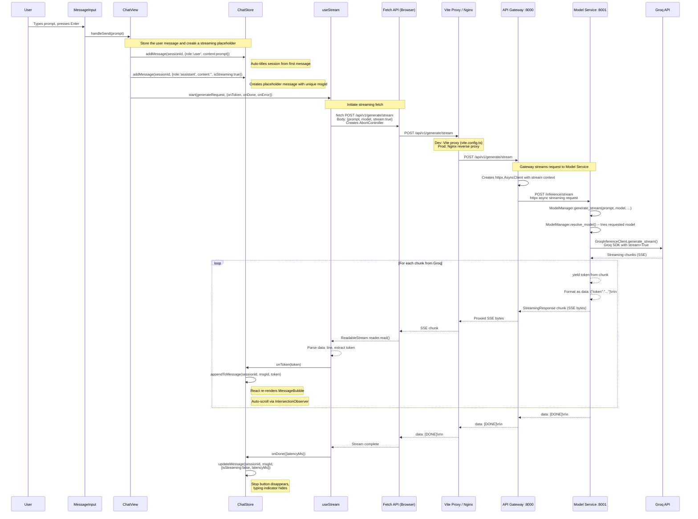
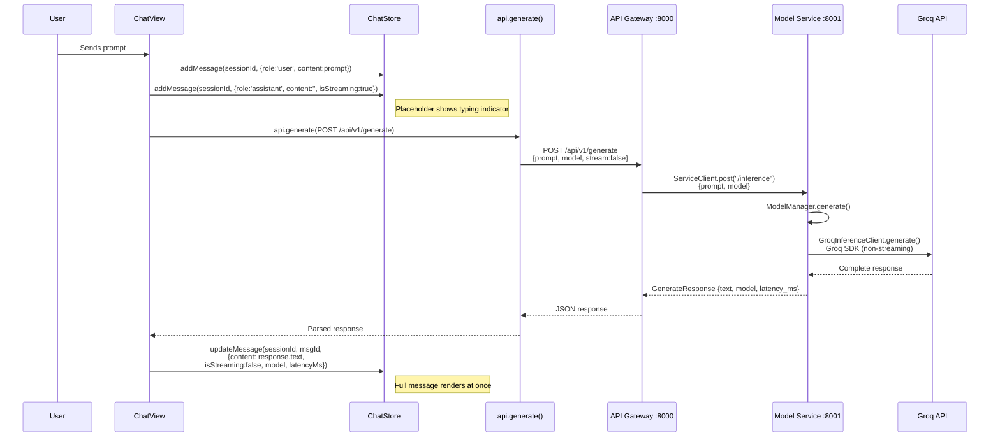
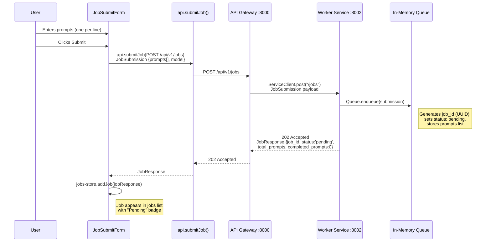
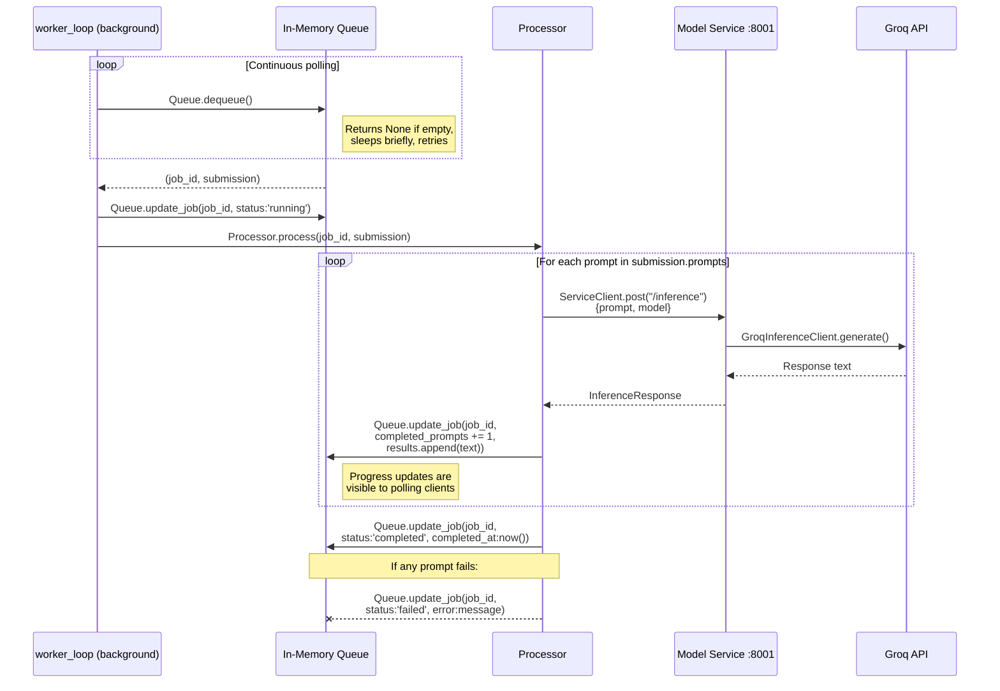
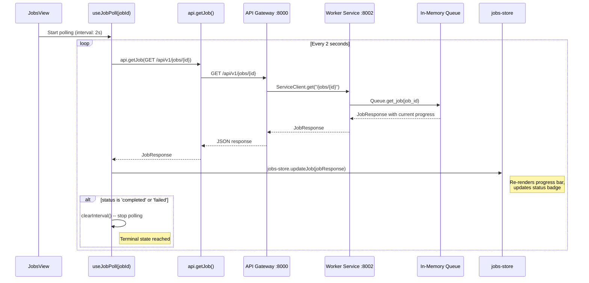
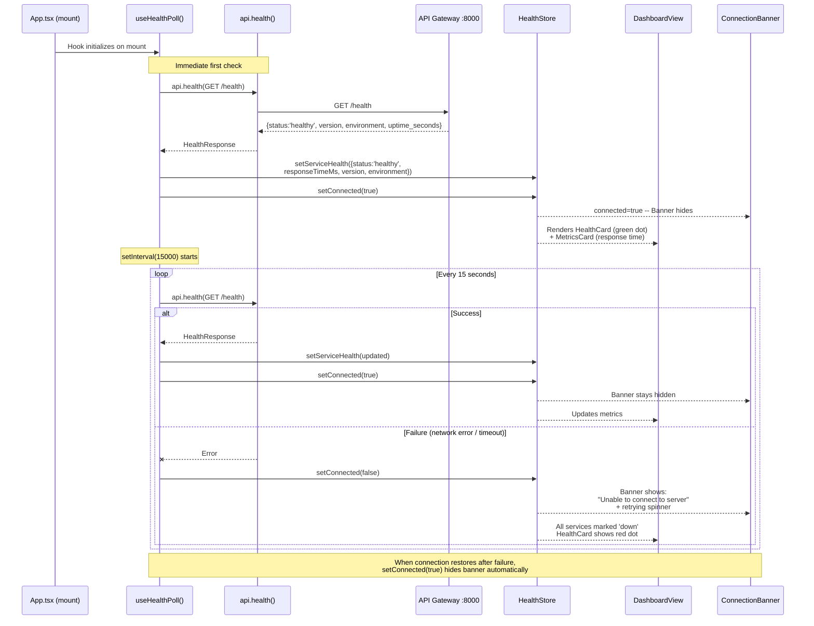
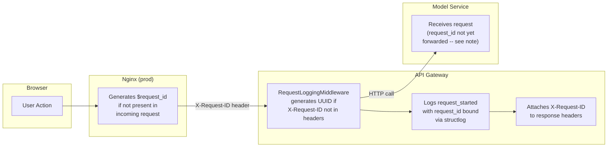
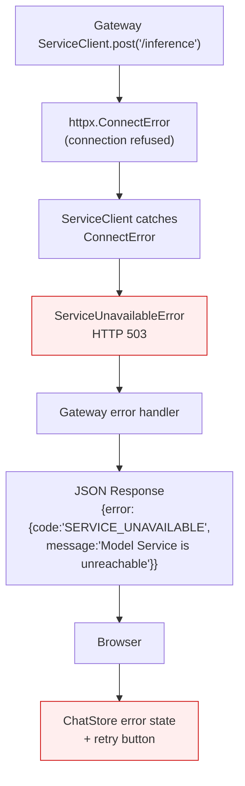

<!-- Version: v0 | Last updated: 2026-04-16 | Status: current -->

# Prodigon AI Platform -- Data Flow & Request Lifecycles

This document traces every user-facing flow through the Prodigon platform, from the first keystroke to the final rendered pixel. Each flow is illustrated with a Mermaid sequence diagram and annotated with the exact function calls, store mutations, and network hops involved.

Use this alongside the [API Reference](api-reference.md) for payload schemas, [Backend Architecture](backend-architecture.md) for service internals, and [Frontend Architecture](frontend-architecture.md) for component/store details.

---

## 1. Streaming Chat (Primary Flow)

This is the most complex and most important flow in the platform. It exercises the full stack: React state management, Server-Sent Events over fetch, Vite dev proxy (or Nginx in production), the API Gateway's streaming proxy, the Model Service's streaming inference, and the Groq API's chunked completion endpoint.

**Cancellation path:** If the user clicks the Stop button during streaming, `useStream.stop()` calls `AbortController.abort()`. This terminates the `fetch` request immediately. The browser closes the connection, which propagates upstream: Vite/Nginx drops the proxy connection, the Gateway's `httpx` stream is interrupted, and the Model Service's generator is garbage-collected. The `onError` callback fires with an `AbortError`, and `ChatStore.updateMessage()` sets `isStreaming: false` on the partial message, preserving whatever tokens were already received.

---

## 2. Non-Streaming Chat

A simpler variant used when the user (or a future settings toggle) opts out of streaming. The entire response is returned in a single JSON payload.

The key difference from the streaming flow: no `ReadableStream` parsing, no incremental store updates, and no SSE protocol. The tradeoff is a longer perceived wait time (no tokens appear until the full response is ready) but simpler error handling.

---

## 3. Batch Job Submission & Polling

Batch processing lets users submit multiple prompts at once for background inference. This flow has three distinct phases: submission, background processing, and polling.

### 3a. Job Submission

### 3b. Background Processing

### 3c. Frontend Polling

**Design note:** Polling was chosen over WebSockets for simplicity. At scale, this would be replaced with SSE push notifications or WebSocket channels to reduce unnecessary requests. The 2-second interval balances responsiveness against server load.

---

## 4. Health Monitoring

The health flow runs continuously in the background, independent of user interaction. It drives the connection banner and the dashboard health indicators.

**Resilience behavior:** The health poll never stops, even after repeated failures. It continues attempting every 15 seconds. When a previously-down backend comes back online, the next successful poll automatically restores the green status and hides the connection banner -- no page refresh required.

---

## 5. Request ID Propagation

Request IDs enable end-to-end tracing of a single user action across all services. Here is how `X-Request-ID` flows through the system:

**How it works step by step:**

1. **Nginx layer (production only):** Nginx generates a `$request_id` using its built-in variable if the incoming request does not already carry an `X-Request-ID` header. This ID is passed upstream to the Gateway.

2. **RequestLoggingMiddleware (Gateway):** On every inbound request, the middleware checks for the `X-Request-ID` header. If absent (e.g., in development without Nginx), it generates a new UUID. The request ID is bound to the structlog context, so every log line emitted during that request includes it automatically.

3. **Response headers:** The middleware attaches the `X-Request-ID` to the outgoing response so the browser (or any upstream caller) can correlate the request.

4. **Inter-service propagation (future improvement):** Currently, `ServiceClient` does not forward the `X-Request-ID` when making calls from the Gateway to the Model Service or Worker Service. This means traces break at service boundaries. A future enhancement should pass the request ID through all inter-service calls to enable full distributed tracing.

---

## 6. Error Propagation Chain

Errors flow upward through a well-defined chain, with each layer adding context or attempting recovery before re-raising.

```mermaid
graph TD
    GroqAPI["Groq API"]
    GroqClient["GroqInferenceClient"]
    ModelManager["ModelManager"]
    FallbackAttempt["ModelManager<br/>(fallback model)"]
    InferenceRoute["Model Service Route"]
    FastAPIHandler["FastAPI app_error_handler"]
    JSONError["JSON Response<br/>{error: {code, message}}"]
    GatewayHTTPX["Gateway httpx call"]
    HTTPStatusError["httpx.HTTPStatusError"]
    GatewayReRaise["Gateway re-raises<br/>as HTTPException"]
    Nginx["Nginx"]
    BrowserFetch["Browser fetch()"]
    ApiRequestError["ApiRequestError<br/>(status, code, message)"]
    ChatStoreError["ChatStore.updateMessage<br/>(error: message)"]
    MessageBubble["MessageBubble<br/>error state + retry button"]

    GroqAPI -->|"API error<br/>(rate limit, invalid key, etc.)"| GroqClient
    GroqClient -->|"raises exception"| ModelManager
    ModelManager -->|"catches, tries fallback model"| FallbackAttempt
    FallbackAttempt -->|"fallback succeeds"| InferenceRoute
    FallbackAttempt -->|"both models fail"| InferenceRoute

    InferenceRoute -->|"InferenceError"| FastAPIHandler
    FastAPIHandler --> JSONError
    JSONError -->|"HTTP 502"| GatewayHTTPX

    GatewayHTTPX --> HTTPStatusError
    HTTPStatusError --> GatewayReRaise
    GatewayReRaise --> Nginx
    Nginx --> BrowserFetch

    BrowserFetch --> ApiRequestError
    ApiRequestError --> ChatStoreError
    ChatStoreError --> MessageBubble

    style MessageBubble fill:#fee,stroke:#c00
    style FallbackAttempt fill:#ffe,stroke:#aa0
```

### Service Unavailable Path

When the Model Service itself is unreachable (container down, network partition), the error path is different:

**Key error behaviors:**

- **Automatic fallback:** When the primary model fails (e.g., rate limit on `llama-3.3-70b-versatile`), `ModelManager` automatically retries with the fallback model (e.g., `llama-3.1-8b-instant`) before giving up.
- **Structured error responses:** All errors reaching the client follow the same shape: `{error: {code: string, message: string}}`, making frontend error handling consistent.
- **Retry affordance:** When the frontend displays an error in a `MessageBubble`, it includes a retry button. Clicking it re-sends the original prompt through the same flow.
- **Streaming errors:** During a streaming response, if an error occurs mid-stream, the SSE connection drops. The `useStream` hook detects the broken stream, calls `onError`, and the partial response is preserved with an error indicator appended.

---

## Cross-References

| Document | What it covers |
|----------|---------------|
| [API Reference](api-reference.md) | Request/response schemas, endpoint details, status codes |
| [Backend Architecture](backend-architecture.md) | Service internals, module structure, configuration |
| [Frontend Architecture](frontend-architecture.md) | Component tree, store design, hooks, routing |
| [System Overview](system-overview.md) | High-level architecture, tech stack, deployment |
