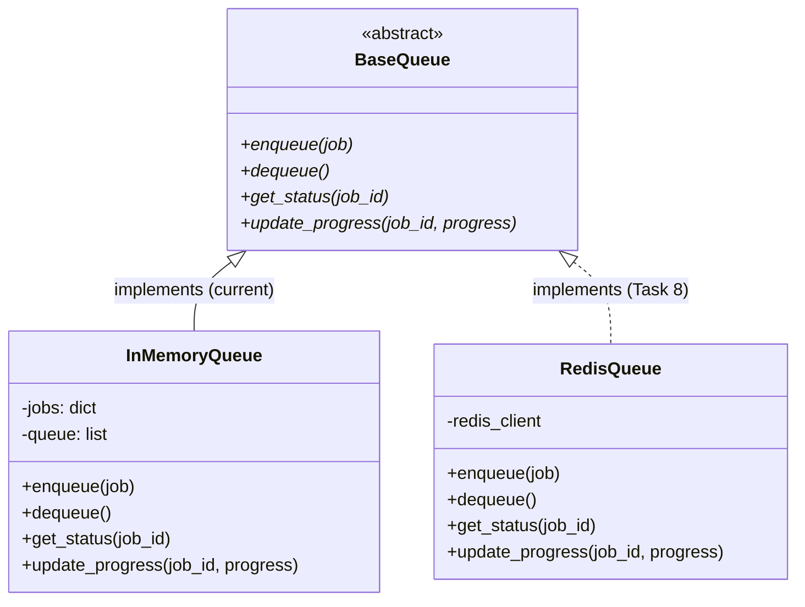

<!-- Version: v0 | Last updated: 2026-04-16 | Status: current -->

# Design Decisions — Architecture Decision Records (ADRs)

These ADRs document the key architectural choices made for the Prodigon platform. Each follows the format: Context, Decision, Alternatives Considered, Consequences. These serve as institutional memory for why things are built this way.

---

## ADR-001: Zustand over Redux/Context for Frontend State

**Context:** The React SPA needs state management for chat sessions (with streaming token updates), settings, health status, and batch jobs. Chat streaming requires high-frequency updates (every token appended to a message).

**Decision:** Zustand 4.5 with 4 independent stores (chat, settings, health, jobs). No middleware, no persistence layer (theme uses manual localStorage).

**Alternatives Considered:**

- **Redux Toolkit** — too much boilerplate (slices, reducers, actions) for this scale; overkill for 4 simple stores.
- **React Context + useReducer** — re-render performance issues with streaming; Context triggers re-renders on ALL consumers, whereas Zustand allows granular subscriptions.
- **Jotai / Recoil** — atom-based models work well but are less familiar to workshop participants.

**Consequences:**

- Minimal boilerplate (each store is ~50 lines).
- No providers needed (stores are module-level singletons).
- `appendToMessage(token)` called per-token during streaming works efficiently because Zustand only re-renders components that read the specific message being updated.
- Trade-off: no Redux DevTools out of the box (Zustand has its own devtools middleware if needed).

---

## ADR-002: Groq API over Local Model Inference

**Context:** The platform needs LLM inference for text generation. Workshop participants need a working system without requiring GPUs or large model downloads.

**Decision:** Groq Cloud API with `llama-3.3-70b-versatile` as default model and `llama-3.1-8b-instant` as fallback. `MockGroqClient` for offline/testing via `USE_MOCK=true`.

**Alternatives Considered:**

- **Local Ollama** — requires GPU or large RAM, model downloads (7GB+), significant setup friction for workshops.
- **OpenAI API** — cost per token, may not be free for all participants.
- **HuggingFace Inference API** — free tier has aggressive rate limits.
- **vLLM / TGI local** — requires NVIDIA GPU, complex setup.

**Consequences:**

- Fast inference (Groq's LPU delivers low latency).
- Free tier available (sufficient for workshop usage).
- No GPU or model download required.
- `MockGroqClient` enables fully offline development and deterministic testing.
- Trade-off: depends on external service availability; mock client mitigates this.

---

## ADR-003: In-Memory Queue over Redis/Celery for Job Processing

**Context:** The Worker Service needs a queue for batch job processing. The queue must support enqueue, dequeue, progress tracking, and status queries.

**Decision:** `BaseQueue` abstract base class (Strategy pattern) with `InMemoryQueue` as the default implementation. Python dict + list for storage.

**Alternatives Considered:**

- **Redis with rq/arq** — production choice but adds infrastructure dependency; Redis is stubbed in docker-compose for Task 8.
- **Celery** — powerful but complex (broker, result backend, worker processes); overkill for teaching.
- **FastAPI BackgroundTasks** — no persistence, no progress tracking, no job status queries.
- **asyncio.Queue** — no persistence, lost on restart.

**Consequences:**

- Zero external dependencies for basic operation.
- `BaseQueue` ABC means swapping to Redis is API-compatible (just implement the 4 methods).
- Workshop Task 8 teaches this exact swap.
- Trade-off: jobs lost on restart, no multi-process support, single-node only.



---

## ADR-004: SSE over WebSockets for Token Streaming

**Context:** The frontend needs to display LLM-generated tokens in real-time as they are produced. The communication is unidirectional (server to client) during generation.

**Decision:** Server-Sent Events via FastAPI `StreamingResponse` with `text/event-stream` media type. Frontend uses `fetch()` + `ReadableStream` (not `EventSource`).

**Alternatives Considered:**

- **WebSocket** — bidirectional not needed for streaming; adds connection lifecycle complexity (open, close, reconnect); more complex server-side code.
- **HTTP long polling** — wasteful (new connection per poll), high latency for token delivery.
- **Native EventSource API** — only supports GET requests; our streaming endpoint requires a POST body with GenerateRequest.

**Consequences:**

- Simple unidirectional stream fits the use case exactly.
- Works through nginx with `proxy_buffering off` and `proxy_http_version 1.1`.
- `fetch` + `ReadableStream` gives full control over request method (POST), headers, and body.
- SSE format (`data: token\n\n`) is simple to parse and generate.
- Trade-off: no bidirectional communication; if needed later (e.g., cancel mid-stream), use AbortController on client side (already implemented).

---

## ADR-005: HTTP Service-to-Service over Direct Python Imports

**Context:** The API Gateway needs to call Model Service and Worker Service. Worker Service needs to call Model Service. All are Python FastAPI services in the same repo.

**Decision:** HTTP calls via `ServiceClient` (httpx.AsyncClient wrapper). Each service runs as an independent uvicorn process.

**Alternatives Considered:**

- **Direct Python imports** — breaks service boundaries, couples deployments, cannot scale independently, undermines the microservices teaching goal.
- **gRPC** — scaffolded in `baseline/protos/` but not implemented; adds protobuf compilation step and complexity. Workshop Task 1 teaches this comparison.
- **Message queue (RabbitMQ/Kafka)** — async communication adds complexity; sync HTTP sufficient for current request-response patterns.

**Consequences:**

- Services are independently deployable and scalable.
- Clear network boundary enforces API contracts.
- `ServiceClient` centralizes timeout/retry/error handling.
- Trade-off: adds network latency vs. direct function call; acceptable for teaching and realistic for production.
- Docker Compose uses DNS names (`http://model-service:8001`) for service discovery.

---

## ADR-006: Pydantic Settings for Configuration Management

**Context:** 3 backend services + shared module all need configuration from environment variables with validation and type safety.

**Decision:** `pydantic-settings` with inheritance. `BaseServiceSettings` defines common fields (service_name, environment, log_level, use_mock). Each service extends with its own fields.

**Alternatives Considered:**

- **python-dotenv + os.environ** — no type validation, no defaults, no documentation of expected vars.
- **Dynaconf** — powerful but heavier dependency; settings layering is overkill here.
- **Custom config class** — reinventing the wheel; pydantic-settings is the standard.

**Consequences:**

- Type validation at startup (bad env vars fail fast with clear errors).
- 12-factor app compliant (all config from environment).
- Inheritance reduces duplication (shared fields in base).
- `env_file = "../../.env"` reads from project root.
- Workshop Task 11 evolves this pattern toward secrets management.
- Trade-off: pydantic-settings adds a dependency; but pydantic is already required for FastAPI.

---

## ADR-007: Monorepo with Shared Module over Separate Repos

**Context:** The system has 3 backend services, a frontend, and workshop materials. Code needs to be shared (schemas, errors, logging, config base).

**Decision:** Single repository with `baseline/shared/` module imported by all services. `pyproject.toml` at root manages the Python project.

**Alternatives Considered:**

- **Separate repos per service** — complex for a teaching project; cross-repo changes (schema updates) require coordinated PRs; participants need to clone multiple repos.
- **Git submodules** — adds git complexity; submodule state management is error-prone.
- **Published shared package (PyPI/private)** — publishing overhead; version pinning complexity.

**Consequences:**

- Shared schemas (GenerateRequest, JobResponse, etc.) prevent drift between services.
- Single `pip install -e ".[dev]"` installs everything.
- Single git clone for participants.
- Trade-off: all services share the same Python environment locally (no per-service venvs); Docker provides proper isolation.
- `[tool.setuptools.packages.find] where = ["baseline"]` scopes package discovery to avoid including `frontend/` and `workshop/`.

---

## ADR-008: FastAPI Dependency Injection via Module Globals

**Context:** Route handlers need expensive objects: HTTP clients (ServiceClient), ModelManager, Queue instances. These should be created once at startup, not per-request.

**Decision:** Module-level globals in `dependencies.py`, initialized during FastAPI `lifespan`, accessed via getter functions used with `Depends()`.

Pattern:

```python
_model_client: ServiceClient | None = None

def init_dependencies(settings):
    global _model_client
    _model_client = ServiceClient(settings.model_service_url)

def get_model_client() -> ServiceClient:
    assert _model_client is not None
    return _model_client
```

**Alternatives Considered:**

- **app.state** — works but less discoverable; no IDE autocomplete on `request.app.state.client`.
- **dependency-injector library** — powerful container-based DI; adds significant complexity for a teaching codebase.
- **Creating instances per-request** — wasteful for HTTP clients (connection pooling lost); ModelManager holds state.

**Consequences:**

- Simple and explicit.
- Testable (can call `init_dependencies` with mock settings in tests).
- IDE support (type hints on getter functions).
- `Depends(get_model_client)` clearly documents what each route needs.
- Workshop Task 4 deepens understanding of this pattern.
- Trade-off: module globals are not ideal for multi-process deployments (each worker gets its own copy); acceptable for uvicorn single-process.

---

## Cross-References

- [Backend Architecture](backend-architecture.md)
- [Frontend Architecture](frontend-architecture.md)
