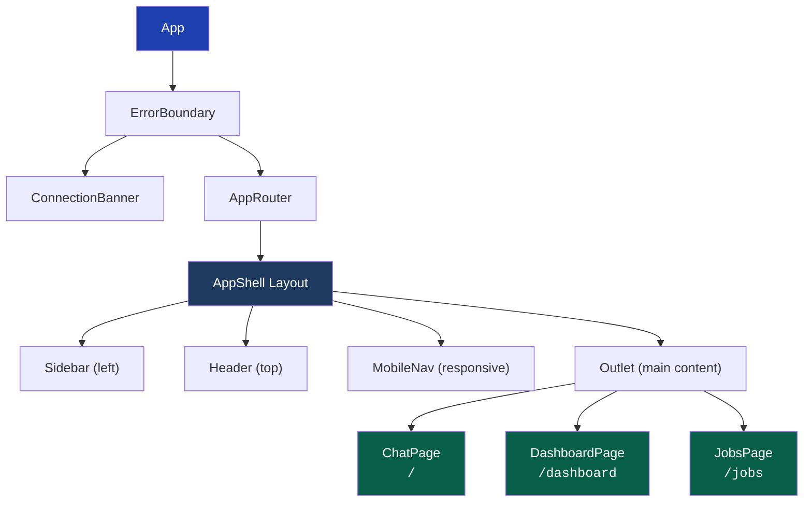
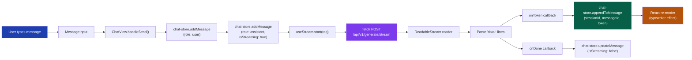
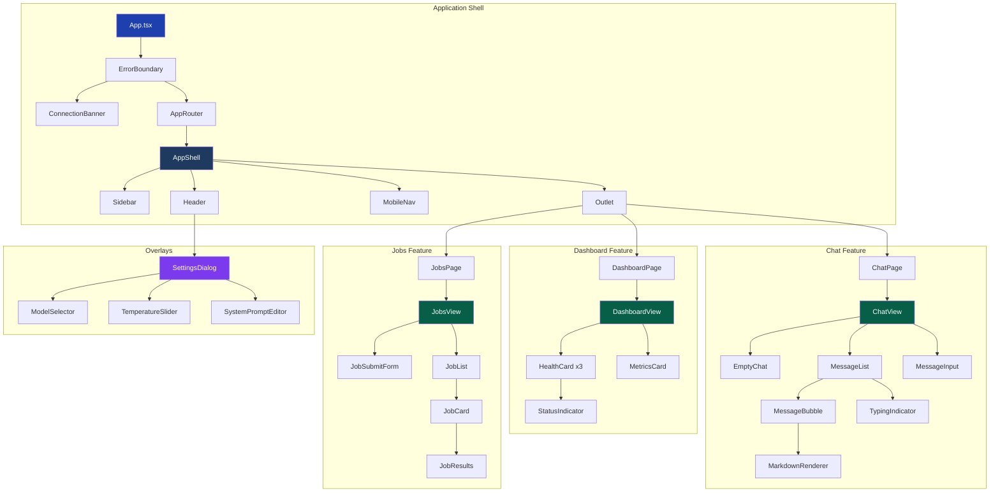
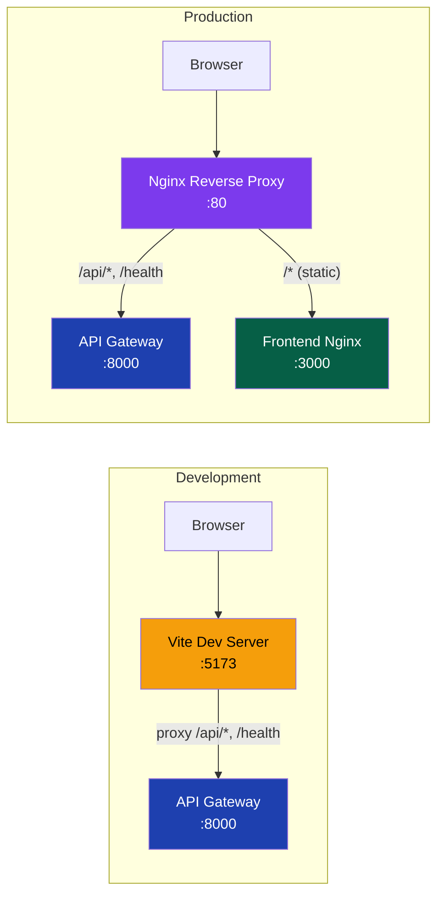

<!-- Version: v0 | Last updated: 2026-04-16 | Status: current -->

# Frontend Architecture Deep Dive -- Prodigon AI Platform React SPA

This document provides a comprehensive architectural reference for the Prodigon AI frontend, a single-page application built with React that serves as the primary user interface for the Prodigon AI platform.

---

## Table of Contents

1. [Tech Stack](#1-tech-stack)
2. [Project Structure](#2-project-structure)
3. [Routing](#3-routing)
4. [State Management (Zustand)](#4-state-management-zustand)
5. [API Client Layer](#5-api-client-layer)
6. [Streaming Architecture](#6-streaming-architecture)
7. [Component Hierarchy](#7-component-hierarchy)
8. [Styling](#8-styling)
9. [Build and Deployment](#9-build-and-deployment)
10. [Cross-references](#cross-references)

---

## 1. Tech Stack

| Layer              | Technology                          | Version | Purpose                                      |
|--------------------|-------------------------------------|---------|----------------------------------------------|
| UI Framework       | React                               | 18.3    | Component model, concurrent rendering        |
| Build Tool         | Vite                                | 5.4     | Fast HMR, optimized production builds        |
| Language           | TypeScript                          | 5.5     | Strict mode enabled for type safety          |
| Styling            | Tailwind CSS                        | 3.4     | Utility-first CSS with dark mode support     |
| State Management   | Zustand                             | 4.5     | Lightweight, hook-based global state         |
| Routing            | React Router                        | 6       | Declarative client-side routing              |
| Icons              | Lucide                              | latest  | Consistent, tree-shakable icon set           |
| Markdown           | react-markdown                      | 9       | Renders LLM output as formatted Markdown     |
| Code Highlighting  | react-syntax-highlighter            | latest  | Syntax highlighting inside Markdown blocks   |

**Why this stack:**

- **React 18.3** gives us concurrent features (Suspense, transitions) and a mature ecosystem.
- **Vite 5.4** replaces Webpack with near-instant HMR and sub-second cold starts.
- **TypeScript 5.5 strict** catches an entire class of bugs at compile time -- essential for a multi-store, multi-endpoint frontend.
- **Zustand** over Redux: minimal boilerplate, no providers needed, trivial to test. Each store is an independent unit.
- **Tailwind CSS** over CSS-in-JS: zero runtime cost, class-based dark mode toggling, design tokens via CSS custom properties.

---

## 2. Project Structure

```
frontend/src/
├── main.tsx              # BrowserRouter + App mount
├── App.tsx               # ErrorBoundary + ConnectionBanner + AppRouter
├── router.tsx            # Routes: /, /dashboard, /jobs inside AppShell
├── index.css             # Tailwind directives, CSS custom properties, animations
├── api/
│   ├── client.ts         # HttpClient class (fetch wrapper, 30s timeout, error classification)
│   ├── endpoints.ts      # api.generate, api.generateStream (AsyncGenerator), api.submitJob, api.getJob, api.health
│   └── types.ts          # TS mirrors of backend Pydantic schemas + custom error classes
├── stores/
│   ├── chat-store.ts     # Sessions, messages, active session, appendToMessage for streaming
│   ├── settings-store.ts # Theme (localStorage), model, temperature, maxTokens, systemPrompt
│   ├── health-store.ts   # Per-service health status, isConnected flag
│   └── jobs-store.ts     # Batch job list + updates
├── hooks/
│   ├── use-stream.ts     # SSE streaming lifecycle (start/stop via AbortController)
│   ├── use-health-poll.ts # Polls /health every 15s
│   ├── use-job-poll.ts   # Polls job status every 2s while pending/running
│   ├── use-theme.ts      # Syncs theme to <html class="dark">
│   ├── use-keyboard-shortcuts.ts # Global keydown handler
│   └── use-auto-scroll.ts # IntersectionObserver auto-scroll during streaming
├── components/
│   ├── chat/             # chat-view, message-list, message-bubble, message-input,
│   │                     #   empty-chat, markdown-renderer, typing-indicator
│   ├── dashboard/        # dashboard-view, health-card, metrics-card, status-indicator
│   ├── jobs/             # jobs-view, job-submit-form, job-list, job-card, job-results
│   ├── layout/           # app-shell, sidebar, header, mobile-nav
│   ├── settings/         # settings-dialog, model-selector, temperature-slider,
│   │                     #   system-prompt-editor
│   └── shared/           # error-boundary (class component), connection-banner
├── lib/
│   ├── constants.ts      # API_BASE_URL='', MODELS list, defaults, poll intervals
│   └── utils.ts          # cn() (clsx+twMerge), nanoid(), formatTime(), formatLatency(), truncate()
└── pages/
    ├── chat-page.tsx     # Ensures active session, renders ChatView
    ├── dashboard-page.tsx
    └── jobs-page.tsx
```

**Architectural rationale:**

- **`api/`** isolates all network concerns. Components never call `fetch` directly.
- **`stores/`** holds global state. Each store is self-contained with no cross-store dependencies.
- **`hooks/`** encapsulates reusable side-effect logic (polling, streaming, DOM observers).
- **`components/`** is organized by feature domain, not by component type. Each subdirectory is a self-contained feature boundary.
- **`lib/`** holds pure utility functions and constants with zero side effects.
- **`pages/`** are thin wrappers that compose feature components and connect them to stores.

---

## 3. Routing

Three pages wrapped in a shared `AppShell` layout:

| Route        | Page Component    | Purpose                                    |
|--------------|-------------------|--------------------------------------------|
| `/`          | `ChatPage`        | Interactive chat with streaming inference  |
| `/dashboard` | `DashboardPage`   | Service health monitoring and metrics      |
| `/jobs`      | `JobsPage`        | Batch job submission and status tracking   |

`AppShell` provides the persistent layout shell: a collapsible **Sidebar** on the left, a **Header** bar at the top, and a main content area rendered via React Router's `<Outlet />`.

### Route and Layout Diagram



**How it works:**

1. `App.tsx` wraps everything in an `ErrorBoundary` (catches render errors globally) and renders a `ConnectionBanner` (shown when the backend is unreachable) plus the `AppRouter`.
2. `router.tsx` defines all routes. The three page routes are nested inside `AppShell`, which means the sidebar and header persist across navigation without remounting.
3. `ChatPage` is the index route (`/`), making the chat interface the default landing page.

---

## 4. State Management (Zustand)

The frontend uses four independent Zustand stores. Each is created via `create()` and consumed as a React hook. There are no cross-store subscriptions -- stores are fully decoupled.

### 4.1 chat-store

The largest and most critical store. Manages multi-session chat state and supports token-by-token streaming updates.

**State shape:**

```typescript
interface ChatStore {
  sessions: ChatSession[];
  activeSessionId: string | null;

  // Derived
  activeSession: () => ChatSession | undefined;

  // Actions
  createSession: () => void;
  deleteSession: (id: string) => void;
  setActiveSession: (id: string) => void;
  addMessage: (sessionId: string, message: ChatMessage) => void;
  updateMessage: (sessionId: string, messageId: string, updates: Partial<ChatMessage>) => void;
  appendToMessage: (sessionId: string, messageId: string, token: string) => void;
}
```

**Data types:**

```typescript
interface ChatSession {
  id: string;           // nanoid-generated
  title: string;        // Auto-set from first user message, truncated
  createdAt: number;    // Unix timestamp
  updatedAt: number;
  messages: ChatMessage[];
}

interface ChatMessage {
  id: string;
  role: 'user' | 'assistant' | 'system';
  content: string;
  timestamp: number;
  model?: string;
  latencyMs?: number;
  isStreaming?: boolean;  // true while tokens are arriving
  error?: string;
}
```

**Key behavior:**

- `createSession()` generates a nanoid, creates a new session with a placeholder title, and prepends it to the sessions list.
- `deleteSession(id)` removes the session and auto-switches `activeSessionId` to the next available session (or `null`).
- `addMessage()` auto-titles the session from the first user message (truncated to ~40 chars).
- `appendToMessage(sessionId, messageId, token)` is the critical path for streaming. It finds the target message by ID and concatenates the incoming token string to `message.content`. This triggers a React re-render for every token, producing the typewriter effect.

### 4.2 settings-store

Manages user preferences. Theme is persisted to `localStorage`.

**State shape:**

```typescript
interface SettingsStore {
  theme: 'light' | 'dark' | 'system';
  sidebarOpen: boolean;
  model: string;
  temperature: number;
  maxTokens: number;
  systemPrompt: string;

  // Actions
  setTheme: (theme: 'light' | 'dark' | 'system') => void;
  toggleSidebar: () => void;
  setModel: (model: string) => void;
  setTemperature: (temp: number) => void;
  setMaxTokens: (tokens: number) => void;
  setSystemPrompt: (prompt: string) => void;
  resetToDefaults: () => void;
}
```

**Persistence strategy:**

- Theme is stored in `localStorage('prodigon-theme')`.
- On store initialization, the theme is read from localStorage. The `applyTheme()` function adds or removes the `dark` class on the `<html>` element to trigger Tailwind's dark mode variants.
- `resetToDefaults()` clears localStorage and resets all values to their compile-time defaults.
- Other settings (model, temperature, etc.) are session-scoped -- they reset on page refresh. This is intentional: inference parameters should not surprise users with stale values.

### 4.3 health-store

Tracks per-service health status for the dashboard.

**State shape:**

```typescript
interface HealthStore {
  services: Record<string, ServiceHealth>;
  isConnected: boolean;

  // Actions
  updateServiceHealth: (name: string, health: ServiceHealth) => void;
  setConnected: (connected: boolean) => void;
}

interface ServiceHealth {
  status: 'healthy' | 'degraded' | 'unhealthy' | 'unknown';
  responseTimeMs?: number;
  lastChecked: number;
  version?: string;
  environment?: string;
}
```

**Tracked services:** `api-gateway`, `model-service`, `worker-service`.

The `isConnected` flag is consumed by the `ConnectionBanner` component to show a global "disconnected" warning. This store is **not persisted** -- health status is inherently ephemeral.

### 4.4 jobs-store

Manages batch job state for the jobs page.

**State shape:**

```typescript
interface JobsStore {
  jobs: JobResponse[];

  // Actions
  addJob: (job: JobResponse) => void;
  updateJob: (jobId: string, updates: Partial<JobResponse>) => void;
  getJob: (jobId: string) => JobResponse | undefined;
}
```

- `addJob()` prepends new jobs (most recent first).
- `updateJob()` patches a job by ID -- used by the polling hook to update status transitions (pending -> running -> completed/failed).
- This store is **not persisted**. Jobs are server-authoritative; the frontend state is a local cache refreshed by polling.

---

## 5. API Client Layer

### 5.1 HttpClient (`client.ts`)

A singleton class wrapping the native `fetch` API with production-grade error handling.

**Features:**

- **30-second timeout** via `AbortController` + `setTimeout`. Prevents hung requests from blocking the UI indefinitely.
- **Automatic JSON serialization/deserialization** on request bodies and response payloads.
- **Error classification** -- converts raw fetch failures into typed error classes:

| Failure Mode          | Error Class        | Trigger                                      |
|-----------------------|--------------------|----------------------------------------------|
| Network unreachable   | `ConnectionError`  | `fetch` throws (DNS failure, offline, CORS)  |
| Request exceeds 30s   | `TimeoutError`     | `AbortController.abort()` fires              |
| HTTP 4xx or 5xx       | `ApiRequestError`  | Response status outside 200-299 range        |

```typescript
class HttpClient {
  async get<T>(path: string): Promise<T>;
  async post<T>(path: string, body?: unknown): Promise<T>;
}
```

**Why a custom wrapper instead of axios or ky:**

- Zero dependencies -- the native `fetch` API is available in all target browsers.
- Full control over timeout and abort behavior, which is critical for the streaming endpoint.
- The error classification layer is specific to our backend's error response format.

### 5.2 Endpoints (`endpoints.ts`)

A typed API surface that maps every backend endpoint to a strongly-typed function call.

| Function              | HTTP Method | Path                       | Returns                  |
|-----------------------|-------------|----------------------------|--------------------------|
| `api.generate(req)`   | POST        | `/api/v1/generate`         | `GenerateResponse`       |
| `api.generateStream(req, signal?)` | POST | `/api/v1/generate/stream` | `AsyncGenerator<string>` |
| `api.submitJob(req)`  | POST        | `/api/v1/jobs`             | `JobResponse`            |
| `api.getJob(jobId)`   | GET         | `/api/v1/jobs/{jobId}`     | `JobResponse`            |
| `api.health()`        | GET         | `/health`                  | `HealthResponse`         |

### 5.3 Streaming Endpoint: `api.generateStream()`

This is the most architecturally significant endpoint. It returns an `AsyncGenerator<string>` that yields individual tokens from the LLM.

**Implementation approach: `fetch` + `ReadableStream` (NOT `EventSource`)**

The SSE endpoint requires a **POST body** containing the `GenerateRequest` payload (prompt, model, temperature, etc.). The native browser `EventSource` API only supports **GET requests** -- it cannot send a request body. Therefore, we use:

1. `fetch()` with method POST to initiate the SSE connection.
2. `response.body.getReader()` to obtain a `ReadableStream` reader.
3. `TextDecoder` to convert raw bytes to UTF-8 strings.
4. Manual parsing of `data:` prefixed lines from the SSE protocol.

**SSE protocol signals:**

| Signal         | Meaning                        | Action                    |
|----------------|--------------------------------|---------------------------|
| `data: <token>`| A token fragment from the LLM  | Yield token to consumer   |
| `data: [DONE]` | Stream completed successfully  | Close the generator       |
| `data: [ERROR]`| Server-side error occurred     | Throw error, close stream |

**Cancellation:** An optional `AbortSignal` parameter allows the caller (via `useStream` hook) to cancel an in-flight stream by aborting the fetch request.

---

## 6. Streaming Architecture

Streaming is the core interactive feature. Here is the complete data flow from user input to rendered token:



### Detailed Flow

1. **User types a message** in `MessageInput` and presses Enter (or clicks Send).
2. **`ChatView.handleSend()`** orchestrates the send sequence:
   - Adds the user's message to the active session via `chat-store.addMessage(sessionId, { role: 'user', content })`.
   - Immediately adds a placeholder assistant message with `isStreaming: true` and empty content.
   - Calls `useStream.start()` with the request payload.
3. **`useStream` hook** manages the streaming lifecycle:
   - Creates a new `AbortController` for cancellation support.
   - Calls `api.generateStream(request, signal)` which returns an `AsyncGenerator<string>`.
   - Iterates the generator in a `for await...of` loop.
   - For each yielded token, invokes the `onToken` callback.
4. **`onToken` callback** calls `chat-store.appendToMessage(sessionId, messageId, token)`, which concatenates the token to the assistant message's `content` field.
5. **React re-renders** the `MessageBubble` component for the assistant message, producing the typewriter effect. The `useAutoScroll` hook keeps the message list scrolled to the bottom.
6. **When the stream completes** (generator returns), the `onDone` callback fires, which calls `chat-store.updateMessage()` to set `isStreaming: false` and record latency.
7. **On error**, the `onError` callback sets an error message on the assistant message and marks streaming as complete.
8. **On cancellation** (user clicks Stop), `useStream.stop()` calls `abort()` on the AbortController, which terminates the fetch request and closes the generator.

### Performance Considerations

- Each `appendToMessage` call triggers a Zustand state update and a React re-render. For fast token streams (50+ tokens/second), this is acceptable because React 18's automatic batching coalesces rapid state updates into fewer re-renders.
- The `useAutoScroll` hook uses `IntersectionObserver` rather than `scrollIntoView()` on every render, avoiding layout thrashing.

---

## 7. Component Hierarchy



### Component Descriptions

**Layout Components (`components/layout/`):**

- **`AppShell`** -- The persistent layout container. Renders the sidebar, header, mobile nav, and an `<Outlet />` for routed page content. The sidebar is collapsible (state in `settings-store`).
- **`Sidebar`** -- Left navigation panel. Contains session list for chat, navigation links, and a "New Chat" button. Collapses to icons on narrow viewports or when toggled.
- **`Header`** -- Top bar with the current page title, settings gear icon (opens `SettingsDialog`), and theme toggle.
- **`MobileNav`** -- Bottom navigation bar shown on mobile viewports. Replaces the sidebar on small screens.

**Chat Components (`components/chat/`):**

- **`ChatView`** -- The main chat orchestrator. Manages the send flow, coordinates `useStream`, and renders either `EmptyChat` (no messages) or `MessageList` + `MessageInput`.
- **`MessageList`** -- Renders all messages in the active session. Uses `useAutoScroll` to stay pinned to the bottom during streaming.
- **`MessageBubble`** -- A single message. User messages are right-aligned with a blue background. Assistant messages are left-aligned and rendered through `MarkdownRenderer`.
- **`MessageInput`** -- A textarea with Enter-to-send (Shift+Enter for newline), a Send button, and a Stop button (visible during streaming).
- **`EmptyChat`** -- Shown when the active session has no messages. Displays a welcome message and suggested prompts.
- **`MarkdownRenderer`** -- Wraps `react-markdown` with `react-syntax-highlighter` for code blocks. Handles headings, lists, links, inline code, and fenced code blocks with language detection.
- **`TypingIndicator`** -- An animated three-dot indicator shown while the assistant message has `isStreaming: true` and content is empty (before the first token arrives).

**Dashboard Components (`components/dashboard/`):**

- **`DashboardView`** -- Lays out three `HealthCard` components (one per service) and a `MetricsCard`.
- **`HealthCard`** -- Displays a service's health status, response time, last checked timestamp, version, and environment. Uses `StatusIndicator` for the colored dot.
- **`MetricsCard`** -- Shows aggregate metrics (total sessions, total messages, average latency).
- **`StatusIndicator`** -- A small colored circle: green (healthy), yellow (degraded), red (unhealthy), gray (unknown).

**Jobs Components (`components/jobs/`):**

- **`JobsView`** -- Contains the job submission form and the job list.
- **`JobSubmitForm`** -- Form fields for batch job parameters (input text list, model, processing type). Submits via `api.submitJob()`.
- **`JobList`** -- Renders all jobs from `jobs-store`, sorted newest first.
- **`JobCard`** -- Displays job ID, status, progress bar (for running jobs), timestamps. Expandable to show `JobResults`.
- **`JobResults`** -- Shows completed job output (generated texts, processing time, token counts).

**Settings Components (`components/settings/`):**

- **`SettingsDialog`** -- A modal dialog opened from the Header. Contains all settings controls.
- **`ModelSelector`** -- Dropdown to choose the LLM model (populated from `constants.MODELS`).
- **`TemperatureSlider`** -- Range slider for inference temperature (0.0 to 2.0).
- **`SystemPromptEditor`** -- Textarea for the system prompt sent with every request.

**Shared Components (`components/shared/`):**

- **`ErrorBoundary`** -- A React class component (required for `componentDidCatch`). Wraps the entire app. On unhandled render errors, displays a fallback UI with a "Reload" button instead of a white screen.
- **`ConnectionBanner`** -- A fixed-position banner at the top of the viewport. Shown when `health-store.isConnected` is `false`. Displays "Unable to connect to server" with a pulsing animation.

---

## 8. Styling

### Design System

The frontend uses **Tailwind CSS 3.4** with a custom design token system built on CSS custom properties.

**Dark mode strategy:** Class-based dark mode (`darkMode: 'class'` in Tailwind config). The `<html>` element receives a `dark` class, which activates Tailwind's `dark:` variants. This is toggled by the `useTheme` hook based on the `settings-store.theme` value.

### Color Tokens

HSL-based design tokens are defined as CSS custom properties in `index.css`:

```css
:root {
  --background: 0 0% 100%;
  --foreground: 222.2 84% 4.9%;
  --card: 0 0% 100%;
  --card-foreground: 222.2 84% 4.9%;
  --popover: 0 0% 100%;
  --popover-foreground: 222.2 84% 4.9%;
  --primary: 221.2 83.2% 53.3%;
  --primary-foreground: 210 40% 98%;
  --destructive: 0 84.2% 60.2%;
  --muted: 210 40% 96.1%;
  --muted-foreground: 215.4 16.3% 46.9%;
  /* ... additional tokens ... */
}

.dark {
  --background: 222.2 84% 4.9%;
  --foreground: 210 40% 98%;
  --primary: 217.2 91.2% 59.8%;
  /* ... dark overrides ... */
}
```

This approach allows the entire color scheme to change by toggling the `.dark` class, without rewriting any component styles.

### Custom Animations

- **`bounce-dot`** -- A CSS keyframe animation used by `TypingIndicator`. Three dots bounce in sequence with staggered `animation-delay` values.
- **Scrollbar styling** -- Custom webkit scrollbar pseudo-elements for a thinner, themed scrollbar in the chat message list.

### Utility: `cn()`

```typescript
import { clsx, type ClassValue } from 'clsx';
import { twMerge } from 'tailwind-merge';

export function cn(...inputs: ClassValue[]) {
  return twMerge(clsx(inputs));
}
```

This utility merges Tailwind classes intelligently. When two conflicting classes are passed (e.g., `p-4` and `p-2`), `tailwind-merge` resolves the conflict by keeping only the last one, preventing broken layouts from class duplication.

---

## 9. Build and Deployment

### Development

```bash
cd frontend
npm install
npm run dev
```

- Vite starts a dev server on **port 5173** with Hot Module Replacement (HMR).
- The Vite config includes a **proxy** that forwards `/api/*` and `/health` requests to `http://localhost:8000` (the API Gateway). This eliminates CORS issues during local development.
- `API_BASE_URL` is set to `''` (empty string) in constants, so all API calls use relative URLs that work transparently with the proxy.

### Production Build

Multi-stage Docker build for minimal image size:

**Stage 1 -- Build (node:20-alpine):**
```dockerfile
FROM node:20-alpine AS builder
WORKDIR /app
COPY package*.json ./
RUN npm ci
COPY . .
RUN npm run build
```

**Stage 2 -- Serve (nginx:1.27-alpine):**
```dockerfile
FROM nginx:1.27-alpine
COPY --from=builder /app/dist /usr/share/nginx/html
COPY nginx.conf /etc/nginx/conf.d/default.conf
```

The frontend nginx config handles:

- **SPA routing:** `try_files $uri $uri/ /index.html` -- all unknown paths serve `index.html`, letting React Router handle client-side routing.
- **Gzip compression:** Enabled for text, CSS, JS, JSON, and SVG.
- **Asset caching:** 1-year `Cache-Control` on hashed assets (Vite adds content hashes to filenames, so cache invalidation is automatic).
- **Security headers:** `X-Frame-Options: DENY`, `X-Content-Type-Options: nosniff`, `Referrer-Policy: strict-origin-when-cross-origin`.

### Network Topology



**Development path:** The browser connects to Vite on `:5173`. Vite serves the React app with HMR and proxies API requests to the Gateway on `:8000`.

**Production path:** The browser connects to Nginx on `:80`. Nginx routes `/api/*` requests to the API Gateway on `:8000` and serves all other paths from the frontend static build on `:3000`.

---

## Cross-references

- [API Reference](api-reference.md) -- Backend endpoint specifications, request/response schemas
- [Data Flow](data-flow.md) -- End-to-end request flow through all services
- [System Overview](system-overview.md) -- High-level architecture, service boundaries, infrastructure
