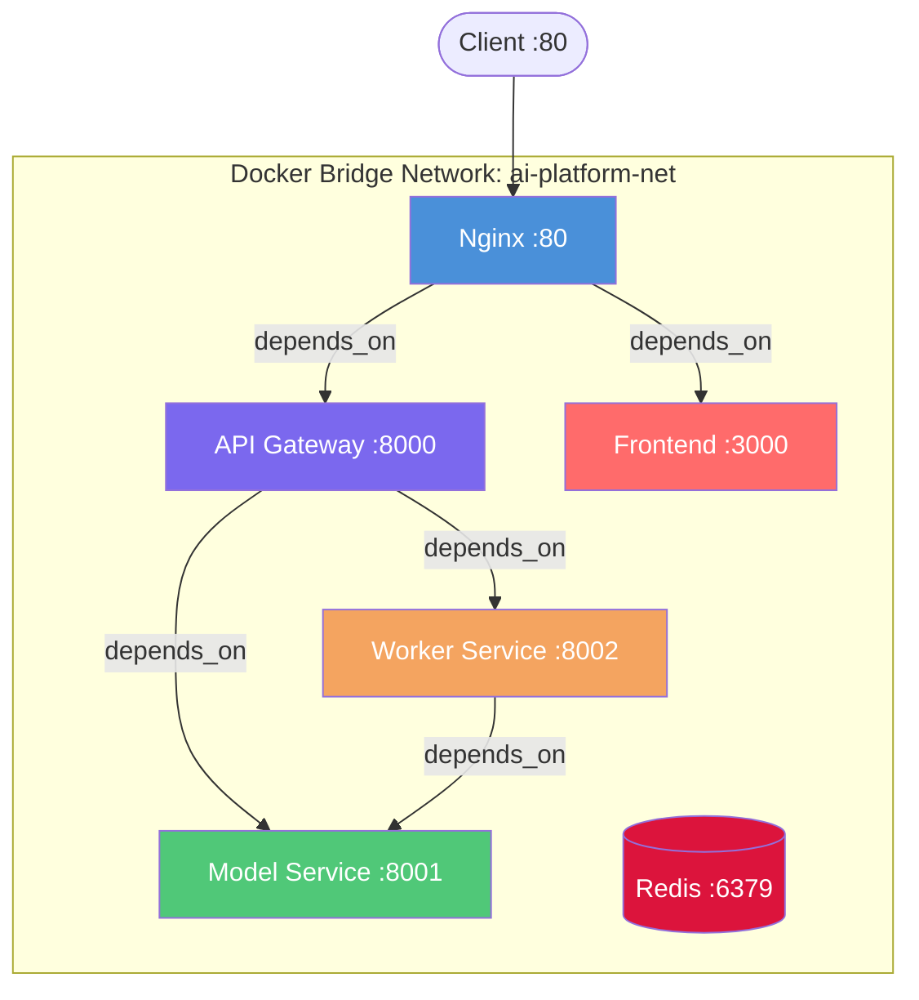
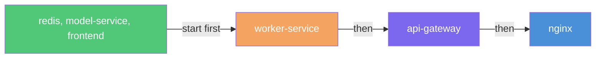
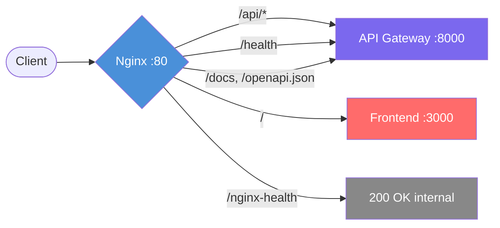
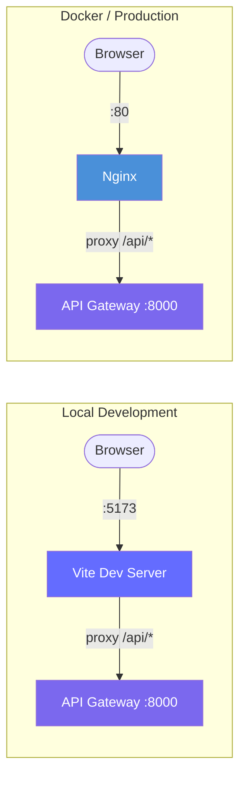

<!-- Version: v0 | Last updated: 2026-04-16 | Status: current -->

# Infrastructure & Deployment

This document covers Docker containerization, Nginx reverse proxy configuration, networking topology, and deployment modes for the Prodigon platform.

---

## 1. Deployment Modes

Prodigon supports four deployment configurations depending on your development needs:

| Mode | Command | What Runs | Ports | Best For |
|------|---------|-----------|-------|----------|
| Local backend only | `source venv/Scripts/activate && make run` | 3 uvicorn processes | 8000, 8001, 8002 | Backend development |
| Local frontend only | `cd frontend && npm run dev` | Vite dev server | 5173 (proxies to 8000) | Frontend development |
| Local full stack | Both above in separate terminals | Backend + Vite | 8000-8002, 5173 | Full-stack development |
| Docker Compose | `make run-docker` | All services + nginx + redis | 80, 3000, 8000-8002, 6379 | Integration testing, demos |

**Choosing a mode:** During active development, use local mode for fast iteration (no container rebuild needed). Use Docker Compose when testing service-to-service communication, nginx routing, or preparing for demos.

---

## 2. Docker Architecture

### Build Contexts

Each service has its own Dockerfile, but build contexts are set relative to `baseline/docker-compose.yml`:

| Service | Build Context | Dockerfile Path |
|---------|--------------|-----------------|
| api-gateway | `baseline/` (`.`) | `api_gateway/Dockerfile` |
| model-service | `baseline/` (`.`) | `model_service/Dockerfile` |
| worker-service | `baseline/` (`.`) | `worker_service/Dockerfile` |
| frontend | `../frontend` | `Dockerfile` |
| nginx | `baseline/infra/` (`./infra`) | `Dockerfile.nginx` |
| redis | N/A (uses image directly) | N/A |

### Backend Service Dockerfiles

All three backend services (`api_gateway`, `model_service`, `worker_service`) follow the same pattern:

```dockerfile
# Base image
FROM python:3.11-slim

WORKDIR /app

# Step 1: Copy and install dependencies first (layer caching)
COPY requirements.txt .
RUN pip install --no-cache-dir -r requirements.txt

# Step 2: Copy shared utilities module
COPY shared/ ./shared/

# Step 3: Copy service-specific code
COPY {service_name}/ ./{service_name}/

# Step 4: Expose service port
EXPOSE {port}

# Step 5: Run with uvicorn
CMD ["uvicorn", "{service_name}.app.main:app", "--host", "0.0.0.0", "--port", "{port}"]
```

**Why this layer order matters:** Docker caches each layer. By copying `requirements.txt` before the source code, dependency installation is cached and only re-runs when dependencies change -- not on every code edit. This dramatically speeds up rebuilds during development.

Files:
- `baseline/api_gateway/Dockerfile` -- exposes **8000**
- `baseline/model_service/Dockerfile` -- exposes **8001**
- `baseline/worker_service/Dockerfile` -- exposes **8002**

### Frontend Dockerfile (Multi-Stage)

The frontend uses a two-stage build to produce a minimal production image:

```dockerfile
# Stage 1 -- Builder
FROM node:20-alpine AS builder
WORKDIR /app
COPY package.json package-lock.json ./
RUN npm ci                    # Deterministic install from lockfile
COPY . .
RUN npm run build             # Outputs to /app/dist

# Stage 2 -- Server
FROM nginx:1.27-alpine
COPY --from=builder /app/dist /usr/share/nginx/html
COPY nginx.conf /etc/nginx/conf.d/default.conf
EXPOSE 3000
CMD ["nginx", "-g", "daemon off;"]
```

**Why multi-stage?** The builder stage includes Node.js, npm, and all dev dependencies (~500MB+). The final image only contains nginx and the compiled static assets (~30MB). This reduces image size by ~95% and eliminates dev tooling from production.

### Nginx Reverse Proxy Dockerfile

File: `baseline/infra/Dockerfile.nginx`

```dockerfile
FROM nginx:1.27-alpine
COPY nginx/nginx.conf /etc/nginx/conf.d/default.conf
EXPOSE 80
```

This is the platform-level reverse proxy that routes traffic between the API gateway and the frontend.

---

## 3. Docker Compose Topology

Defined in `baseline/docker-compose.yml`. All services communicate over a shared bridge network.

### Service Dependency Graph



### Service Definitions

| # | Service | Port Mapping | Build / Image | Key Environment Variables | Depends On |
|---|---------|-------------|---------------|--------------------------|------------|
| 1 | **nginx** | 80:80 | `./infra/Dockerfile.nginx` | -- | api-gateway, frontend |
| 2 | **api-gateway** | 8000:8000 | `./api_gateway/Dockerfile` | `MODEL_SERVICE_URL=http://model-service:8001`, `WORKER_SERVICE_URL=http://worker-service:8002` | model-service, worker-service |
| 3 | **model-service** | 8001:8001 | `./model_service/Dockerfile` | `GROQ_API_KEY` (from .env) | -- |
| 4 | **worker-service** | 8002:8002 | `./worker_service/Dockerfile` | `MODEL_SERVICE_URL=http://model-service:8001` | model-service |
| 5 | **frontend** | 3000:3000 | `../frontend/Dockerfile` | -- | -- |
| 6 | **redis** | 6379:6379 | `redis:7-alpine` | -- | -- |

### Networking

- **Network:** `ai-platform-net` (bridge driver)
- **DNS Resolution:** Docker's built-in DNS resolves service names automatically. For example, `api-gateway` can reach the model service at `http://model-service:8001` without any manual network configuration.
- **Environment:** All services read from `env_file: ../.env` (the root `.env` file)

### Startup Order



Note: `depends_on` only controls startup **order**, not readiness. Services should implement health checks and retry logic for robustness.

---

## 4. Nginx Reverse Proxy Configuration

File: `baseline/infra/nginx/nginx.conf`

This is the platform-level nginx that sits in front of all services in the Docker Compose deployment.

### Upstream Blocks

```nginx
upstream api_gateway {
    server api-gateway:8000;
}

upstream frontend {
    server frontend:3000;
}
```

### Routing Rules



| Location | Target | Special Configuration |
|----------|--------|-----------------------|
| `/api/` | `api_gateway` (port 8000) | SSE support: `proxy_buffering off`, `proxy_cache off`, `proxy_http_version 1.1`, `Connection ''`. Timeouts: connect 10s, read/send 60s. Headers: `X-Real-IP`, `X-Forwarded-For`, `X-Forwarded-Proto`, `X-Request-ID` |
| `/health` | `api_gateway` (port 8000) | Standard proxy pass |
| `/docs`, `/openapi.json` | `api_gateway` (port 8000) | API documentation (Swagger UI + OpenAPI spec) |
| `/` | `frontend` (port 3000) | WebSocket upgrade support for Vite HMR |
| `/nginx-health` | Internal | Returns `200 "healthy"` (for orchestrator health checks) |

### SSE-Specific Configuration Explained

The `/api/` location block includes special configuration for Server-Sent Events (SSE), which is how the streaming inference endpoint delivers tokens to the client:

| Directive | Purpose |
|-----------|---------|
| `proxy_buffering off` | Prevents nginx from buffering SSE events. Without this, nginx collects response data before forwarding, which would delay token delivery and defeat the purpose of streaming. |
| `proxy_cache off` | SSE responses are unique per-request streams. Caching them would return stale or incorrect data to subsequent clients. |
| `proxy_http_version 1.1` | Required for HTTP keep-alive connections. SSE relies on a long-lived connection that stays open while tokens stream. HTTP/1.0 closes after each response. |
| `proxy_set_header Connection ''` | Clears the `Connection: close` header that nginx adds by default. Without this, nginx would terminate the connection after the first chunk of data, cutting off the stream. |

**Timeouts:**
- `proxy_connect_timeout 10s` -- max time to establish connection to upstream
- `proxy_read_timeout 60s` -- max time between successive reads from upstream (generous for LLM inference)
- `proxy_send_timeout 60s` -- max time between successive writes to upstream

**Forwarded Headers:**
- `X-Real-IP` -- client's actual IP (not nginx's)
- `X-Forwarded-For` -- full proxy chain
- `X-Forwarded-Proto` -- original protocol (http/https)
- `X-Request-ID` -- request tracing identifier

---

## 5. Frontend Nginx Configuration

File: `frontend/nginx.conf`

This is the nginx instance **inside** the frontend Docker container that serves the built React/Vite static assets. It is separate from the platform-level reverse proxy.

### Key Configuration

| Feature | Configuration | Purpose |
|---------|--------------|---------|
| **Listen port** | `3000` | Internal container port, mapped to host via docker-compose |
| **Static files** | Served from `/usr/share/nginx/html` | Output of `npm run build` |
| **SPA routing** | `try_files $uri $uri/ /index.html` | All unknown routes fall back to `index.html` for client-side routing. Without this, refreshing on `/chat` would return a 404 since no `chat` file exists on disk. |
| **Gzip compression** | Enabled for `text/html`, `text/css`, `application/javascript`, `application/json`, `image/svg+xml` | Reduces transfer size by 60-80% for text-based assets |
| **Asset caching** | `/assets/*` gets `expires 1y` | Vite hashes filenames on build (e.g., `index-a1b2c3.js`), so long cache is safe -- any code change produces a new filename, busting the cache automatically |

### Security Headers

| Header | Value | Purpose |
|--------|-------|---------|
| `X-Frame-Options` | `SAMEORIGIN` | Prevents clickjacking by blocking the page from being embedded in iframes on other domains |
| `X-Content-Type-Options` | `nosniff` | Prevents browsers from MIME-sniffing responses away from the declared Content-Type |
| `Referrer-Policy` | `strict-origin-when-cross-origin` | Limits referrer information sent to external sites (origin only, no path) |

---

## 6. Vite Dev Server Proxy

File: `frontend/vite.config.ts`

In local development, the Vite dev server on `:5173` proxies API requests to the backend:

```typescript
server: {
  port: 5173,
  proxy: {
    '/api': {
      target: 'http://localhost:8000',   // API Gateway
      changeOrigin: true,
    },
    '/health': {
      target: 'http://localhost:8000',
      changeOrigin: true,
    },
  },
}
```

### Why This Matters

The frontend code uses **relative URLs** for all API calls (`API_BASE_URL = ''`). This means:
- In **development**: `fetch('/api/v1/generate')` hits Vite at `:5173`, which proxies to the API Gateway at `:8000`
- In **Docker/production**: `fetch('/api/v1/generate')` hits nginx at `:80`, which proxies to the API Gateway at `:8000`

The frontend code is identical in both environments. No conditional URL logic, no environment-specific API base URLs.



---

## 7. Port Map

| Service | Local Dev Port | Docker Port | Protocol | Notes |
|---------|---------------|-------------|----------|-------|
| Nginx reverse proxy | N/A | 80 | HTTP | Only runs in Docker |
| API Gateway | 8000 | 8000 | HTTP | Entry point for all API requests |
| Model Service | 8001 | 8001 | HTTP | Internal service; handles LLM inference |
| Worker Service | 8002 | 8002 | HTTP | Internal service; handles async/batch jobs |
| Frontend (Vite dev) | 5173 | N/A | HTTP | Only runs locally; HMR enabled |
| Frontend (nginx prod) | N/A | 3000 | HTTP | Only runs in Docker |
| Redis | N/A | 6379 | TCP | Stub for Task 8 (caching layer) |

### Port Conflict Troubleshooting

If a port is already in use:
- **Windows:** `netstat -ano | findstr :{port}` to find the process, then `taskkill /PID {pid} /F`
- **Linux/Mac:** `lsof -i :{port}` to find the process, then `kill {pid}`

---

## 8. Environment Configuration

Files: `.env.example` (root) and `baseline/.env.example`

### Variable Reference

| Variable | Default | Description |
|----------|---------|-------------|
| `ENVIRONMENT` | `development` | `"development"` or `"production"` |
| `LOG_LEVEL` | `INFO` | Python logging level (`DEBUG`, `INFO`, `WARNING`, `ERROR`) |
| `GROQ_API_KEY` | *(required)* | Groq API key for LLM inference |
| `USE_MOCK` | `false` | Use `MockGroqClient` instead of real API (for testing without API key) |
| `DEFAULT_MODEL` | `llama-3.3-70b-versatile` | Primary model for inference |
| `MAX_TOKENS` | `1024` | Default max tokens per generation |
| `TEMPERATURE` | `0.7` | Default sampling temperature (0.0 = deterministic, 1.0 = creative) |
| `MODEL_SERVICE_URL` | `http://localhost:8001` | Docker override: `http://model-service:8001` |
| `WORKER_SERVICE_URL` | `http://localhost:8002` | Docker override: `http://worker-service:8002` |
| `QUEUE_TYPE` | `memory` | `"memory"` (in-process) or `"redis"` (distributed) |
| `REDIS_URL` | `redis://localhost:6379/0` | Docker override: `redis://redis:6379/0` |
| `ALLOWED_ORIGINS` | `http://localhost:3000,http://localhost:8000,http://localhost:5173,http://localhost:80` | CORS allowed origins (comma-separated) |

### Docker vs Local URLs

When running locally, services communicate via `localhost`:

```
API Gateway --> http://localhost:8001 (Model Service)
API Gateway --> http://localhost:8002 (Worker Service)
```

In Docker, the `docker-compose.yml` overrides these with Docker DNS names via environment variables:

```
API Gateway --> http://model-service:8001 (Model Service)
API Gateway --> http://worker-service:8002 (Worker Service)
Worker       --> http://model-service:8001 (Model Service)
Redis        --> redis://redis:6379/0
```

This is handled transparently -- the same application code reads from environment variables, and docker-compose sets the correct values for the containerized environment.

### Setup Steps

1. Copy the example file: `cp .env.example .env`
2. Set your Groq API key: edit `.env` and fill in `GROQ_API_KEY`
3. (Optional) Adjust model settings, log level, or toggle mock mode
4. For Docker: no additional changes needed; docker-compose overrides service URLs automatically

---

## Cross-References

- [Getting Started](getting-started.md) -- Setup instructions and first run
- [System Overview](system-overview.md) -- High-level architecture and request flow
- [Backend Architecture](backend-architecture.md) -- Service internals, endpoints, and design patterns
- [Frontend Architecture](frontend-architecture.md) -- React app structure and API integration
