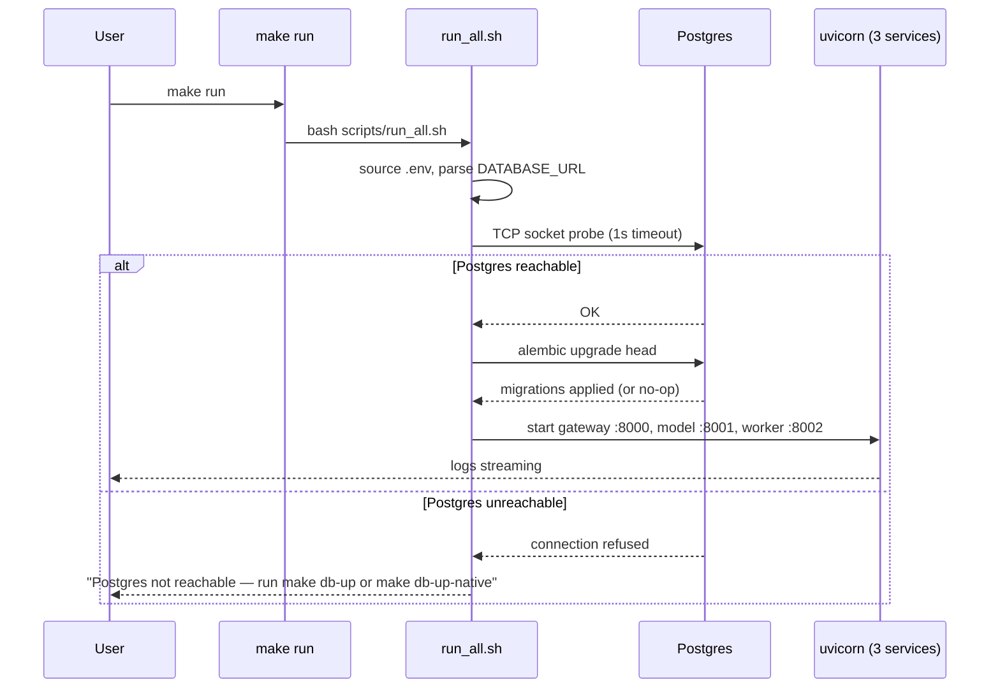
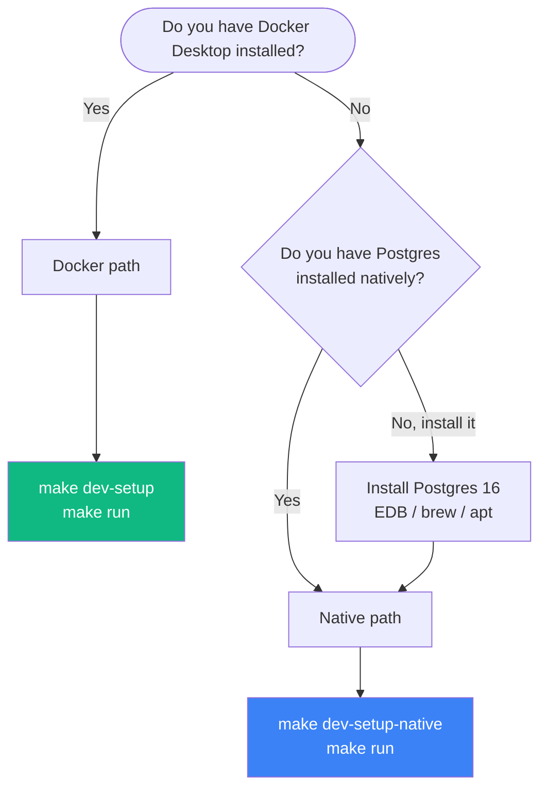

# Lesson 0.1 — Getting Started: Dev Environment Walkthrough

> **Goal:** from a fresh `git clone` to a running 3-service stack + Postgres + frontend in under 15 minutes, with every health check green.

## Why this lesson exists

The rest of Part 0 (and all of Part I–III) assumes a running baseline. If `make run` doesn't work, nothing works. This lesson walks you through every moving piece of the dev environment so that when something breaks later — a migration, a stale `.env`, a port collision — you know exactly where to look.

## Level 1 — Beginner (intuition)

The Prodigon baseline is **three Python services, one Postgres database, and one React frontend** that all talk to each other over HTTP on your machine.

```
┌──────────────┐   ┌──────────────┐   ┌──────────────┐   ┌──────────────┐
│  Frontend    │──▶│ API Gateway  │──▶│Model Service │──▶│  Groq API    │
│   :5173      │   │    :8000     │   │    :8001     │   │  (cloud)     │
└──────────────┘   └──────┬───────┘   └──────────────┘   └──────────────┘
                          │
                          ├──▶ ┌──────────────┐
                          │    │Worker Service│
                          │    │    :8002     │
                          │    └──────┬───────┘
                          │           │
                          ▼           ▼
                    ┌──────────────────────┐
                    │  Postgres :5432      │
                    │  chat + jobs + users │
                    └──────────────────────┘
```

You don't need to understand every arrow yet. You just need all five boxes to be alive.

There are **two tools** that do all the orchestration:

- **`make`** — one-word commands wired up in the `Makefile` (e.g., `make run`, `make db-up`, `make health`). Read the Makefile once; you'll use 4–5 targets 95% of the time.
- **`.env`** — a plain text file of configuration (Groq API key, database URL, CORS origins). Copied from `.env.example` by `scripts/setup.sh`.

The happy path is:

```bash
bash scripts/setup.sh                # Python deps + .env
source venv/Scripts/activate         # (Windows Git Bash) activate the venv
# edit .env to set GROQ_API_KEY, or set USE_MOCK=true
make db-up-native                    # bootstrap Postgres (native install)
make db-migrate                      # apply Alembic migrations
make run                             # starts gateway + model + worker
# in another terminal:
cd frontend && npm install && npm run dev
```

Open `http://localhost:5173`. Done.

## Level 2 — Intermediate (what each piece actually does)

### The `Makefile` — your control panel

The Makefile groups commands into three categories:

| Category | Targets | What they do |
|---|---|---|
| **Setup** | `setup`, `dev-setup`, `dev-setup-native` | Install Python deps, create `.env`, optionally orchestrate DB + migrate |
| **Database** | `db-up`, `db-up-native`, `db-down`, `db-migrate`, `db-revision` | Start/stop Postgres (Docker or native), apply Alembic migrations |
| **Run** | `run`, `run-docker`, `run-gateway`, `run-model`, `run-worker`, `run-frontend` | Start one or all services |
| **Quality** | `test`, `lint`, `health`, `clean` | Pytest, ruff, health checks, wipe caches |

Read `Makefile` top to bottom — every target has a `## Short description` comment that shows up in `make help`. That one-liner is your index.

### Two Postgres paths

You pick one, you do **not** use both at once:

| | Docker path | Native path |
|---|---|---|
| **When to use** | You have Docker Desktop installed and prefer containers | You have Postgres installed via Homebrew / apt / EDB installer |
| **Start DB** | `make db-up` | `make db-up-native` |
| **What it does** | Runs `postgres:16-alpine` from `baseline/docker-compose.yml` | Runs `psql -f scripts/db_bootstrap.sql` against your local Postgres to create the `prodigon` role + db |
| **Stop DB** | `make db-down` | Your OS service manager (`brew services stop`, `net stop`, etc.) |
| **Data lives** | Named Docker volume `postgres-data` | Your Postgres data directory |

Both paths end with `make db-migrate` to apply Alembic migrations and create the tables.

### `scripts/run_all.sh` — what happens when you `make run`

`make run` delegates to this shell script, which:

1. **Parses `DATABASE_URL`** from `.env` and extracts host/port
2. **Opens a TCP socket** to verify Postgres is reachable — fails fast with an actionable hint (`make db-up` / `make db-up-native`) if not
3. **Runs `alembic upgrade head`** (idempotent at head — safe to run every boot)
4. **Starts the three uvicorn servers** in the background and wires up a cleanup trap

The preflight step is load-bearing: without it, you'd get cryptic 500s on the first request to `/api/v1/chat/sessions` instead of a "Postgres not reachable" message before the server even boots.

### `.env` — what matters

Open `.env` after `scripts/setup.sh` runs. The fields that matter:

```
GROQ_API_KEY=your-key-here              # get one at console.groq.com, or USE_MOCK=true
USE_MOCK=false                          # true = fake LLM responses, no API key needed
DATABASE_URL=postgresql+asyncpg://...   # prefilled default works out of the box
QUEUE_TYPE=postgres                     # postgres (durable) or memory (tests only)
ALLOWED_ORIGINS=http://localhost:5173,http://localhost:3000
LOG_LEVEL=INFO
```

Everything else has sensible defaults.

## Level 3 — Advanced (what a senior engineer notices)

### The preflight pattern

`scripts/run_all.sh` embodies a **fail-fast pattern**: validate your environment before starting any long-running process. In production, the equivalent is the Kubernetes readiness probe + liveness probe split:

- **Readiness probe** — can this pod accept traffic right now? (Equivalent: the Postgres TCP socket check in `run_all.sh`)
- **Liveness probe** — is this pod healthy long-term? (Equivalent: `make health` hitting `/health` on each service)

Teaching detail: the TCP socket check uses Python with a 1-second timeout instead of `pg_isready` because `pg_isready` isn't guaranteed to be in `PATH` on fresh Windows installs. The check has to work on every platform an attendee might bring to the workshop.

### Idempotent migrations on every boot

`alembic upgrade head` runs every time `make run` or the gateway container starts. This is safe because Alembic tracks applied revisions in the `alembic_version` table — running `upgrade head` when already at head is a no-op.

The trade-off: a small startup-time cost (usually <100ms for an empty migration set) in exchange for **eliminating an entire class of bugs** where someone forgets to migrate and the schema silently drifts.

In production, you'd extract migrations into a dedicated init container or a pre-deploy step — but for dev, boot-time migration is the right call.

### Two configuration anchors: `.env` + `settings.py`

Every service has its own `config.py` that extends a Pydantic `BaseSettings` class. The `.env` file populates those settings at startup, and `BaseSettings` validates each field (type coerces, required-field errors). If `DATABASE_URL` is missing or malformed, the service **refuses to boot** with a clear error — not a mysterious 500 on the first request.

This is the same pattern used in production systems that pull config from AWS Parameter Store, Kubernetes ConfigMaps, or HashiCorp Vault: one source of truth (the `.env` here, Vault there), one validation layer (Pydantic), one point of failure (startup).

## Diagrams

### Startup sequence



### Decision tree — which path to pick



## What you'll build in the lab

The `lab/` directory walks you through a fresh-clone simulation:

1. Install dependencies
2. Bootstrap Postgres (pick your path)
3. Apply migrations
4. Start services
5. Hit the API with `curl`
6. Open the frontend and create a chat session
7. Run `verify.py` to confirm everything is wired correctly

**Full lab with `starter/` + `solution/`** — the starter contains a skeleton walkthrough script and an incomplete verify.py; the solution contains a finished, automated version.

## What's next

Once your stack is running and `make health` is green, move on to **[Lesson 0.2 — System Architecture Tour](../task02_system_architecture/README.md)** to build the mental model of what you just started.

## References

- `Makefile` — all `make` targets
- `scripts/setup.sh` — Python deps + `.env` creation + optional migration
- `scripts/run_all.sh` — Postgres preflight + migrate + uvicorn launch
- `scripts/check_health.sh` — what `make health` runs
- `scripts/db_bootstrap.sql` — native Postgres role/db creation
- `.env.example` — template for your `.env`
- `architecture/getting-started.md` — the long-form version of this lesson
