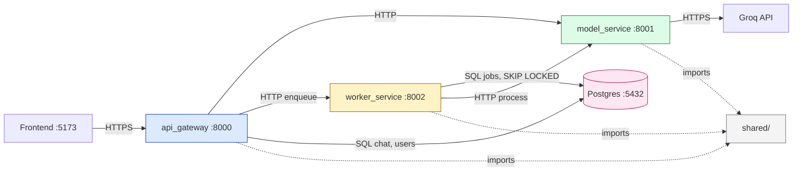

# Lesson 0.2 — System Architecture Tour

> **Goal:** build a working mental model of the Prodigon baseline — the three services, the shared module, and the network hops between them — before we refactor any of it.

## Why this lesson exists

In Lesson 0.1 you booted the stack. You saw five green boxes: `frontend`, `api-gateway`, `model-service`, `worker-service`, and `postgres`. This lesson answers the obvious follow-up questions:

- **Why three backend services instead of one app?**
- **What lives in `shared/`, and why can every service import it?**
- **When gateway calls model-service, what actually happens on the wire?**

If you can answer those three questions at the end of this lesson, you're ready for Lesson 0.3 (dependency injection) and Lesson 0.4 (full request flows).

## Level 1 — Beginner (intuition)

The Prodigon backend is split into **three services that do very different jobs**, plus one shared code library that all of them import.

```
┌────────────────┐   HTTP   ┌──────────────────┐   HTTP   ┌────────────────┐
│  api_gateway   │ ───────▶ │  model_service   │ ───────▶ │    Groq API    │
│     :8000      │          │      :8001       │          │     (cloud)    │
│  public API    │          │  inference +     │          └────────────────┘
│  auth, CORS,   │          │  cache + retries │
│  orchestration │          └──────────────────┘
└───────┬────────┘
        │ HTTP (enqueue)
        ▼
┌────────────────┐          ┌──────────────────┐
│ worker_service │ ────────▶│   Postgres       │
│     :8002      │  writes  │    :5432         │
│  batch / async │  jobs    │  chat, users,    │
│  polling loop  │◀─────────│  jobs, queue     │
└────────────────┘  dequeue │                  │
                            └──────────────────┘
```

Think of it like a restaurant:

- **`api_gateway`** is the host stand — it meets every guest, checks the reservation, and routes them to the right table.
- **`model_service`** is the kitchen — it doesn't talk to guests directly. It takes structured tickets (Groq API calls) and produces output.
- **`worker_service`** is catering — the back kitchen that handles large orders asynchronously while the main kitchen keeps serving walk-ins.
- **`shared/`** is the recipe book — every station uses the same measurements, the same plating standards, the same allergen codes.
- **Postgres** is the walk-in fridge — everyone reads from it, and the caterer uses it as a ticket board.

You don't need to memorize which service owns which endpoint yet. You just need to see that **different concerns live in different processes**, and that gives you three knobs to turn independently: scaling, failure isolation, and deployment.

### The port map (memorize this)

| Port | Service | Role |
|---:|---|---|
| 5173 | frontend (Vite) | React dev server |
| 8000 | api_gateway | Public HTTP API |
| 8001 | model_service | Internal inference API |
| 8002 | worker_service | Internal job API + background loop |
| 5432 | Postgres | Data + durable job queue |

The gateway is the **only** service the frontend calls. 8001 and 8002 are internal — in production they would live behind a private network and never be exposed to the internet.

## Level 2 — Intermediate (how the baseline wires it)

### The three services, concretely

**`baseline/api_gateway/`** — the single public entry point.

Routes live under `app/routes/`:

- `health.py` — `/health` returns `{status: "ok"}` (used by `make health` and by K8s readiness probes in production).
- `generate.py` — `POST /api/v1/generate` (sync text gen) and `POST /api/v1/generate/stream` (SSE streaming). Both proxy to `model_service`.
- `chat.py` — chat session CRUD. Writes directly to Postgres via SQLAlchemy; **does not** call model_service — the frontend calls `/generate/stream` separately to get an assistant reply, then persists it back through `chat`.
- `jobs.py` — `POST /api/v1/jobs` and `GET /api/v1/jobs/{id}`. Proxies to `worker_service`.
- `workshop.py` — a diagnostic/debug surface used in later lessons.

Notice what the gateway **doesn't** do: it never calls Groq directly, it never runs inference, it never pops jobs from the queue. It validates, authenticates, and routes — that's the API Gateway pattern.

**`baseline/model_service/`** — encapsulates everything Groq-related.

- `main.py` — FastAPI app, lifespan hooks that warm the cache and open the HTTP pool to Groq.
- `routes/inference.py` — `POST /inference` (sync) and `POST /inference/stream` (SSE from Groq). No authentication on these routes because they're private — if someone can reach `:8001`, they're already inside the trust boundary.
- `services/` — the model adapter, response cache, retry/backoff logic, and token accounting.

Why separate? **Because Groq-specific code shouldn't leak into the gateway.** If you swap Groq for OpenAI tomorrow, you change files in `model_service/` only. The gateway's contract (`POST /inference` returning a `GenerateResponse`) doesn't move.

**`baseline/worker_service/`** — async and batch.

Two things live here in the same process:

1. **An HTTP API** (`app/routes/jobs.py`) that `api_gateway` calls to enqueue a job. The enqueue writes a row to the `batch_jobs` table and returns `{job_id, status: "pending"}` immediately (HTTP 202).
2. **A polling loop** (`app/worker.py`) that wakes every second, issues a `SELECT ... FOR UPDATE SKIP LOCKED` query against `batch_jobs`, claims one row, and calls `model_service` to process it.

`SKIP LOCKED` is the important bit: if you scale the worker to N replicas, each `dequeue()` call atomically picks a different row. No two workers process the same job. We get competing-consumers semantics out of plain Postgres — no Redis, no Kafka, no broker to operate.

### What lives in `shared/`

`baseline/shared/` is a plain Python package that every service imports. It contains exactly the things that would be **duplicated and drift** if each service copied them:

| File | What it is | Why it's shared |
|---|---|---|
| `config.py` | Pydantic `BaseSettings` base class | All services read `.env` the same way |
| `constants.py` | Model IDs, default timeouts, job statuses | Single source of truth for magic values |
| `db.py` | SQLAlchemy async engine, session factory | All services talk to the same Postgres the same way |
| `errors.py` | `AppError` hierarchy (`ServiceUnavailableError`, `ValidationError`, etc.) | Consistent error semantics across services |
| `http_client.py` | Typed `ServiceClient` wrapping `httpx.AsyncClient` | One place to add retries / tracing headers |
| `logging.py` | Structured JSON logger via `structlog` | Every service emits the same log shape |
| `models.py` | SQLAlchemy ORM models (`ChatSession`, `ChatMessage`, `BatchJob`, `User`) | Schema is authoritative in one place |
| `schemas.py` | Pydantic request/response DTOs | The wire contract between services |

**Rule of thumb:** if you add something to `shared/`, every service must be able to import it without pulling in service-specific dependencies. No FastAPI imports in `shared/`. No route handlers. Just primitives.

### Communication — how services actually talk

Two channels, no exceptions:

**1. HTTP between services.** `api_gateway` calls `model_service` and `worker_service` through `shared.http_client.ServiceClient` — an `httpx.AsyncClient` wrapper that:

- Adds a per-request timeout (default 30s)
- Catches `ConnectError` / `TimeoutException` and raises a typed `ServiceUnavailableError`
- Logs every failure with the URL, status code, and a truncated response body

Service URLs are **static**: the gateway reads `settings.model_service_url` and `settings.worker_service_url` from `.env`. No service registry, no Consul, no Kubernetes DNS in dev. We'll upgrade this in Part I (Task 2).

**2. Postgres as a shared database.** All three services share the same Postgres. This is normally an anti-pattern (the "shared database" microservices smell), but it's fine here because:

- `worker_service` is the **only consumer** of the `batch_jobs` table (no other service reads it)
- `api_gateway` is the **only consumer** of `chat_sessions` and `chat_messages`
- No table is written by more than one service, so there are no cross-service transactions

In other words, the tables are partitioned by ownership even though the DB is physically shared. If we ever needed to extract `worker_service` into its own DB, the blast radius would be one module.

### The Mermaid view



## Level 3 — Advanced (what a senior engineer notices)

### The gateway is the only trust boundary

`api_gateway` terminates TLS (in production, behind nginx — see `baseline/infra/nginx.conf`, currently stubbed), validates JWTs (Part III Task 9), enforces rate limits (Part III Task 10), and writes audit logs. `model_service` and `worker_service` trust their callers implicitly.

This is a deliberate choice: **authentication is expensive** (JWT signature verification, DB lookup for user roles) and centralizing it at the edge keeps the internal services fast. The cost is that **network isolation becomes a correctness property** — if `:8001` is ever reachable from the internet, your auth is gone.

In a Kubernetes deployment this is enforced by a `NetworkPolicy` that only permits traffic from the gateway's pod to the model-service pod. In `docker-compose` it's implicit in that we only `ports:` the gateway.

### Why not a monolith?

For a system this small, a monolith would genuinely be simpler. The honest answer for why we split it:

- **Failure isolation.** A memory leak in the Groq client shouldn't crash chat session CRUD. Split processes mean split OOMs.
- **Independent scaling.** Inference is CPU-bound and expensive; serving `/health` is free. You want to scale them independently.
- **Deployment cadence.** The model routing logic will change daily in Part II. Chat session storage changes monthly. Different change rates → different deploy cycles.
- **Teaching.** The whole point of the workshop is to refactor between architectures — you can only compare monolith-vs-microservices if the microservice version exists to compare against.

The cost of this split, which we pay every day:

- Three `uvicorn` processes to watch instead of one
- Network hops with their own failure modes (timeouts, retries, partial failures)
- Version skew: if you deploy a new `shared/schemas.py` to `model_service` but not `api_gateway`, responses fail to parse

That last one is the subtle killer. Part I Task 2 (Microservices vs Monolith) goes deep on when the trade is worth it.

### The Postgres-as-queue trick

Using `SELECT ... FOR UPDATE SKIP LOCKED` for the job queue gives us most of what a real queue provides (competing consumers, durability, at-least-once delivery) for none of the operational cost. The trade-offs:

- **Pros:** one database to back up, no separate broker to monitor, transactional enqueue + business-logic write (a user action can insert a chat message *and* enqueue a job atomically).
- **Cons:** polling (even at 1s intervals) is a hot scan on a small table; at 10k jobs/sec you'd overwhelm Postgres; no fan-out / pub-sub.

For the baseline's scale (human-submitted batch jobs, probably <1/sec), it's perfect. Task 8 (Caching & Load Balancing) will show when and how to graduate to Redis Streams or proper brokers.

## Related lessons

- **[Lesson 0.3 — Lifecycle & Dependency Injection](../task03_lifecycle_and_di/)** — how each service wires up its `shared/` dependencies (DB engine, HTTP clients, settings) via FastAPI's `Depends()`.
- **[Lesson 0.4 — Request Flows](../task04_request_flows/)** — walks through `/generate`, `/generate/stream`, and `/jobs/batch` line by line, file by file.

## References

- `architecture/system-overview.md` — the canonical architecture diagram
- `architecture/backend-architecture.md` — service-by-service breakdown with file citations
- `baseline/docker-compose.yml` — how the services are wired in containers
- `baseline/infra/nginx.conf` — reverse-proxy stub (Part III will flesh this out)
- `baseline/shared/http_client.py` — the inter-service HTTP wrapper
- `baseline/worker_service/app/services/queue.py` — the SKIP LOCKED queue implementation
