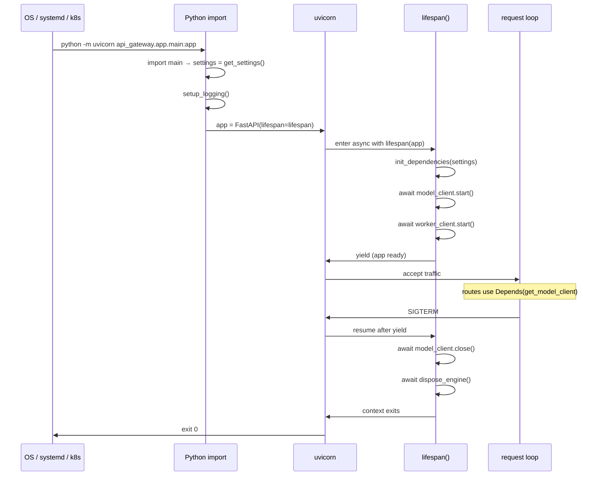
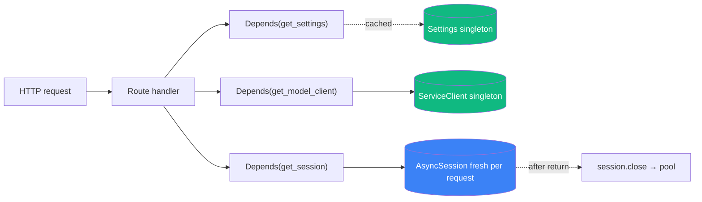

# Lesson 0.3 — Service Lifecycle & Dependency Injection

> **Goal:** understand the two patterns that every service in this repo uses to manage expensive, shared objects — the **lifespan context manager** and **FastAPI's `Depends()` system** — well enough to add your own.

## Why this lesson exists

Every service in the baseline has the same three-line startup story:

```python
@asynccontextmanager
async def lifespan(app: FastAPI):
    model_client, worker_client = init_dependencies(settings)  # create
    await model_client.start()                                  # open connections
    yield                                                       # (app runs)
    await model_client.close()                                  # drain
    await dispose_engine()                                      # release
```

And every route that needs a dependency reaches for it via `Depends()`:

```python
async def endpoint(db: AsyncSession = Depends(get_session)):
    ...
```

If you don't understand this pattern, every route in Parts I–III looks like magic. If you do, the entire codebase collapses into a predictable shape.

## Level 1 — Beginner (intuition)

Think of a web service like a restaurant:

- **Lifespan** = the prep kitchen before opening and the cleanup after closing. You sharpen knives, preheat ovens, and stock ingredients *once* at opening — not every time an order comes in. You clean up once at closing.
- **Dependency injection** = the waiter delivering the right tool to the right cook. The sauté cook doesn't fetch their own pans; the prep kitchen puts them on the station. When the cook needs a pan, it's already there.

In FastAPI:

- The **lifespan** is an `async with` block that wraps the entire app's lifetime. Everything before `yield` runs at startup; everything after runs at shutdown.
- A **dependency** is just a function. You declare `Depends(get_thing)` in your route's signature, and FastAPI calls `get_thing()` for you on every request, passing the result into your route.

```python
# Declare a dependency (a plain function)
def get_logger():
    return logging.getLogger(__name__)

# Use it in a route
@app.get("/hello")
async def hello(log = Depends(get_logger)):
    log.info("hello called")
    return {"ok": True}
```

That's the entire mental model. The rest is plumbing.

## Level 2 — Intermediate (how the baseline wires it)

Open `baseline/api_gateway/app/main.py`. The structure is always the same:

### Step 1 — Resolve settings at module import

```python
settings = get_settings()                        # cached Pydantic BaseSettings
setup_logging(settings.service_name, settings.log_level)
```

Happens **once**, when Python first imports the module. Validates config immediately — misspelled env var = fast failure.

### Step 2 — Define lifespan

```python
@asynccontextmanager
async def lifespan(app: FastAPI):
    logger.info("api_gateway_starting")
    model_client, worker_client = init_dependencies(settings)
    await model_client.start()
    await worker_client.start()
    logger.info("api_gateway_ready")
    yield                                         # <-- app runs here
    await model_client.close()
    await worker_client.close()
    await dispose_engine()
```

The `yield` is the critical line. Everything above it runs at startup; everything below runs at shutdown. `asynccontextmanager` turns this into a proper `async with` compatible object.

### Step 3 — Create the app and wire middleware

```python
app = FastAPI(lifespan=lifespan)
app.add_middleware(TimingMiddleware)
app.add_middleware(RequestLoggingMiddleware)
app.add_middleware(CORSMiddleware, allow_origins=settings.cors_origins, ...)
```

Middleware order matters: the *last* added middleware runs *first* on the request path (and *last* on the response path). So `TimingMiddleware` wraps everything and `CORSMiddleware` is innermost.

### Step 4 — Include routers

```python
app.include_router(health.router)
app.include_router(generate.router)
app.include_router(chat.router)
```

Each router in `api_gateway/app/routes/*.py` is a collection of endpoints. They're kept in separate files so the main module stays under 100 lines.

### Step 5 — The DI layer lives in `dependencies.py`

Open `baseline/api_gateway/app/dependencies.py`:

```python
@lru_cache
def get_settings() -> GatewaySettings:
    return GatewaySettings()

_model_client: ServiceClient | None = None
_worker_client: ServiceClient | None = None

def init_dependencies(settings: GatewaySettings) -> tuple[ServiceClient, ServiceClient]:
    global _model_client, _worker_client
    _model_client = ServiceClient(base_url=settings.model_service_url)
    _worker_client = ServiceClient(base_url=settings.worker_service_url)
    return _model_client, _worker_client

def get_model_client() -> ServiceClient:
    if _model_client is None:
        raise RuntimeError("Model client not initialized.")
    return _model_client
```

The pattern:

1. **Module-level globals** (`_model_client`, `_worker_client`) hold the expensive objects.
2. **`init_dependencies()`** populates them at startup (called from `lifespan`).
3. **`get_model_client()`** is the FastAPI dependency function. Routes use `Depends(get_model_client)` to get a reference.

This is the **module-global singleton pattern**. It's simple, testable (override via `app.dependency_overrides[...]`), and avoids the complexity of a real DI container.

### Database sessions — a different flavor of the same pattern

`baseline/shared/db.py` uses a **generator dependency** instead of a plain function:

```python
async def get_session() -> AsyncIterator[AsyncSession]:
    sm = get_sessionmaker()
    async with sm() as session:
        yield session
```

FastAPI detects that `get_session` is a generator, calls `next()` to get the yielded value, and after the route completes, advances the generator one more time — which runs the `async with`'s cleanup.

Net effect: every route gets a fresh DB session, and the session is always closed even if the route raises.

## Level 3 — Advanced (what a senior engineer notices)

### Why lifespan instead of `@app.on_event("startup")`?

Older FastAPI used `@app.on_event("startup")` and `@app.on_event("shutdown")` decorators. They still work but are **deprecated** because:

1. **Shared state between startup and shutdown was awkward.** A global `client = None` at module scope, then assigning it in startup and closing it in shutdown. Nothing ties them together.
2. **No native async-context-manager support.** Libraries that expose `async with` interfaces (httpx, SQLAlchemy, Redis clients) wanted to be used as context managers.
3. **Error handling was weird.** An exception in startup would kill the app, but there was no clean way to unwind partial initialization.

`lifespan` fixes all three: one function, natural `async with`, and if the try-finally discipline is there, half-initialized state is cleaned up correctly.

### Why `@lru_cache` on `get_settings()`?

```python
@lru_cache
def get_settings() -> GatewaySettings:
    return GatewaySettings()
```

Pydantic `BaseSettings` reads `.env` and environment variables every time you call `GatewaySettings()`. That's fine during startup, but if `Depends(get_settings)` called `GatewaySettings()` on every request, we'd re-parse `.env` on every request — wasteful.

`@lru_cache` memoizes the result. First call reads `.env`; subsequent calls return the cached instance. With no arguments, `lru_cache` acts as a singleton.

**Trade-off:** the settings object is immutable for the lifetime of the process. To rotate a secret, you have to restart. In production this is fine — config changes require a deploy anyway. In dev, it's a 200ms `make run`.

### Why generator dependencies for DB sessions?

FastAPI's dependency system has two flavors:

- **Function dependencies** — `Depends(get_x)` returns whatever `get_x()` returns. Simple.
- **Generator dependencies** — `Depends(get_y)` runs `get_y()` up to its `yield`, returns the yielded value to the route, then resumes `get_y()` after the route. Perfect for resources that need setup + teardown in one place.

For DB sessions, you need:
- **Before the route:** get a session from the pool
- **After the route:** return it to the pool (even if the route raised)

Generator dependencies do exactly that in one function. The `async with sm() as session:` block is the canonical pattern.

### The dependency-override escape hatch

```python
# In tests
app.dependency_overrides[get_model_client] = lambda: FakeModelClient()
```

This is why the module-global pattern matters. The override works because `get_model_client` is a function that FastAPI calls — swap the function, get the fake. A hard-coded `client = ServiceClient(...)` at module top would be untestable.

Part I Task 4 goes deep on this. For now, know that testability is free when you follow the pattern.

## Diagrams

### Lifespan sequence



### Dependency resolution per request



Green = shared for the whole process. Blue = per-request, returned to the pool after.

## What you'll build in the lab

You'll add a **request counter** to the API Gateway that:

1. Increments on every request (via a middleware)
2. Is exposed via a new DI-backed dependency (`get_counter`)
3. Powers a new route `GET /api/v1/metrics/requests` that returns the current count
4. Is verifiable with a pytest that calls the app 10 times and asserts `counter == 10`

Full lab with `starter/` + `solution/`. The starter has skeleton files with `TODO`s; the solution has the complete working version plus tests.

## What's next

**[Lesson 0.4 — Request Flows](../task04_request_flows/README.md)** walks through how the dependencies you just learned about get used in the three main request paths (sync, streaming, jobs).

## References

- `baseline/api_gateway/app/main.py` — lifespan + middleware wiring (gateway)
- `baseline/model_service/app/main.py` — same pattern, different service
- `baseline/worker_service/app/main.py` — same pattern, plus the polling loop
- `baseline/api_gateway/app/dependencies.py` — DI layer
- `baseline/shared/db.py` — generator dependency for DB sessions
- `architecture/backend-architecture.md` §1 (Lifespan) and §5 (Shared Module)
- [FastAPI — Dependencies](https://fastapi.tiangolo.com/tutorial/dependencies/)
- [FastAPI — Lifespan](https://fastapi.tiangolo.com/advanced/events/)
