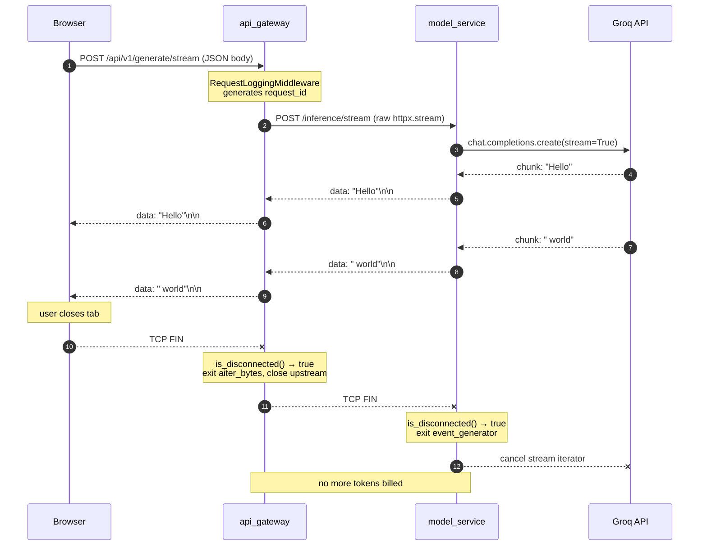

# Lesson 0.4 — Request Flows: Sync, Streaming, Jobs

> **Goal:** internalize the three canonical request shapes in the baseline —
> synchronous RPC, server-sent streaming, and durable background jobs — well
> enough to pick the right one for a new feature and debug it end-to-end
> through the logs.

## Why this lesson exists

The baseline exposes one AI product through three very different HTTP shapes,
each suited to a different latency / throughput / UX trade-off:

| Flow | Endpoint | HTTP shape | Latency budget | Who pays the wait |
|---|---|---|---|---|
| **Sync** | `POST /api/v1/generate` | one request, one JSON response | seconds | the caller blocks |
| **Streaming** | `POST /api/v1/generate/stream` | SSE, tokens arrive progressively | first-byte fast, full text slow | the caller, but visibly |
| **Jobs** | `POST /api/v1/jobs/batch` | 202 + polled status endpoint | minutes | nobody — client moves on |

If you only ever pick one shape for everything, the system degrades in a
specific, predictable way: sync for a 30-prompt batch burns a worker for a
minute; jobs for a single prompt adds seconds of polling overhead for no
reason; streaming used where the client can't buffer tokens wastes the
token budget. The goal of this lesson is to make those trade-offs concrete
by watching each flow actually execute.

Prerequisite reading: **[Lesson 0.3 — Service Lifecycle & DI](../task03_lifecycle_and_di/README.md)**.
The `Depends(get_model_client)` calls you'll see in each route work the way
they do because of the patterns in Lesson 0.3.

## Level 1 — Beginner (intuition)

Think of walking into three different kinds of shops:

- **Sync** is the espresso bar. You order, you wait at the counter for
  15 seconds, you walk out with your drink. One customer is served at a
  time — if the person in front ordered a complicated thing, you wait.
- **Streaming** is the sushi conveyor. You sit down, plates start flowing
  past you one at a time. You don't wait for the "full meal" to arrive —
  you eat as it comes. If you leave, the chef stops making more.
- **Jobs** is the dry cleaner. You drop off your shirts, get a numbered
  ticket, and leave. The cleaner works on it over the next hour. You come
  back (or they call you) when it's done. Meanwhile you went to lunch.

The three HTTP shapes mirror exactly these patterns:

```
Sync:       client ──request──► server ──(wait)──► response ──► client
Streaming:  client ──request──► server ──tok──► client ──tok──► client ──tok──► ...
Jobs:       client ──submit──► server ──202+id──► client (goes away)
                 ...later...
            client ──poll(id)──► server ──status──► client
```

Use sync for fast, simple things. Use streaming when the thing is slow and
the user wants to see progress. Use jobs when the thing takes too long to
keep a connection open, or when you want to process many of them cheaply
in the background.

## Level 2 — Intermediate (how the baseline wires it)

### Flow A — Sync: `POST /api/v1/generate`

The code path is almost absurdly short. Open
`baseline/api_gateway/app/routes/generate.py`:

```python
@router.post("/generate", response_model=GenerateResponse)
async def generate_text(
    request: GenerateRequest,
    model_client: ServiceClient = Depends(get_model_client),
):
    result = await model_client.post("/inference", json=request.model_dump())
    return GenerateResponse(**result)
```

That's the whole endpoint. Three steps:

1. FastAPI validates the incoming JSON against `GenerateRequest` (a Pydantic
   model). Bad payload → 422 before your code runs.
2. The injected `model_client` (a `ServiceClient` wrapping `httpx`) POSTs to
   the model service. Default timeout: 30 s. See
   `baseline/shared/http_client.py`.
3. Model service runs Groq, returns JSON, gateway forwards it.

End to end: one TCP connection gateway→model_service, one TCP connection
model_service→Groq, one JSON response walking back out. The caller blocks
the whole time.

### Flow B — Streaming: `POST /api/v1/generate/stream`

Streaming is where the baseline gets interesting. The gateway route uses a
**raw httpx streaming client** rather than `ServiceClient`, because
`ServiceClient` buffers the whole response into a dict:

```python
async def proxy_stream():
    async with httpx.AsyncClient(timeout=httpx.Timeout(60.0)) as client:
        async with client.stream("POST", f"{settings.model_service_url}/inference/stream",
                                 json=body.model_dump()) as response:
            async for chunk in response.aiter_bytes():
                if await http_request.is_disconnected():
                    return                  # browser closed the tab → bail
                yield chunk

return StreamingResponse(proxy_stream(), media_type="text/event-stream", ...)
```

Upstream, `model_service` produces SSE frames token by token. See
`baseline/model_service/app/routes/inference.py`:

```python
async for token in model_manager.generate_stream(...):
    if await http_request.is_disconnected():
        return
    yield f"data: {json.dumps(token)}\n\n"
yield "data: [DONE]\n\n"
```

Three things worth pausing on:

- **Wire format is SSE.** Each token is framed as `data: "<json-encoded token>"\n\n`.
  JSON-encoding the token protects against tokens that contain newlines —
  if Groq emits `"###\n\n"` and we put it on the wire raw, the double newline
  would terminate the SSE frame early.
- **Byte-for-byte proxying.** The gateway doesn't parse the frames. It just
  forwards bytes. Simpler, fewer failure modes, and means the same pattern
  works if we ever swap the model service for something that speaks a
  different streaming protocol.
- **Disconnect propagation.** If the browser closes the tab, `is_disconnected()`
  goes true on the gateway. The gateway exits its `async for`, which exits the
  outer `async with`, which closes the upstream socket. Model service sees
  *its* `is_disconnected()` flip, exits its generator, and stops pulling from
  Groq. No abandoned token bills.

### Flow C — Jobs: `POST /api/v1/jobs/batch`

The job flow is split across three processes. Open
`baseline/api_gateway/app/routes/jobs.py`:

```python
@router.post("/jobs", response_model=JobResponse, status_code=202)
async def submit_job(submission: JobSubmission,
                     worker_client: ServiceClient = Depends(get_worker_client)):
    result = await worker_client.post("/jobs", json=submission.model_dump())
    return JobResponse(**result)   # includes job_id
```

The gateway is a thin proxy; the interesting code is in
`baseline/worker_service/app/services/queue.py` (`PostgresQueue`):

```python
async def dequeue(self) -> tuple[str, JobSubmission] | None:
    async with self._sm() as session:
        stmt = (select(BatchJob)
                .where(BatchJob.status == JobStatus.PENDING.value)
                .order_by(BatchJob.created_at.asc())
                .limit(1)
                .with_for_update(skip_locked=True))
        result = await session.execute(stmt)
        job = result.scalar_one_or_none()
        if job is None:
            return None
        job.status = JobStatus.RUNNING.value
        await session.commit()
        return str(job.id), submission
```

That `with_for_update(skip_locked=True)` translates to
`SELECT ... FOR UPDATE SKIP LOCKED`. It's the whole reason this flow works
with multiple workers:

- Worker A and Worker B both poll at the same instant.
- Worker A's query locks row #7. Worker B's query sees the lock and
  **silently skips** row #7, claiming row #8 instead.
- No retries, no contention storm, no "who goes first" coordination.
  Postgres does the fair arbitration for you.

The worker loop is boring by design
(`baseline/worker_service/app/worker.py`):

```python
while True:
    item = await queue.dequeue()
    if item is None:
        await asyncio.sleep(poll_interval)      # default 1 s
        continue
    job_id, submission = item
    await processor.process(job_id, submission)
```

Poll, claim, work, repeat. On exception, log and keep looping — the worker
survives bad jobs.

### Request IDs and log correlation

Every gateway request enters `RequestLoggingMiddleware`
(`baseline/api_gateway/app/middleware/logging_mw.py`):

```python
request_id = request.headers.get("X-Request-ID", str(uuid.uuid4()))
logger.info("request_started", request_id=request_id, ...)
response.headers["X-Request-ID"] = request_id
```

The request_id is generated (or honored, if the client sent one) and echoed
back on the response. Structured JSON logs from `shared/logging.py`
make this searchable: `grep '"request_id": "abc-123"'` gives you every
log line for that request across every service — provided the id is
propagated to downstream calls.

**Honest caveat:** in the baseline, the gateway logs the request_id but
doesn't yet forward `X-Request-ID` as an outbound header to the model or
worker services. Lesson 0.5 introduces that propagation; Part III hardens
it. For now, correlation works when you log the id at the gateway and then
grep by timestamp window for downstream lines — good enough for a workshop,
not good enough for production.

## Level 3 — Advanced (what a senior engineer notices)

### The streaming path has natural backpressure — the sync path doesn't

When model_service yields a token, that `yield` blocks until the gateway's
`aiter_bytes` loop consumes it. That loop blocks until the client's TCP
window has room. So if a client is slow, Groq generation implicitly slows
too — the backpressure chain reaches all the way upstream.

Sync has none of this. If Groq is taking 29 s to finish, gateway and
model_service are both holding sockets open, both holding event-loop tasks
alive. The only protection is the 30 s default timeout in `ServiceClient`.
Remove that timeout and a hung upstream becomes a resource leak.

### Why SKIP LOCKED beats a FIFO list

A naive queue does `SELECT ... WHERE status = 'pending' ORDER BY created_at
LIMIT 1` and then `UPDATE ... SET status='running'`. Race: two workers both
SELECT the same row, both UPDATE, both "claim" it — and process the same
job twice.

`FOR UPDATE` locks the row for the rest of the transaction. `SKIP LOCKED`
tells concurrent sessions "don't wait, just move on." Together they give
you:

- **Exactly-once claim** (modulo worker crash between claim and commit — see
  below).
- **No lock-wait pileup** when N workers poll at the same time.
- **Natural per-row fairness** via `ORDER BY created_at`.

**Crash recovery caveat:** if a worker claims a job (status → `running`)
and then crashes, the row is stuck in `running` forever. Production
patterns: a `heartbeat_at` column + a reaper that resets stale rows, or a
`visibility_timeout` style mechanism. The baseline doesn't do this yet —
it's a deliberate simplification for Part 0.

### SSE vs WebSockets vs gRPC streaming

SSE is one-way (server → client) over vanilla HTTP. Three reasons the
baseline picked it over WebSockets:

1. **Works through any HTTP proxy.** Nginx, Cloudflare, corporate proxies —
   all handle SSE. WebSockets require explicit upgrade handling.
2. **Native browser support via `EventSource`.** Auto-reconnects on drop
   (which you may or may not want — see production_reality.md).
3. **Plain text on the wire.** Debuggable with `curl -N`. A `tcpdump` is
   readable.

WebSockets would be right if we needed bidirectional messaging inside one
connection (e.g., a chat where user and assistant type concurrently). gRPC
streaming is right when both ends are internal services — Part I Task 1
covers the trade-off in depth.

### The poll-loop tax

The worker polls every 1 s when the queue is empty. That's one Postgres
round-trip per worker per second of idle time. With 4 workers and a quiet
Friday night, that's 345,600 queries per day for nothing.

This is fine at baseline scale — the query is `LIMIT 1` on an indexed
status column; it costs microseconds. But at 50 workers it becomes visible
in the DB's top queries. The next-step-up is Postgres `LISTEN`/`NOTIFY`:
workers `LISTEN jobs_channel`; the enqueuer `NOTIFY`s; workers wake on a
real signal instead of polling. Beyond that, a real broker (Redis Streams,
RabbitMQ, SQS) takes the polling off your primary database entirely.
Task 3 of Part I and Task 8 of Part II evolve this.

## Diagram — the streaming flow end-to-end



The critical property: disconnect travels upstream. Forget the
`is_disconnected()` check at any hop and you keep paying Groq for tokens
nobody will read.

## What you'll do in the lab

A read-along lab (no starter/solution dirs):

1. Fire a sync request with `curl`, find the matching log lines in both
   services.
2. Fire a streaming request with `curl -N`, watch the SSE frames arrive.
3. Submit a batch job, watch the `jobs` table transition
   pending → running → completed via `psql`.
4. Bonus: kill the worker, submit a job, show that it stays `pending`
   indefinitely; restart the worker, watch it claim the row.

See [`lab/README.md`](lab/README.md).

## What's next

**[Lesson 0.5 — Persistence & Observability](../task05_persistence_observability/README.md)**
covers the `jobs` table schema you saw transition in the lab, plus the
structured logging and metrics story that makes these flows observable in
production.

## References

- `baseline/api_gateway/app/routes/generate.py` — sync + streaming endpoints
- `baseline/api_gateway/app/routes/chat.py` — streaming + persistence
- `baseline/api_gateway/app/routes/jobs.py` — job submit/read
- `baseline/worker_service/app/worker.py` — polling loop
- `baseline/worker_service/app/services/queue.py` — `PostgresQueue` with SKIP LOCKED
- `baseline/model_service/app/routes/inference.py` — sync + streaming inference
- `baseline/shared/http_client.py` — `ServiceClient` with 30 s default timeout
- `baseline/shared/logging.py` — structlog JSON config
- `baseline/api_gateway/app/middleware/logging_mw.py` — request_id generation
- [PostgreSQL — `SELECT FOR UPDATE SKIP LOCKED`](https://www.postgresql.org/docs/current/sql-select.html#SQL-FOR-UPDATE-SHARE)
- [HTML Living Standard — Server-Sent Events](https://html.spec.whatwg.org/multipage/server-sent-events.html)
