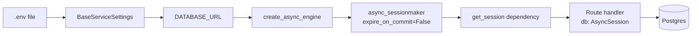

# Lesson 0.5 — Persistence, Config, and Observability

Part of **Part 0 — Baseline Introduction** (Lesson 5 of 6).

| | |
|---|---|
| Duration | 30 min live + 30 min lab |
| Difficulty | Intermediate |
| Prerequisites | Lessons 0.1–0.4. Comfortable with Python type hints and async/await. |
| Goal | Understand the state layer and cross-cutting concerns: ORM models, Alembic migrations, Pydantic Settings, structured logging, and the error hierarchy. |

Lessons 0.1–0.4 focused on the request path: how a request enters the gateway, gets dispatched, and flows between services. This lesson zooms into what the request path **leans on** every time it runs: the database, the config, and the logs. These are the boring layers — and the ones that break first when the system grows.

---

## What we cover

1. SQLAlchemy 2.x async — engine, sessionmaker, and the `get_session` dependency
2. Alembic — why migrations (not `Base.metadata.create_all`) own the schema
3. Pydantic Settings — an env-driven config hierarchy
4. structlog — JSON logs with a `request_id` bound per request
5. The `AppError` hierarchy — how we map exceptions to HTTP responses

Cross-reference:
- Engine/session **lifecycle** (when is the engine built, when is it disposed?) is covered in [`../task03_lifecycle_and_di/`](../task03_lifecycle_and_di/).
- Where `request_id` is **bound** into logs (the middleware) is covered in [`../task04_request_flows/`](../task04_request_flows/). This lesson covers how the logger itself is configured.

---

## Level 1 — Beginner (intuition)

Think of a service as a person doing a job:

- They need **notes** to remember what happened (that is persistence — the database).
- They need **instructions** on how to behave (that is config — env vars).
- They need to **talk out loud** when something interesting happens so a supervisor can hear (that is logging).
- They need a clear way to **say "something went wrong"** without panicking (that is the error hierarchy).

If any of these four are ad-hoc, the service still works on a laptop — but the moment you run two copies, or restart one, or try to debug a failure at 3 AM, the cracks show.

The baseline centralizes all four in `baseline/shared/` so every service gets the same plumbing for free:

```
baseline/shared/
  db.py         # one async engine, one session factory, one get_session dependency
  models.py     # the SQLAlchemy ORM classes (users, chat_sessions, chat_messages, batch_jobs)
  schemas.py    # Pydantic I/O schemas (what crosses the wire)
  config.py     # BaseServiceSettings — env-driven, typed, overridable per service
  logging.py    # structlog setup — JSON out, context-aware
  errors.py     # AppError hierarchy — status_code + error_code baked into every exception
```

The rule: if a concern is shared across services, it lives in `shared/`. If it is specific to one service, it stays inside that service's package.

---

## Level 2 — Intermediate (how the baseline wires it)

### 2.1 The persistence pipeline



The chain starts at an `.env` file at the repo root and ends at a Postgres row. Each step does one job.

### 2.2 The engine and sessionmaker (`shared/db.py`)

Two things matter in `baseline/shared/db.py`:

1. There is **exactly one engine per process**, built lazily in `get_engine()`. Building at import time would break tests that want to swap the URL.
2. The sessionmaker is constructed with `expire_on_commit=False`. In synchronous SQLAlchemy, the default `expire_on_commit=True` is fine — on next attribute access it silently reloads the row. In async code, that silent reload would need an `await`, which the attribute-access syntax cannot provide. The result is an `ImplicitIOError` at runtime. `expire_on_commit=False` keeps ORM objects usable after `commit()` without surprise I/O.

`get_session` is the FastAPI dependency:

```python
async def get_session() -> AsyncIterator[AsyncSession]:
    sm = get_sessionmaker()
    async with sm() as session:
        yield session
```

The `async with` guarantees the session is closed (and its connection returned to the pool) even if the route raises. Cleanup is non-negotiable when you run dozens of requests per second.

### 2.3 Alembic is the schema truth

It is tempting in a tutorial to call `Base.metadata.create_all()` and move on. We do not. The models file is the **desired state**; Alembic migrations are the **transition history**. Production databases only change via migrations.

Workflow:

```bash
# 1. Change a model in shared/models.py (add a column, new table, etc.)
# 2. Autogenerate a revision by diffing models against the live DB:
alembic -c baseline/alembic.ini revision --autogenerate -m "add nickname to users"

# 3. ALWAYS read the generated file in baseline/alembic/versions/.
#    Autogenerate is a helper, not a decision maker.

# 4. Apply it:
alembic -c baseline/alembic.ini upgrade head
```

`baseline/alembic/env.py` imports `shared.models` so every ORM class is registered on `Base.metadata` — that is what autogenerate diffs against. If you add a model file that `env.py` does not import, autogenerate will think you deleted it and emit a `drop_table`.

The initial migration in `baseline/alembic/versions/20260423_0900_initial_baseline_schema.py` creates all four tables and seeds a `default_user` row so the gateway has a user ID to attribute ownership to before auth exists.

### 2.4 Pydantic Settings — inheritance pattern

In `baseline/shared/config.py`:

```python
class BaseServiceSettings(BaseSettings):
    service_name: str = "unknown"
    environment: str = "development"
    log_level: str = "INFO"
    use_mock: bool = False

    model_config = {"env_file": "../../.env", "extra": "ignore"}
```

Each service subclasses it. The gateway adds `cors_origins`, `model_service_url`, etc. The model service adds `groq_api_key`, `default_model`. The worker adds its own knobs.

Advantages over `os.environ.get(...)`:
- Types are coerced at startup — a typo in `MAX_TOKENS=abc` fails at boot, not on the first request.
- Defaults live next to the field, not scattered through the code.
- Subclasses inherit shared fields without copy-paste.
- `.env` is loaded automatically; Docker's runtime env vars override it.

### 2.5 Structured logging (`shared/logging.py`)

Plain `logger.info("user 42 signed in")` is fine for local dev. At scale, logs go to Datadog/Loki/CloudWatch, and you want to `WHERE request_id = "abc123" AND level = "error"`. That requires JSON.

`setup_logging()` configures structlog with a JSON renderer in production (console renderer when `log_level=DEBUG` for readability). `structlog.contextvars.merge_contextvars` merges anything bound via `bind_contextvars` into every log line from that task.

The middleware (see Lesson 0.4) binds `request_id` once per request. Every subsequent log line — in the route, in a helper, in the HTTP client, even in the worker if you propagate the header — comes out with the same `request_id`. Grep once, see the whole trace.

### 2.6 The error hierarchy (`shared/errors.py`)

```
AppError (status_code, error_code)
 ├── ValidationError (422)
 ├── InferenceError (502)
 ├── ServiceUnavailableError (503)
 └── JobNotFoundError (404)
```

A FastAPI exception handler catches anything deriving from `AppError` and returns a consistent JSON body:

```json
{"error": {"code": "JOB_NOT_FOUND", "message": "Job not found: abc", "request_id": "r-123"}}
```

Rule: **never `raise Exception(...)`** in a route. Always raise a typed `AppError` subclass. If you need a new semantic error, add a class to `errors.py` rather than overloading an existing one.

---

## Level 3 — Advanced (what a senior engineer notices)

- **Autogenerate is not a spec.** It misses: index changes on existing columns (it often drops/recreates them instead of altering), enum value additions in Postgres (requires a transaction dance), custom constraint renames, and partial indexes. Always diff the generated file against what you actually intended and hand-edit.
- **Pool sizing interacts with Postgres `max_connections`.** `pool_size=5, max_overflow=10` per process × N gateway replicas × M worker replicas can exhaust a default 100-connection Postgres in an afternoon. A pgBouncer in transaction-pooling mode is the standard fix at scale.
- **`expire_on_commit=False` has a downside** — stale reads. If another session updates a row between your commit and your next access, you still see the old value. Explicit `session.refresh(obj)` or a new query is the remedy when freshness matters.
- **`@lru_cache`'d settings means "pod restart to rotate secrets."** Convenient for consistency, painful for rotation. Either accept the pod-restart model or front secrets with a fetcher that has its own TTL.
- **JSON logs are cheap to query and expensive to ship.** Sample high-volume paths (`/health`, `/metrics`) or drop them before they hit the aggregator. A single chatty debug log at 10k rps can cost more than your model API bill.
- **N+1 query patterns are lurking.** `session = await db.get(ChatSession, id); messages = session.messages` inside an async context will trigger one query per attribute access unless you eager-loaded. Use `selectinload(ChatSession.messages)` for 1-to-many, `joinedload` for to-one. The default is lazy and it is almost never what you want in async code.
- **Error messages leak internals.** `str(exception)` can contain SQL, file paths, or even secrets from a misconfigured driver. The `AppError.message` field is a deliberate abstraction — the human-readable message, not the raw cause. Log the cause with `exc_info=True`; return only the sanitized message.
- **CI must run `alembic upgrade head` against a fresh DB.** Otherwise a developer who forgot to generate a migration can merge a code change that breaks on deploy. One of the cheapest checks you can add.
- **Every model field deserves a comment on the migration.** The ORM shows "what should be," the migration shows "what actually got deployed." When they disagree six months later, the migration wins.

---

## What to do next

1. Read the lab: [`lab/README.md`](lab/README.md). Three small hands-on exercises in the live repo — no starter code to copy, you run commands against the baseline itself.
2. Read [`production_reality.md`](production_reality.md) for deeper failure modes.
3. Review [`slides.md`](slides.md) if you are delivering this lesson.

### Coming up

- **Lesson 0.6** wraps Part 0 with the frontend primer.
- **Part I** starts refactoring: REST vs gRPC, microservice boundaries, batch vs streaming pipelines. Every refactor assumes the state layer and observability layer you learned here.
