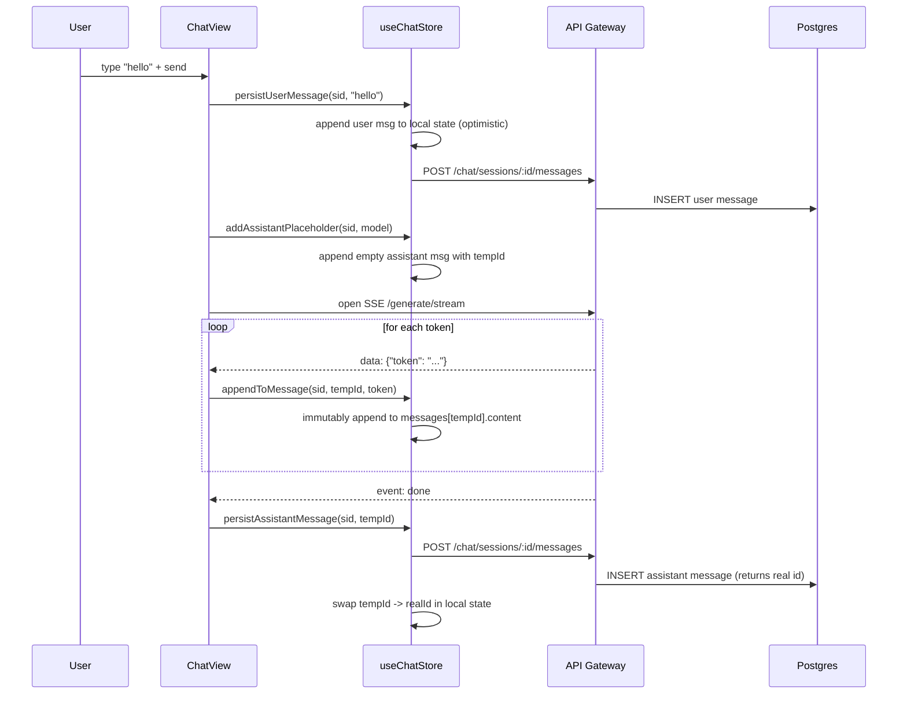
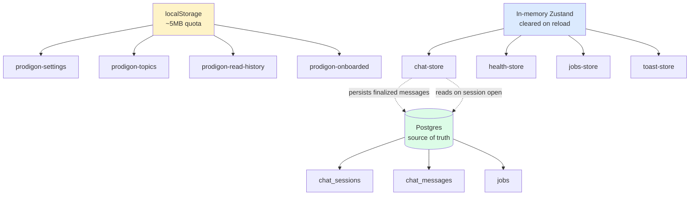

# Lesson 0.6 — Frontend Primer: Layout, Stores, Streaming

> **Goal:** give backend-focused attendees *just enough* of a mental model of the React frontend to navigate it when a workshop task crosses the network boundary. This is the shortest lesson in Part 0 — the workshop is backend-heavy, but you shouldn't be lost when you open `frontend/src/`.

## Why this lesson exists

Four of the previous five lessons ended with "open the frontend and watch the request flow." If you don't have a mental map of the frontend, you treat it as a black box that emits HTTP requests. That's fine until a bug lives on *the other side* of the network boundary — a message that renders weirdly, a stale cache, a lost SSE connection. At that point, "black box" costs you an hour of `console.log`.

This lesson gives you three anchors:

1. **The three-panel layout** — so you can find any screen in under 10 seconds.
2. **Zustand stores** — so you know where state lives and how to inspect it.
3. **The SSE reconciliation pattern** — so you understand the dance between local state (source of truth during streaming) and the database (source of truth after).

That's it. No React deep-dive, no TypeScript philosophy. Enough to read the code and not get lost.

## Level 1 — Beginner (intuition)

The frontend is a single-page React app that looks like this:

```
┌──────────────────────────────────────────────────────────────────┐
│  Header (branding, health pill, settings)                        │
├────────────────┬─────────────────────────────┬───────────────────┤
│                │                             │                   │
│  Topics        │   Chat                      │   Inspector       │
│  (workshop     │   (conversation +           │   (metadata,      │
│   taxonomy)    │    streaming responses)     │    tokens, job    │
│                │                             │    status)        │
│                │                             │                   │
│  ⌘B toggles    │   main UI                   │   ⌘I toggles      │
│                │                             │                   │
└────────────────┴─────────────────────────────┴───────────────────┘
```

Three panels. Left = "what to learn." Center = "talk to the model." Right = "what just happened."

- **Topics Panel** reads from `frontend/src/lib/topics-data.ts` — a static tree of the workshop taxonomy (this is where Part 0 was wired in). Click a lesson → markdown renders in the center panel instead of chat.
- **Chat Panel** is the real LLM UI. Send a message, watch tokens stream in.
- **Inspector Panel** shows per-message metadata: model used, tokens, latency, any background job attached.

State is stored in a few small **Zustand stores** (think: "a global object you can subscribe to from any component, without a provider"). Each store lives in one file under `frontend/src/stores/`:

| Store | File | What it holds |
|---|---|---|
| `useChatStore` | `chat-store.ts` | Sessions, messages, streaming state |
| `useSettingsStore` | `settings-store.ts` | Theme, model preference, API URL |
| `useTopicsStore` | `topics-store.ts` | Which parts are expanded, which lessons you've read |
| `useHealthStore` | `health-store.ts` | Backend health polling |
| `useJobsStore` | `jobs-store.ts` | Background job status |
| `useToastStore` | `toast-store.ts` | Toast notifications |

When you need "where does X live?", the answer is almost always "one of these six stores."

The last thing worth knowing on first read: **streaming chat does not hit the DB on every token**. Tokens are local-only during the stream; the final message is persisted at the end. More on that below.

## Level 2 — Intermediate (how the baseline wires it)

### The app shell — `components/layout/app-shell.tsx`

The shell is a CSS-grid three-column layout that reads from `useSettingsStore` to know which panels are collapsed. Collapsing a panel doesn't unmount its subtree — it just applies a `w-0` tailwind class and a transition. State is preserved.

```
app-shell.tsx
├── <Header />                 (top bar)
├── <TopicsPanel />            (left: topic-tree.tsx)
├── <ChatView />               (center: chat-view.tsx, or <ContentViewer /> if a lesson is open)
└── <InspectorPanel />         (right: per-message details)
```

The ⌘B / ⌘I keyboard shortcuts (wired in `hooks/use-keyboard-shortcuts.ts`) flip booleans in the settings store; the grid re-renders.

### Stores: Zustand over Context

Zustand chose itself over React Context for three reasons:

1. **No provider pyramid.** A React Context needs a `<Provider>` at the top; Zustand stores are plain module exports you import where needed.
2. **Selector-based subscriptions.** A component that needs `messages` doesn't re-render when `isStreaming` changes — Zustand's `useStore(s => s.messages)` creates a selector, and only the selected slice is diffed.
3. **Persist middleware out of the box.** Settings and read-history are persisted to `localStorage` via Zustand's `persist` middleware, no hand-rolled `useEffect` serialization.

Every store in this repo is a single file with this shape:

```ts
interface State { /* data */ }
interface Actions { /* functions that mutate data */ }

export const useFooStore = create<State & Actions>()(
  persist(                              // optional
    devtools((set, get) => ({ ... })),  // Redux DevTools integration
    { name: 'prodigon-foo' }            // localStorage key
  )
);
```

Actions call `set({ ... })` to update; selectors read via `get()`. That's the whole API.

### localStorage — what's persisted, what isn't

Open DevTools → Application → Local Storage → `http://localhost:5173`. You'll see:

| Key | Source | What's in it |
|---|---|---|
| `prodigon-settings` | `settings-store.ts` | theme, model, sidebar collapse states, API base URL |
| `prodigon-topics` | `topics-store.ts` | which part accordions are expanded |
| `prodigon-read-history` | `topics-store.ts` | which lessons you've marked as read |
| `prodigon-onboarded` | onboarding flow | flag to suppress the welcome modal |

**What is *not* persisted:** chat messages, sessions, health data. Those come from the backend. The design rule is: *persist only what you can afford to lose and what fits in 5MB.* Full chat history lives in Postgres; localStorage would blow past the quota in a week of heavy use.

### The SSE reconciliation pattern

This is the one piece of frontend architecture worth internalizing — it shows up verbatim in every production chat app.

**The problem:** you want tokens on the screen as the model generates them (streaming = good UX). You also want to refresh the page and see the finished conversation (persistence = table stakes). Those two requirements imply two sources of truth: local React state during the stream, Postgres after.

**The baseline's answer** (see `chat-store.ts` actions, `chat-view.tsx` for the caller):

1. User submits a prompt.
2. `persistUserMessage(sessionId, content)` — optimistically append the user's message to local state **and** POST it to `/api/v1/chat/sessions/:id/messages`. The local append is instant; the POST is fire-and-forget.
3. `addAssistantPlaceholder(sessionId, model)` — insert an empty assistant message with a temp ID into local state. The UI shows a typing indicator.
4. Open an SSE connection to `/api/v1/generate/stream`. Each `data: {token}` event calls `appendToMessage(sessionId, tempId, token)`. React re-renders only the message bubble subscribed to that slice.
5. On the `done` SSE event, `persistAssistantMessage(sessionId, tempId)` writes the finalized message to the DB and swaps the temp ID for the real server-generated one.

The critical rule: **during streaming, local state is authoritative. After the `done` event, the DB is authoritative.** Reconciling those two without a visible flash — without the message disappearing and reappearing — is the whole trick.

See the Mermaid diagram below for the full sequence.

### Keyboard-first UX

`hooks/use-keyboard-shortcuts.ts` registers global shortcuts at the shell level:

- **⌘K** — command palette (search sessions, jump to lessons, trigger actions)
- **⌘B** — toggle left (Topics) panel
- **⌘I** — toggle right (Inspector) panel
- **⌘/** — show the shortcuts help overlay
- **⌘,** — open settings

Each one dispatches to a store action or opens a modal. The hook is a single `useEffect` that listens on `window` and routes by key combo — boring, portable, good.

## Level 3 — Advanced (what a senior engineer notices)

### The SSE pattern only works because of three invariants

1. **The server emits tokens in order.** If tokens arrived out of order, `appendToMessage` would scramble the output. SSE preserves order by design (single TCP connection), so this is free — but switch to WebSockets and you'd own this guarantee yourself.
2. **The temp ID is swapped exactly once.** If `persistAssistantMessage` ran twice, you'd duplicate the message. Guarded by a flag (`isPersisting`) on the store.
3. **`appendToMessage` mutates by reference-equal swap.** If it mutated the message object in place, Zustand's shallow equality would miss the update and skip the re-render. The action constructs a new message object every time.

Violate any of those and the UI glitches in subtle ways that take a debug session to trace.

### Per-concern stores, not a mega-store

An early version of this frontend had a single `useAppStore` that held chat + settings + topics + health. It worked — until the chat view re-rendered every time the health poll updated. Zustand's selector optimization only helps if subscribers pick small slices; if the store is monolithic, every consumer pays the diff cost of the whole tree.

Splitting into six per-concern stores solved the re-render storm and made each store's responsibility obvious from its filename. This is the same insight as "don't put unrelated tables in the same DB schema" — cohesion beats convenience.

### Why `persist` for settings but not chat

`persist` middleware serializes on every `set()` call (debounced). For settings (5–10 keys, rarely mutated) this is free. For chat (dozens of messages, mutated on every token) it would serialize thousands of times per response — and the full transcript would blow past localStorage's ~5MB quota within a few long conversations. So chat state is in-memory only; Postgres is the persistence layer.

The design principle: **persist what's expensive to lose and cheap to store. Everything else is either disposable or lives in the backend.**

### The streaming re-render problem

React will re-render every component that subscribes to a changing slice of state. If you naively put `streamingText` at the top of the chat store and every message bubble subscribes to it, every token triggers a re-render of every bubble. The workaround in `chat-store.ts`: tokens append to a specific message's `content` field, and each bubble selects `messages.find(m => m.id === myId)?.content` — so only the actively streaming bubble re-renders.

Even so, a 500-token response re-renders that bubble 500 times. For short responses, fine. For long code generations, you'll feel it on low-end hardware. The production escape hatches: throttle token flushes (batch 10 tokens per render), or drop to a ref-based "append to DOM directly" path for the streaming message only.

### Accessibility during streaming

Screen readers don't know what "streaming" means. The fix is an `aria-live="polite"` region on the chat area, and a status announcement when `done` fires ("Response complete"). The baseline wires this in `chat-view.tsx` but it's the kind of detail that gets lost in the next refactor. See `production_reality.md` for more.

## Diagrams

### SSE reconciliation sequence



### State-ownership map



## What you'll do in the lab

The lab is a read-along devtools tour — no code to write. You'll:

1. Trace a streaming chat request through the Network tab and React DevTools.
2. Inspect each `prodigon-*` key in localStorage and explain its shape.
3. Find the SSE reconciliation logic in `chat-store.ts` by following callers.
4. Run the ⌘K command palette and verify Part 0 lessons show up (they were wired in as part of this workshop update).

Bonus challenges: add a keyboard shortcut, add a new per-concern store.

## What's next

That wraps Part 0. You have a running stack, a mental map of architecture + lifecycle + request flows + persistence + frontend, and you've touched every layer that the rest of the workshop refactors.

**Part I, Task 1 — REST vs gRPC** takes the inference endpoint you used in Lesson 0.4 and puts it behind both a REST and a gRPC interface. You'll benchmark latency, compare schemas, and see where each protocol earns its keep. See [Part I, Task 1](../../part1_design_patterns/task01_rest_vs_grpc/README.md).

## References

- `frontend/src/components/layout/app-shell.tsx` — three-panel grid + panel collapse logic
- `frontend/src/stores/chat-store.ts` — SSE reconciliation actions
- `frontend/src/stores/settings-store.ts` — persisted user preferences
- `frontend/src/stores/topics-store.ts` — expanded parts + read-history
- `frontend/src/api/client.ts` — typed API client with SSE handling
- `frontend/src/hooks/use-keyboard-shortcuts.ts` — ⌘K / ⌘B / ⌘I / ⌘/
- `frontend/src/components/topics/topic-tree.tsx` — Topics accordion
- `frontend/src/components/topics/content-viewer.tsx` — markdown renderer
- `frontend/src/lib/topics-data.ts` — workshop taxonomy (Part 0 wired in here)
- `../task04_request_flows/README.md` — the backend side of streaming
- [Zustand docs](https://zustand.docs.pmnd.rs/) — the state library
- [MDN: Server-Sent Events](https://developer.mozilla.org/en-US/docs/Web/API/Server-sent_events) — the protocol under `/generate/stream`
