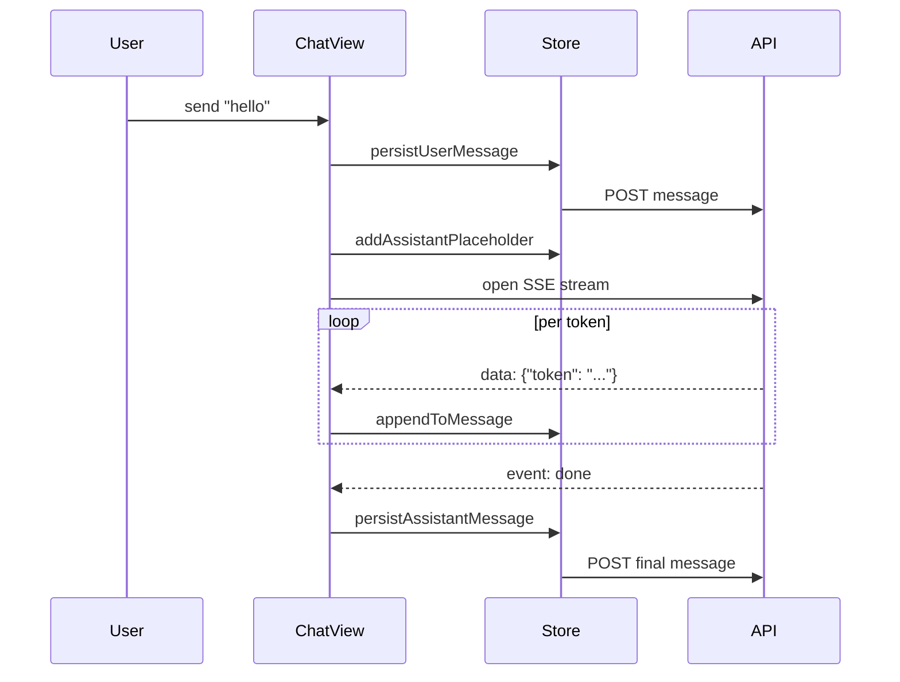

# Lesson 0.6 — Frontend Primer (Slides)

**Duration:** ~30 min live (or 20 min self-paced with the lab)
**Audience:** backend-focused attendees who want to navigate the frontend
**Format:** 17 slides

---

## Slide 1 — Title

**Frontend Primer: Layout, Stores, Streaming**
*The minimum viable mental model of the React frontend*

Workshop Part 0 · Lesson 0.6 (last in Part 0)

---

## Slide 2 — Why this lesson exists

Part 0 has sent you into the frontend five times already:
- "Open `localhost:5173` and create a chat session."
- "Watch the tokens stream in."
- "Refresh the page — your session persists."

If the frontend is a black box, you can't debug across the network boundary.

**Goal:** three anchors — layout, stores, streaming — so you can read the code.

Not a React deep-dive. Not a TypeScript course. The minimum viable mental model.

---

## Slide 3 — The three-panel layout

```
┌────────────┬────────────────────┬───────────────┐
│  Topics    │   Chat             │   Inspector   │
│  (left)    │   (center)         │   (right)     │
│            │                    │               │
│  ⌘B        │   main UI          │   ⌘I          │
└────────────┴────────────────────┴───────────────┘
```

- **Left:** workshop taxonomy from `topics-data.ts`
- **Center:** chat (or markdown viewer if a lesson is open)
- **Right:** per-message metadata (model, tokens, latency, jobs)

File: `frontend/src/components/layout/app-shell.tsx`

---

## Slide 4 — Six stores, one per concern

| Store | File | Holds |
|---|---|---|
| `useChatStore` | `chat-store.ts` | sessions, messages, streaming |
| `useSettingsStore` | `settings-store.ts` | theme, model, panel toggles |
| `useTopicsStore` | `topics-store.ts` | expanded parts, read-history |
| `useHealthStore` | `health-store.ts` | backend health polling |
| `useJobsStore` | `jobs-store.ts` | background job status |
| `useToastStore` | `toast-store.ts` | toast notifications |

"Where does X live?" → one of these six.

---

## Slide 5 — Why Zustand over React Context

Three wins, in order of how often they matter:

1. **No provider pyramid.** Plain module exports; import where needed.
2. **Selector subscriptions.** `useStore(s => s.messages)` — only re-renders when `messages` changes, not `isStreaming`.
3. **`persist` middleware.** Zero-boilerplate localStorage sync.

Trade-off: less ecosystem than Redux, no time-travel by default. For app state under a handful of stores, Zustand wins.

---

## Slide 6 — A store is a single file

```ts
export const useChatStore = create<State & Actions>()(
  devtools((set, get) => ({
    sessions: [],
    messages: {},
    appendToMessage: (sid, mid, token) => set(state => ({
      messages: { ...state.messages,
        [mid]: { ...state.messages[mid],
          content: state.messages[mid].content + token
        }
      }
    })),
  }))
);
```

Data + actions + maybe `persist` or `devtools` middleware. That's the shape of every store in this repo.

---

## Slide 7 — localStorage: what's persisted

| Key | Shape (shortened) |
|---|---|
| `prodigon-settings` | `{ theme, model, leftOpen, rightOpen }` |
| `prodigon-topics` | `{ expandedParts: ['part0', ...] }` |
| `prodigon-read-history` | `{ 'task-0-1': { readAt: ... }, ... }` |
| `prodigon-onboarded` | `"true"` |

**Not persisted:** chat messages, sessions, health. Those come from Postgres.

Rule: *persist what's cheap to store and expensive to lose.*

---

## Slide 8 — The streaming problem

You want both:
- **Tokens on screen as the model generates** (good UX)
- **Refresh the page, conversation is still there** (table stakes)

Implication: **two sources of truth**.
- Local state — authoritative during the stream
- Postgres — authoritative after

Reconciling those without a visible flash is the whole trick.

---

## Slide 9 — The SSE reconciliation pattern (steps)

1. `persistUserMessage(sid, content)` — append locally + POST to DB (optimistic).
2. `addAssistantPlaceholder(sid, model)` — empty assistant bubble with `tempId`.
3. Open SSE: `/api/v1/generate/stream`.
4. For each `data: {token}` event → `appendToMessage(sid, tempId, token)`.
5. On `done` event → `persistAssistantMessage(sid, tempId)` — POST + swap tempId for real id.

Callers: `chat-view.tsx`. Actions: `chat-store.ts`.

---

## Slide 10 — Sequence diagram



One user action = one optimistic insert + one stream + one final persist.

---

## Slide 11 — Three invariants the pattern depends on

1. **Tokens arrive in order.** SSE guarantees this by design (single TCP). Switch to WebSockets → you own the guarantee.
2. **`persistAssistantMessage` runs exactly once.** Guarded by an `isPersisting` flag.
3. **Append produces a new message object.** If you mutated in place, Zustand's shallow-equal diff would skip the re-render.

Violate any → subtle UI glitches that eat an afternoon.

---

## Slide 12 — Keyboard-first UX

| Shortcut | What it does |
|---|---|
| ⌘K | command palette |
| ⌘B | toggle left panel (Topics) |
| ⌘I | toggle right panel (Inspector) |
| ⌘/ | show shortcuts help |
| ⌘, | open settings |

One hook: `hooks/use-keyboard-shortcuts.ts`. A single `useEffect` listens on `window`, routes by key combo, dispatches to store actions.

---

## Slide 13 — Common pitfall: the mega-store

A v0 of this frontend had `useAppStore` holding chat + settings + topics + health.

Symptom: chat view re-rendered every time the health poll ticked (every 10s).

**Fix:** split into six per-concern stores. Each consumer subscribes to only what it cares about.

Insight: Zustand's selector optimization only helps if stores are small. Monolithic store = every subscriber diffs the whole tree.

---

## Slide 14 — Common pitfall: streaming re-render storms

A 500-token response = 500 re-renders of the message bubble.

**Default defense:** each bubble subscribes to *its own* message slice, not the whole array. Only the streaming bubble re-renders.

**When that isn't enough:**
- Batch token flushes (10 tokens per `appendToMessage` call)
- Use a ref + direct DOM append for the in-flight message

Ship the defaults. Optimize when you feel it.

---

## Slide 15 — Accessibility during streaming

Screen readers don't know what "streaming" means. By default, they announce every token or nothing — both bad.

**Fix:** `aria-live="polite"` on the chat region, plus an explicit "Response complete" announcement on the `done` event.

Wired in `chat-view.tsx` but it's the kind of detail that gets lost in the next refactor.

---

## Slide 16 — Live demo (5 min)

1. Open `localhost:5173`.
2. DevTools → Network → send a chat message → watch the `eventsource` request.
3. DevTools → Application → Local Storage → inspect the four `prodigon-*` keys.
4. Edit `frontend/src/stores/chat-store.ts` briefly — show `appendToMessage`.
5. ⌘K → type "Task 0.1" → Part 0 lessons appear in the palette.
6. ⌘B → left panel collapses; state survives.

Five minutes, all three anchors touched.

---

## Slide 17 — Key takeaways + what's next

1. **Three panels:** Topics (⌘B) | Chat | Inspector (⌘I).
2. **Six stores:** per-concern, not monolithic.
3. **localStorage** holds cheap-to-store, expensive-to-lose state. Never full chat.
4. **SSE reconciliation:** local state during stream, DB after `done`.
5. **Invariants** (ordered tokens, persist-once, reference swaps) keep it glitch-free.

**That wraps Part 0.** Next: **Part I, Task 1 — REST vs gRPC**. We'll take the inference endpoint you used in Lesson 0.4 and stand it up behind both protocols.
