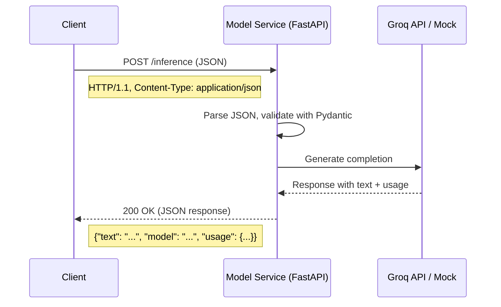
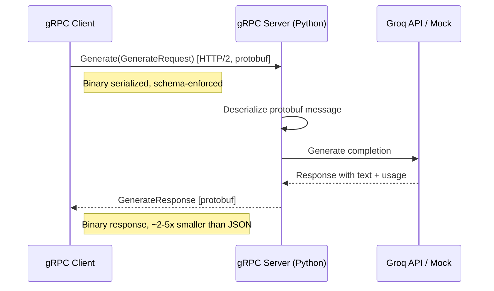
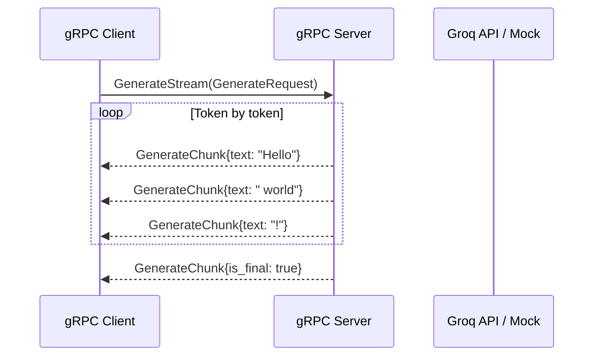

# Task 1: REST vs gRPC for Model Inference

## Overview

This task explores two dominant approaches for exposing an AI model inference service:
**REST (HTTP/1.1 + JSON)** and **gRPC (HTTP/2 + Protocol Buffers)**. You will implement
both interfaces for the same inference logic, compare them side by side, and benchmark
their performance.

---

## Concept Explanation

### Beginner: What Are REST and gRPC?

**REST** (Representational State Transfer) is the way most web APIs work today. Your
client sends an HTTP request with a JSON body, and the server sends back an HTTP
response with a JSON body. It is simple, human-readable, and works in every browser.

```
Client  --->  POST /inference  {"prompt": "Hello"}  --->  Server
Client  <---  200 OK  {"text": "Hi there!", ...}    <---  Server
```

**gRPC** (Google Remote Procedure Call) is a framework built on HTTP/2 that uses
Protocol Buffers (protobuf) for serialization instead of JSON. You define your API in
a `.proto` file, compile it into client and server code, and call remote methods as if
they were local functions.

```
Client  --->  Generate(GenerateRequest{prompt: "Hello"})  --->  Server
Client  <---  GenerateResponse{text: "Hi there!", ...}     <---  Server
```

**Key intuition:** REST is like sending letters (human-readable, universally understood).
gRPC is like a phone call (faster, requires both sides to speak the same language).

### Intermediate: Engineering Tradeoffs

| Dimension | REST | gRPC |
|---|---|---|
| **Protocol** | HTTP/1.1 (usually) | HTTP/2 (mandatory) |
| **Serialization** | JSON (text-based) | Protobuf (binary) |
| **Schema** | Optional (OpenAPI/Swagger) | Required (.proto files) |
| **Streaming** | Workarounds (SSE, WebSocket) | Native (4 streaming modes) |
| **Browser support** | Native | Requires grpc-web proxy |
| **Tooling** | curl, Postman, any HTTP client | Specialized tools (grpcurl, BloomRPC) |
| **Latency** | Higher (JSON parsing, HTTP/1.1) | Lower (binary, multiplexed) |
| **Code generation** | Optional | Built-in (protoc compiler) |
| **Human readability** | Excellent (JSON) | Poor (binary on wire) |
| **Backward compat** | Discipline-based | Field numbering in proto |
| **Learning curve** | Low | Medium |

**When REST wins:** You need browser clients, third-party integrations, quick
prototyping, or human-debuggable traffic. Most public-facing APIs should be REST.

**When gRPC wins:** Internal service-to-service communication where you control both
ends, latency matters, you need streaming, or you want strict schema enforcement.

### Advanced: Production Considerations

**HTTP/2 Multiplexing.** gRPC runs on HTTP/2, which multiplexes multiple requests over
a single TCP connection. This eliminates head-of-line blocking at the HTTP level and
reduces connection overhead. For high-throughput internal services making thousands of
calls per second, this is a significant advantage.

**Load Balancing Complexity.** HTTP/1.1 load balancing is trivial -- any L4/L7 load
balancer works. gRPC requires L7 (application-layer) load balancing that understands
HTTP/2 frames. A naive TCP load balancer will pin all requests from a multiplexed
connection to a single backend. Solutions include:
- Client-side load balancing (each client knows all backends)
- L7 proxies: Envoy, Linkerd, Istio
- gRPC lookaside load balancing (xDS protocol)

**Bi-directional Streaming.** gRPC natively supports four communication patterns:
1. Unary (request-response, like REST)
2. Server streaming (server sends multiple messages)
3. Client streaming (client sends multiple messages)
4. Bi-directional streaming (both sides send streams)

For AI systems, server streaming is invaluable -- it enables token-by-token delivery
of LLM output without SSE or WebSocket workarounds.

**Proto Evolution.** Protocol Buffers enforce backward compatibility through field
numbering. You can add new fields (they get default values on old clients), but you
must never reuse a field number. In practice, teams maintain a proto registry and run
backward-compatibility checks in CI.

**TLS and Security.** gRPC strongly encourages (and in many deployments requires) TLS.
HTTP/2's ALPN negotiation is TLS-aware. In Kubernetes, service meshes like Istio
handle mTLS transparently, but bare-metal deployments need explicit certificate
management.

---

## Architecture Diagrams

### REST Request Flow



### gRPC Request Flow



### Streaming Comparison



---

## When to Use REST

- **Public APIs** consumed by unknown clients (browsers, mobile apps, third parties)
- **CRUD operations** where latency is not the primary concern
- **Quick prototyping** and developer experience
- **Webhooks and integrations** with external services
- **APIs that need to be human-debuggable** (curl, browser dev tools)

**Real-world examples:** OpenAI API, Stripe, GitHub, Twilio -- all REST/JSON.

## When to Use gRPC

- **Internal microservice communication** where you control both client and server
- **High-throughput, low-latency paths** (e.g., model service to feature store)
- **Streaming use cases** (token streaming, real-time data feeds)
- **Polyglot environments** where services are in different languages (proto generates
  clients for Go, Java, Python, Rust, etc.)
- **Strict schema contracts** between teams

**Real-world examples:**
- **Google** invented gRPC and uses it for almost all internal service communication
- **Netflix** uses gRPC between backend services, REST for external APIs
- **Uber** uses gRPC for their ~4000+ microservices
- **Dropbox** migrated internal APIs from REST to gRPC for performance

---

## Hybrid Pattern (The Production Answer)

Most production AI systems use **both**:

```
                    REST (JSON)                        gRPC (protobuf)
  Browser/Mobile  ------------>  API Gateway  ---------------------->  Model Service
  External APIs   ------------>  API Gateway  ---------------------->  Worker Service
                                                                       Feature Store
```

The API gateway speaks REST to the outside world and gRPC to internal services.
This gives you the best of both: developer-friendly external APIs and fast internal
communication.

---

## File Structure for This Task

```
task01_rest_vs_grpc/
  README.md                  <-- You are here
  slides.md                  <-- Slide deck outline
  production_reality.md      <-- Production reality check
  lab/
    README.md                <-- Hands-on lab instructions
    starter/
      grpc_server.py         <-- Starter code (YOUR CODE HERE)
      grpc_client.py         <-- Starter code (YOUR CODE HERE)
      rest_client.py         <-- Complete REST client for comparison
    solution/
      grpc_server.py         <-- Complete gRPC server
      grpc_client.py         <-- Complete gRPC client
      benchmark.py           <-- REST vs gRPC benchmark
```
