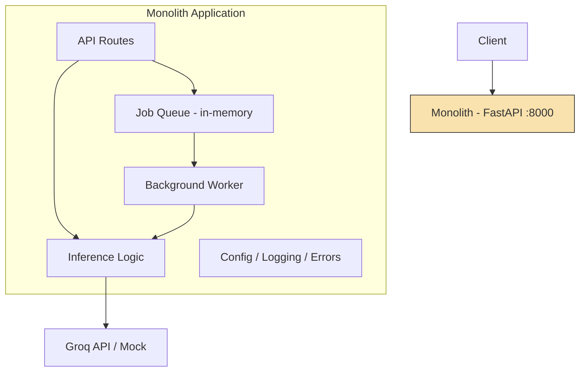
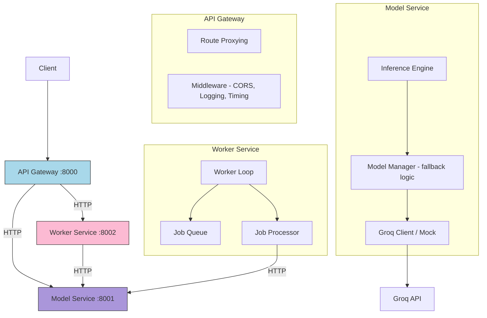

# Task 2: Microservices vs Monolith

## Overview

This workshop explores two fundamental architectural approaches for building AI systems:
the **monolith** (one deployable unit) and **microservices** (many small, independent services).
You will start with a working monolithic application, understand its strengths and limitations,
then refactor it into a microservices architecture -- the same architecture used by the baseline
codebase in this repository.

---

## Concept Explanation

### Beginner: What Are We Talking About?

**Monolith** -- Think of a single restaurant where one chef handles everything: taking orders,
cooking appetizers, cooking entrees, and making desserts. Everything happens in one kitchen.
If the chef gets overwhelmed, the whole restaurant slows down.

**Microservices** -- Now imagine splitting that into three specialized food trucks: one for
appetizers, one for entrees, one for desserts. Each truck operates independently, has its own
chef, and can be replaced or scaled without affecting the others. But now you need a coordinator
to route customer orders to the right truck.

In software terms:

- A **monolith** is a single application that contains all the logic: API routing, model
  inference, job processing, and configuration -- all in one codebase, one process, one deployment.
- **Microservices** split that into independent services (API Gateway, Model Service, Worker
  Service), each running in its own process, each deployable separately.

### Intermediate: Engineering Tradeoffs

| Dimension | Monolith | Microservices |
|---|---|---|
| **Deployment** | One artifact to build/test/deploy | Each service has its own pipeline |
| **Failure isolation** | A crash in any module takes down everything | A crash in one service leaves others running |
| **Team autonomy** | All developers work in the same codebase | Teams own individual services independently |
| **Data consistency** | Easy -- one database, one transaction | Hard -- distributed state, eventual consistency |
| **Network overhead** | Zero -- all calls are in-process | Every service call crosses the network (latency, failures) |
| **Debugging** | One log stream, one stack trace | Requests span multiple services; need distributed tracing |
| **Scaling** | Scale the entire application (even parts that are idle) | Scale individual services based on their load |
| **Operational cost** | One server, one container | Many containers, orchestrators, service meshes |
| **Local development** | Run one thing | Run N things (or use docker-compose) |
| **Onboarding** | Understand one codebase | Understand the architecture + individual services |

The critical insight: microservices do NOT reduce complexity -- they redistribute it from
the code into the infrastructure and communication layer.

### Advanced: Production Considerations

**Distributed tracing.** When a request passes through Gateway -> Model Service -> Worker,
how do you trace a single user request? You need correlation IDs propagated through headers
(e.g., `X-Request-ID`), and a tracing system like Jaeger or Datadog APM to stitch them together.

**Eventual consistency.** In a monolith, submitting a job and reading its status share the same
in-memory state. In microservices, the job queue lives in one service while the API gateway
proxies status checks. If the network hiccups, the client might see stale data. You must
design for this: idempotent operations, retry-safe endpoints, and clear status models.

**Service mesh.** As service count grows, managing communication (mTLS, retries, load balancing,
circuit breaking) at the application level becomes untenable. A service mesh (Istio, Linkerd)
handles this transparently at the infrastructure layer. But it adds operational complexity that
is unjustifiable for small teams.

**The "Monolith First" pattern (Martin Fowler).** Start with a monolith, understand your domain
boundaries, then extract services when you have clear reasons. Premature decomposition leads to
distributed monoliths -- the worst of both worlds: all the network complexity of microservices
with all the coupling of a monolith.

---

## Architecture Diagrams

### Monolith Architecture



### Microservices Architecture



---

## Comparison Table: At a Glance

| Aspect | Monolith | Microservices | Winner |
|---|---|---|---|
| Time to first deploy | Minutes | Hours (Docker, compose, networking) | Monolith |
| Adding a feature | Edit one file | Decide which service owns it, coordinate | Monolith |
| Scaling inference only | Scale the entire app | Scale only Model Service | Microservices |
| Team of 2 developers | Overkill to split | Overhead not worth it | Monolith |
| Team of 20 developers | Merge conflicts, slow CI | Independent deployments | Microservices |
| Production debugging | grep the log file | Need distributed tracing | Monolith |
| Fault tolerance | One bug crashes everything | One service fails, others survive | Microservices |
| Technology diversity | One language, one framework | Each service can use different tech | Microservices |

---

## The "Monolith First" Pattern

Martin Fowler and the ThoughtWorks team advocate starting with a monolith:

1. **You don't know your boundaries yet.** Service boundaries are a guess until you have real
   traffic and real features. Drawing them wrong means expensive re-architecture later.
2. **Monoliths are faster to iterate on.** No network calls, no service discovery, no
   distributed debugging -- just code and run.
3. **Extract when you have evidence.** When a specific module needs independent scaling, a
   different release cadence, or a different technology -- that is the signal to extract.

The progression:
```
Monolith --> Modular Monolith --> Selective Extraction --> Microservices
```

Our workshop follows exactly this progression: you start with `monolith.py` and refactor it
into the baseline microservices architecture.

---

## Decision Framework: Which Approach?

Choose **monolith** when:
- Your team is small (< 5 engineers)
- You are in the exploration/MVP phase
- Your domain boundaries are unclear
- You need to ship fast and iterate
- Your system has simple scaling needs

Choose **microservices** when:
- Multiple teams need to deploy independently
- Specific components need independent scaling (e.g., inference is GPU-bound)
- You need fault isolation (a bad model version should not crash your job queue)
- You have the operational maturity (CI/CD, monitoring, containerization)
- Your domain boundaries are well understood

Choose **modular monolith** (the middle ground) when:
- You want clean boundaries but are not ready for distributed systems overhead
- Your team is medium-sized (5-15 engineers)
- You want to prepare for future extraction without paying the cost now

---

## Real-World Examples

### Amazon
Amazon started as a monolithic Java application. As they grew, the monolith became the
bottleneck: deploying a small change required building and testing the entire system.
They decomposed into hundreds of microservices, each owned by a "two-pizza team."
This enabled them to deploy thousands of times per day.

### Netflix
Netflix moved from a monolithic Java application to microservices when they migrated
to AWS. They pioneered many patterns: circuit breakers (Hystrix), service discovery (Eureka),
and API gateways (Zuul). Their architecture now has 700+ microservices.

### Shopify
Shopify took the modular monolith approach. Instead of splitting into separate services,
they enforced strict module boundaries within a single Ruby on Rails application.
Components communicate through well-defined interfaces, but everything deploys as one unit.
This gives them most of the organizational benefits of microservices without the
operational complexity.

### The Lesson
All three companies started with monoliths. The decision to decompose came from specific,
measurable pain points -- not from architectural trends.

---

## Workshop Structure

| File | Purpose |
|---|---|
| `lab/starter/monolith.py` | Complete monolithic application (your starting point) |
| `lab/starter/refactor_guide.md` | Step-by-step guide for breaking it apart |
| `lab/solution/README.md` | Points to baseline/ as the completed microservices version |
| `slides.md` | Presentation outline for this topic |
| `production_reality.md` | What breaks in real production systems |

---

## How to Use This Workshop

1. **Read** this README to understand the concepts.
2. **Run** `lab/starter/monolith.py` to see the monolithic system in action.
3. **Follow** `lab/starter/refactor_guide.md` to refactor it step by step.
4. **Compare** your result with the baseline microservices architecture.
5. **Reflect** using `production_reality.md` on what would change in a real system.

---

## Prerequisites

```bash
pip install fastapi uvicorn httpx pydantic pydantic-settings structlog groq
```

Or, if using the project requirements:
```bash
cd baseline && pip install -r requirements.txt
```

Set environment variable for mock mode (no Groq API key needed):
```bash
export USE_MOCK=true
```
