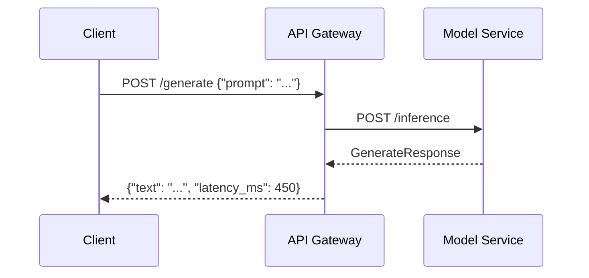
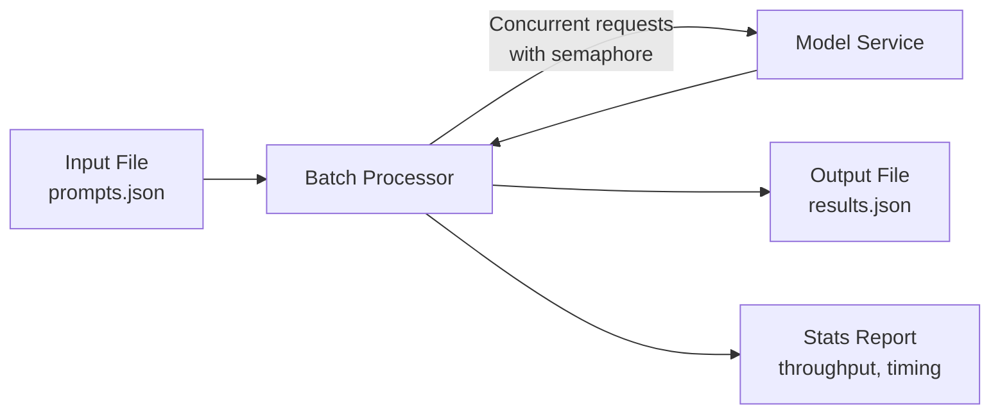
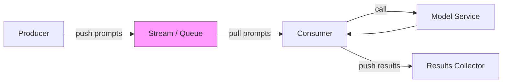

# Task 3: Batch vs Real-Time vs Streaming Inference

## Overview

AI systems process data in fundamentally different ways depending on latency
requirements, throughput goals, and resource constraints. This task explores the
three core processing patterns -- **batch**, **real-time**, and **streaming** --
and teaches you when and why to choose each one.

---

## Concept Explanations

### Beginner: Three Ways to Serve Food

Think of an AI inference service like a restaurant kitchen.

| Pattern | Analogy | How It Works |
|---------|---------|--------------|
| **Real-time** | Drive-thru window | One customer pulls up, places an order, waits a few seconds, and gets their food. Each request is handled individually the moment it arrives. |
| **Batch** | Assembly line / catering order | A large catering order comes in. The kitchen prepares all 200 meals at once on an assembly line -- far more efficient than cooking each one separately. Nobody expects instant service; the whole batch is delivered together. |
| **Streaming** | Conveyor belt sushi | Plates move along a conveyor belt continuously. The kitchen puts plates on one end, customers pick them off the other. Food is produced and consumed in a steady flow, not all at once and not one-at-a-time on demand. |

**Key takeaway:** The "best" pattern depends on whether you need results *now*,
*eventually*, or *continuously*.

---

### Intermediate: Engineering Tradeoffs

#### Latency vs Throughput

- **Real-time** optimizes for **latency** (respond as fast as possible per request).
  Every request pays the full overhead: network round-trip, model load, tokenization.
- **Batch** optimizes for **throughput** (process the most items per unit of time).
  Amortizes overhead across many items. A GPU can process a batch of 32 prompts
  nearly as fast as one.
- **Streaming** balances **both**. Individual items flow through with low latency,
  but the system sustains high throughput because it never stops processing.

#### Resource Utilization

| Pattern | GPU/CPU Usage | Memory | Network |
|---------|--------------|--------|---------|
| Real-time | Bursty -- idle between requests | Low per request | Many small calls |
| Batch | Sustained high utilization | High (entire dataset in memory) | Few large transfers |
| Streaming | Steady moderate utilization | Bounded by buffer size | Continuous small messages |

#### Cost Implications

- Batch is cheapest per-item because you can use spot instances, off-peak pricing,
  and saturate hardware.
- Real-time is most expensive per-item but delivers the best user experience.
- Streaming sits in between -- you provision for steady throughput rather than peak load.

#### When to Use Each

| Pattern | Use When | Example |
|---------|----------|---------|
| Real-time | User is waiting for a response | Chatbot, autocomplete, search |
| Batch | Results are not time-sensitive | Nightly model retraining, bulk embeddings, report generation |
| Streaming | Data arrives continuously and results are needed soon (but not instantly) | Log anomaly detection, social media sentiment, real-time recommendations |

---

### Advanced: Production Considerations

#### Backpressure

In streaming systems, what happens when the producer emits data faster than the
consumer can process it?

- **Unbounded buffers** lead to memory exhaustion and OOM kills.
- **Bounded buffers** (like `asyncio.Queue(maxsize=N)`) apply backpressure:
  the producer blocks when the buffer is full, naturally throttling input.
- Production systems use **watermarks** -- a high-water mark to slow producers
  and a low-water mark to resume them.

#### Exactly-Once Semantics

- **At-most-once:** Fire and forget. Fast, but items can be lost.
- **At-least-once:** Retry on failure. Items may be processed twice.
- **Exactly-once:** The gold standard. Requires idempotent consumers or
  transactional commits (e.g., Kafka transactions).

Most AI inference is **idempotent** (same input yields same output), so
at-least-once with deduplication is usually sufficient.

#### Stream Processing Frameworks

| Framework | Strengths | When to Use |
|-----------|-----------|-------------|
| Kafka Streams | Exactly-once, stateful processing | High-volume event streams |
| Apache Flink | Low-latency windowing, complex event processing | Real-time analytics |
| Redis Streams | Simple, low-ops, good for moderate volume | Lightweight streaming between microservices |
| Pulsar | Multi-tenancy, geo-replication | Multi-region deployments |

#### Windowing

Streaming systems often aggregate results over time windows:

- **Tumbling windows:** Fixed-size, non-overlapping (e.g., every 5 minutes).
- **Sliding windows:** Fixed-size, overlapping (e.g., last 5 minutes, updated every 1 minute).
- **Session windows:** Dynamic size based on activity gaps.

---

## Comparison Table

| Dimension | Real-Time | Batch | Streaming |
|-----------|-----------|-------|-----------|
| **Latency** | Milliseconds to seconds | Minutes to hours | Seconds to minutes |
| **Throughput** | Low (one at a time) | Very high (bulk) | High (continuous) |
| **Resource efficiency** | Low (idle between requests) | High (saturated hardware) | Moderate (steady utilization) |
| **Complexity** | Low | Medium | High |
| **Failure handling** | Retry per request | Restart batch or checkpoint | Offset tracking, replay |
| **Scaling** | Horizontal (more instances) | Vertical (bigger machines) or parallel | Partition-based |
| **Data freshness** | Instant | Stale (last batch run) | Near-real-time |
| **Cost per item** | Highest | Lowest | Middle |
| **Best for AI** | Chatbots, search, APIs | Embeddings, fine-tuning, evals | Monitoring, content moderation, recommendations |

---

## Architecture Diagrams

### Real-Time Inference

### Batch Inference

### Streaming Inference

---

## Real-World AI Examples

### Batch
- **Daily model retraining:** Collect the day's data, retrain overnight, deploy in the morning.
- **Bulk embedding generation:** Embed 10 million documents for a vector database.
- **Evaluation suites:** Run a model against 5,000 test cases and compute metrics.

### Real-Time
- **Chatbot / assistant:** User types a message, expects a reply in under 2 seconds.
- **Code autocomplete:** IDE sends partial code, model returns suggestions instantly.
- **Search ranking:** Re-rank search results with an LLM before displaying.

### Streaming
- **Content moderation:** Scan user-generated content as it is posted.
- **Log anomaly detection:** Process application logs in real time to flag anomalies.
- **Real-time recommendations:** Update recommendations as user behavior streams in.

---

## How This Connects to the Baseline Codebase

The baseline already contains building blocks for all three patterns:

| Pattern | Baseline Component | Where |
|---------|--------------------|-------|
| Real-time | `POST /inference` endpoint | `baseline/model_service/app/routes/inference.py` |
| Batch | `POST /jobs` + worker loop | `baseline/worker_service/app/routes/jobs.py` |
| Streaming | `InMemoryQueue` abstraction | `baseline/worker_service/app/services/queue.py` |

In this task's lab, you will build **client-side pipelines** that exercise these
server-side components in all three modes.

---

## Next Steps

Proceed to the [Hands-On Lab](lab/README.md) to implement and compare all three
inference patterns.
